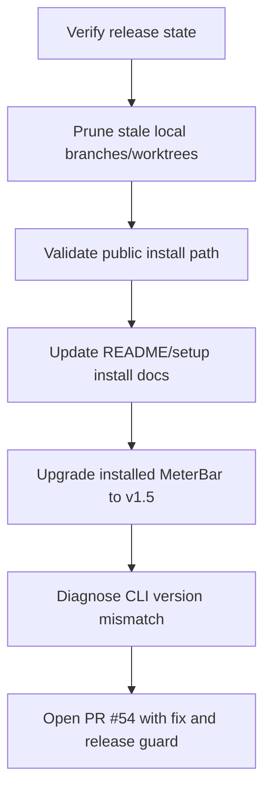

# Sessions: 2026-06-24

**Summary:** Popover reset countdown placement

---

## Session 1: Place reset countdowns under their matching quota bars

**Duration:** ~20 minutes
**Status:** Complete

### What was done

- Checked open PRs #50 and #51. #50 is related to exhausted quota-card handling but does not fix
  the normal per-bar reset countdown layout; #51 is unrelated cost refresh behavior.
- Moved popover quota reset countdowns into each `PopoverLimitRow`, immediately under the matching
  Session, Weekly, Sonnet, or Code Review bar.
- Removed the aggregate provider-card reset countdown footer so a Session reset no longer appears
  below the Weekly bar.
- Checked the companion Usage Dashboard: it already renders reset countdowns per quota row, so no
  UI relocation was needed there.
- Removed a stale dashboard `resetWindows` adapter left over from the older aggregate reset pattern.

### Files changed

- `MeterBar/Views/MenuBarView.swift` - Reset countdowns now render below their matching quota bar.
- `MeterBar/Views/UsageDashboardView.swift` - Removed unused reset-window adapter.

### Verification

- `swift test --filter ResetCountdownTests` passed: 11 tests, 0 failures.
- `git diff --check` passed.
- `xcodebuild -project MeterBar.xcodeproj -scheme MeterBar -configuration Debug -destination 'platform=macOS' CODE_SIGNING_ALLOWED=NO build` passed.

---

## Session 2: Release versioning convention captured

**Duration:** ~5 minutes
**Status:** Complete

### What was done

- Confirmed the newly published release is `v1.5` and should remain as-is.
- Documented the release-versioning preference so future agents remember to use three-part SemVer.
- Noted that bugfix releases after `v1.5` should use patch versions such as `1.5.1`.

### Key decisions

- Keep `v1.5` because it was already published and matched the project's prior two-part version convention.
- Use three-part SemVer for future MeterBar releases.
- Do not rewrite or delete already-published release tags unless the user explicitly requests it.

### Files changed

- `.agents/SYSTEM/ai/USER-PREFERENCES.md` - Added release-versioning workflow preference.
- `.agents/SESSIONS/2026-06-24.md` - Added this session note.

### Next steps

- Use `1.5.1` for the next bugfix release after `v1.5`.

---

## Session 3: Release cleanup, install docs, and CLI version PR

**Duration:** ~1 hour
**Status:** Complete

### Flow

### What was done

- Ran release cleanup dry-run and confirmed no stranded or merged-but-not-in-trunk branches.
- Removed stale local branches `develop`, `ship/13`, and `ship/14`.
- Repaired and removed stale `ship/13` and `ship/14` worktrees that still pointed at the old repo path.
- Verified the Homebrew cask and GitHub release assets for MeterBar.
- Updated README install instructions with an agent install prompt, fully-qualified Homebrew cask commands, and the correct source clone directory.
- Updated `.agents/docs/SETUP.md` to replace stale cookie/API-key setup instructions with current CLI/local-state setup.
- Upgraded installed MeterBar via Homebrew from `1.4` to `1.5`.
- Confirmed the bundled CLI reported stale version `1.0.0` even though the app/cask were `1.5`.
- Fixed the CLI version source so bundled `meterbar --version` reads the enclosing `MeterBar.app` bundle version.
- Added a release workflow guard that fails packaging if the bundled CLI version differs from the app version.
- Opened PR #54: `Fix bundled CLI version reporting`.

### Key decisions

- Use the GitHub PR merge state as the cleanup oracle because this repo uses squash-style merges.
- Use `VincentShipsIt/tap/meterbar` in docs to avoid ambiguity when multiple taps provide a `meterbar` cask.
- Treat source-built CLI version output as `development`; released/Homebrew builds should report the app bundle version.
- Add release-time validation instead of relying on manual version checks after publishing.

### Files changed

- `README.md` - Added agent install prompt, fully-qualified Homebrew commands, and fixed `cd meterbar.app`.
- `.agents/docs/SETUP.md` - Updated installation/authentication setup to match the current product.
- `MeterBarCLI/Sources/MeterBarCLI.swift` - Replaced hardcoded CLI version with app bundle version lookup.
- `.github/workflows/release.yml` - Added bundled CLI/app version consistency check.
- `.agents/SESSIONS/2026-06-24.md` - Added this session note.

### Mistakes and fixes

- `git worktree remove` initially failed because secondary worktrees had stale `.git` pointers to the old repo path. Fixed with `git worktree repair`, then removed normally without force.
- `brew upgrade --cask meterbar` failed because two taps exposed `meterbar`. Fixed by using the fully-qualified `vincentshipsit/tap/meterbar` cask and updating docs.
- Local SwiftPM release build hit stale module-cache paths after the repo move, then hung in release compilation after cleaning. Verified the fix with a debug build plus a fake app-bundle simulation instead; GitHub CI passed on PR #54.

### Verification

- `brew upgrade --cask vincentshipsit/tap/meterbar` upgraded MeterBar `1.4 -> 1.5`.
- `/Applications/MeterBar.app` reported app version `1.5`.
- `swift run --package-path MeterBarCLI meterbar --version` returned `development` outside an app bundle.
- Fake `MeterBar.app` bundle with `CFBundleShortVersionString = 1.5` made the symlinked CLI report `1.5`.
- `git diff --check` passed.
- PR #54 checks passed: CI build, Secret Scan, and CodeRabbit.

### Next steps

- Merge PR #54.
- Cut the next patch release after merge so the installed Homebrew CLI reports the same version as the GUI.

---

**Total sessions today:** 3
