# 2026-07-13

## Session: v1.7.1 milestone implementation

**Summary:** Implemented the six fixes originally planned for v1.7.1, with one isolated worktree, branch, commit, and ready PR per issue. The milestone itself had been closed empty and the issues had moved to the `2026-W29 · Weekly Release` milestone, so delivery followed issues #127–#132.

| Issue | Delivery |
|---|---|
| #127 first-run onboarding | `codex/127-onboarding`, PR #155 |
| #128 Sparkle auto-update | `codex/128-sparkle-auto-update` |
| #129 honest estimated-limit labels | Existing branch `codex/129-label-estimated-limits`, PR #152 |
| #130 shared pricing source | `codex/130-shared-pricing`, PR #154 |
| #131 Session Wake master feature gate | `codex/131-session-wake-feature-gate`, PR #153 |
| #132 provider parse health | `codex/132-provider-parse-health`, PR #156 |

### Sparkle release flow

```mermaid
flowchart LR
    Tag["Canonical release tag"] --> Preflight["Developer ID, notarization, and EdDSA preflight"]
    Preflight --> Build["Universal app, widget, and CLI"]
    Build --> Sign["Sign Sparkle helpers, app; notarize and staple"]
    Sign --> Zip["Create final release ZIP"]
    Zip --> Appcast["generate_appcast via private key on stdin"]
    Appcast --> Verify["Validate version, URL, length, and EdDSA signature"]
    Verify --> Release["Publish ZIP, SHA-256, and appcast.xml"]
    Release --> Client["Opted-in Sparkle clients read latest/download/appcast.xml"]
```

### Decisions and constraints

- Pinned Sparkle 2.9.4 in the Xcode project; the standalone CLI deliberately does not link Sparkle.
- Automatic checks default off in Info.plist. The Settings toggle is explicit consent; **Check Now** is manual.
- `CFBundleVersion` now tracks the three-part marketing version because Sparkle compares the build version, not only the display version.
- Release CI consumes `SPARKLE_PUBLIC_ED_KEY` as an Actions variable and `SPARKLE_ED_PRIVATE_KEY` as a secret. Missing values fail before build work.
- The custom signer follows Sparkle's helper-specific signing order and preserves Downloader XPC entitlements.
- v1.7.0 as already shipped does not contain Sparkle, so it cannot discover v1.7.1 automatically. It requires one manual/Homebrew upgrade; v1.7.1 establishes the future automatic path.
- The first worktree creation loop used zsh's reserved `path` variable and temporarily changed that subprocess's command lookup. No repository state changed; the loop was rerun with `worktree_dir`.

### Verification

- Every issue branch: `swift test`, strict SwiftLint, standalone CLI build, and Xcode app/widget build.
- #128: 536 Swift tests; Sparkle configuration/appcast/version tests; `actionlint`; `shellcheck`; Info.plist validation; universal arm64+x86_64 app/widget/CLI; CLI confirmed not linked to Sparkle; helper-aware ad-hoc release signing and deep verification; embedded Session Wake dry-run.

### External release prerequisite

Before tagging v1.7.1, configure the Actions variable and secret described in `docs/sparkle-updates.md`. The workflow will intentionally reject a release without them.
