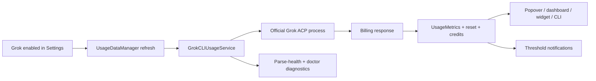

# 2026-07-14 — Fix broken Claude Code usage (OAuth primary)

## Problem
`claude /usage` (CLI 2.1.208) only renders the usage screen in an interactive TTY.
Every headless spawn a GUI app can make returns a session **cost summary**
(`Total cost: $0.0000 …`), so `ClaudeCodeCLIUsageParser` found no usage windows →
`parsingFailed("No Claude usage windows found.")` → the card showed "Refresh failed".
#156's parse-health surfaced it; #145 fixed only a separate PATH hook error.

## Research (option 1 — authenticated API)
- Confirmed the live source Claude Code's own `/usage` screen reads:
  `GET https://api.anthropic.com/api/oauth/usage` with the `Claude Code-credentials`
  Keychain OAuth token (`Authorization: Bearer`, `anthropic-beta: oauth-2025-04-20`).
  Response: `five_hour` / `seven_day` / `seven_day_sonnet` windows (`utilization`,
  `resets_at`) + `extra_usage`.
- Verified dead-ends from the brief: no `usage`/`status` subcommand;
  `-p "/usage" --output-format json` runs an empty session; PTY makes `claude` hang.
- **Key finding:** MeterBar already implemented this exact endpoint in
  `ClaudeCodeLocalService` — but gated behind the opt-in `ClaudeCodeEnableOAuthFallback`
  flag and only tried *after* the (broken) CLI path failed.

## Fix
Promoted OAuth from "legacy fallback" to the **primary** source:
- `ClaudeCodeLocalService.fetchUsageMetrics` now tries `/api/oauth/usage` first for
  the **default account** (`fetchUsageViaOAuth` returns `nil` ⇒ CLI fallback; throws
  on a real network/decode error rather than retrying the headless-broken CLI).
  Custom (`CLAUDE_CONFIG_DIR`) accounts stay CLI-only (no Keychain token).
- Extracted pure, tested helpers: `metrics(from:)`, `prefersOAuth(account:oauthEnabled:)`,
  `isOAuthUsageEnabled(defaults:)` — single source of truth for the flag, now **on by
  default** (`object(forKey:) as? Bool ?? true`), routed through the two other call
  sites (`ProviderSnapshot`, `ProviderReadinessInspector`).
- Renamed `ClaudeCodeUsageSource.legacyOAuth` → `.oauth`; refreshed Settings copy.
- Option 3 as a bonus: `ClaudeCodeCLIUsageParser` now detects the cost-summary shape
  and throws a legible error instead of the vague "No usage windows found."

## Tests (TDD-first)
- `ClaudeCodeOAuthUsageTests` — mapping, source policy, enabled-by-default flag.
- `ClaudeCodeCLIUsageParserTests.testDetectsCostSummaryInsteadOfUsageScreen`.
- Existing decode contract tests already cover the wire model.

## Tradeoff
Enabling OAuth by default means one **one-time macOS Keychain prompt** on first launch
of a signed release (the grant persists across Sparkle updates). Opt out via Settings ▸
Claude Code ▸ "Claude Code OAuth usage" (dev builds re-prompt per rebuild).

## Follow-up (out of scope)
`WakeQuotaAuthority`/`LiveWakeQuotaProvider` still call the raw CLI service; the
session-wake default-account quota gate would also benefit from OAuth, but needs a
**side-effect-free** OAuth fetch to avoid coupling UI `@Published` state into wake decisions.

---

# 2026-07-14 — Provider-card interaction affordances

## Problem
Tappable provider cards looked static — no hover/pressed styling anywhere in the app
(zero `.onHover`), the only "clickable" cue was an accessibilityHint sighted users
never see. Keyboard shortcuts were minimal (no ⌘R). The only context menu was the
hidden status-item NSMenu. Several `.help()` tooltips just repeated visible text.

## Changes (affordances only — a11y labeling is a separate chip)
- **New shared file** `MeterBar/Views/Components/ProviderCardInteraction.swift`:
  - `ProviderCardButtonStyle` — subtle hover fill + accent stroke + press scale, quick
    `.snappy(0.18)` curve, honors Reduce Motion. Applied only to the two tappable cards
    so the tappable/non-tappable distinction stays meaningful.
  - `CardDisclosureChevron` — trailing `chevron.right`, shown only when the card opens a
    detail panel (`onSelect != nil`).
  - `ProviderCardCommand` / `ProviderCardCommands` — pure, testable context-menu model
    (Refresh this provider · Open status page · Open in Dashboard · Hide provider).
    `.make(...)` injects side effects for tests; `.standard(...)` wires the real stores
    (`UsageDataManager.refresh(service:)`, `statusPageURL`, `ProviderVisibilityStore.set`,
    `UsageDashboardWindowController.show`). Mirrors/extends the hidden NSMenu.
  - `MeterBarShortcut` + `.meterBarRefreshShortcut()` — one source of truth for ⌘R.
- **Popover** (`MenuBarView.PopoverProviderStatusCard`) and **dashboard**
  (`DashboardProviderCards.ProviderOverviewStatusCard`): hover button style, chevron,
  and `.providerCardContextMenu(...)` attached. ⌘R bound on both the popover header
  refresh button and the dashboard toolbar refresh button.
- **Tooltip cleanup:** removed the 4 redundant `.help()` calls in `ResetCountdowns.swift`
  (they repeated the visible countdown text). Kept tooltips that add new info
  (UsageBar pace breakdown, ExtraUsageStatusPill On/Off).
- Made `PopoverProviderStatusCard` internal (was `private`) so the smoke test can host it.

## Tests
- `DashboardLayoutTests`: command order/titles/kinds, each command fires its wired action,
  `.standard` covers every kind, ⌘R constant, and an NSHostingView smoke of the overview card.
- `MenuBarSmokeTests`: popover-card host smoke + commands fire for the card's own service.

## Note
`MeterBarTheme.Motion` was not present on this branch's baseline (the task hedged "if
present"), so the hover animation uses a local `.snappy(0.18)` constant instead.
# 2026-07-14 (session 2) — Unify empty/error states + kill fabricated share-card data

## Problem
Empty/loading/error states were inconsistent across surfaces and one surface showed
fabricated data:
- Provider "not connected" notices differed per provider (Claude Code stacked **two**
  `SettingsNotice`s, Codex one, Cursor two, OpenRouter notice+inline-error), all worded
  differently.
- Cost/usage sections invented near-duplicate empty strings ("No cost data for enabled
  providers" vs "No cost data loaded yet"; "No usage data yet…" vs "Provider is disabled.").
- **Fake data:** `SocialShareTokenChart` substituted a hardcoded `[4,7,5,10,8,…]` array at
  reduced opacity ("waiting for scan") instead of an honest empty state — the only surface
  rendering synthetic-looking numbers.

## Fix
- **New `EmptyStateCard`** (`MeterBar/Views/Components/EmptyStateCard.swift`): one shape —
  icon + title + one-line message + optional action button; `.neutral` / `.warning` tone.
  Renders inline (no tile of its own) so it drops into `SettingsPanelSection`.
- **Migrated every settings empty/not-connected/error state** to it: one notice per provider
  with unified "Not connected" framing (kept provider-specific recovery text — "Run codex
  login" vs "Log in to Cursor IDE"). Collapsed the cost/usage duplicates to one card each,
  keyed on the genuinely distinct condition (never-scanned vs scanned-but-empty;
  no-usage-yet vs provider-disabled).
- **Killed the fabricated chart data:** removed the hardcoded array. Added
  `SocialShareCardContent.hasDailyChartData` as the single honest signal; when false the card
  renders a "scan needed" placeholder (dashed baseline + caption), never fake bars. Kept the
  card's intentional fixed-palette export geometry.
- **Differentiated the two cost-scan loaders** via doc comments: `CostScanLoadingChart` =
  first/empty scan (full takeover) vs `CostScanProgressBadge` = refresh over existing data
  (corner overlay).

## Tests
- `EmptyStateCardTests` — tone→tint mapping + hosting render smoke (with/without action).
- `SocialShareCardContentTests` — `hasDailyChartData` reflects real totals (empty/zero ⇒ false),
  plus a render-smoke asserting the card builds its honest empty state with no scan.
- `SettingsViewSmokeTests` — added an EmptyStateCard-in-`SettingsPanelSection` layout smoke.

## Mistake and fix
- **Mistake:** Initial edits landed in the **main checkout** (`master`) instead of this
  worktree, on top of another live session's in-progress "R-settings split" refactor.
- **Fix:** Re-applied all edits to the worktree against the clean base via an exact
  match-count script; reverse-applied only my blocks in main (content-preserving, leaving the
  other session's work intact) and removed the stray file there. Verified main retains none of
  my distinctive copy.
- **Prevention:** Edit via worktree-relative paths; never absolute paths into the parent repo.
# 2026-07-14 — Accessibility labeling + Dynamic Type pass

## Problem
VoiceOver labeling was sparse/inconsistent. Only `ProviderOverviewStatusCard`
had the full `.accessibilityElement(children:.combine)` + label(+hint) treatment.
The popover provider row had a hint but no label; the popover status card,
summary card, every limit row (3 impls), stat stacks, icon-only glass header
buttons, ApiUsageCard, and the Session Wake controls read as fragmented subview
trees. Below-legible-minimum fixed fonts (8pt "Estimated" ×3, 9pt metric label)
bypassed Dynamic Type; the 34/28pt cost headlines were frozen in pixels.

## Change
- **Pure, testable a11y helpers** on `SnapshotLimit` and `ProviderSnapshot`
  (`accessibilityLabel`/`accessibilityValue`), mirroring visible row copy and
  following the existing `DailyUsageDay.chartAccessibilityLabel` pattern. One
  source of truth so the three limit-row renderers and both provider-card
  branches can't drift.
- **Applied combine+label(+value/hint)** to: popover `PopoverProviderStatusCard`
  (both branches now identical via shared helper; hint only on the actionable
  one), `PopoverProviderStatusSummaryCard`, all three limit rows
  (`DashboardLimitRow`, `MenuBarProviderLimitDetailRow`, `PopoverLimitRow`),
  `DashboardMetricTile`, `CostMetric`, `UsageDetailMetric`, and `ApiUsageCard`
  (header + per-model rows).
- **Icon-only glass header buttons** labeled "Open Dashboard" / "Refresh"
  (inner SF Symbols marked `.accessibilityHidden(true)`); decorative
  "No sources" clock and summary chevron hidden.
- **Session Wake controls**: empty-string `Toggle`/`Picker`/`Stepper` labels
  filled in (kept `.labelsHidden()` — no visual change) so VoiceOver names them;
  menu toggle folds status into `.accessibilityValue`.
- **`SettingsRowView`**: title+detail combined into one element centrally
  (benefits every Settings row; trailing control stays separately actuable).
- **Dynamic Type**: 8pt "Estimated" tags → `.caption2`; 9pt `UsageDetailMetric`
  label → `.caption2`; cost headlines → `@ScaledMetric(relativeTo:)` (34/28 at
  default, scales up; `minimumScaleFactor`+`lineLimit(1)` guard overflow).
  Chart 8pt axis date labels intentionally left (dense axis, cited good ref).

## Tests (TDD-first)
`AccessibilityLabelTests` — label/value composition across estimated, currency,
exhausted, empty, and multi-window cases on both types. Pure-helper style,
auto-discovered by `swift test` (path-based test target; xcodebuild only builds).

## Scope
Accessibility + Dynamic Type only; no visual redesign. SF-Symbol `.system(size:)`
icon sizing left as-is (not text legibility).
# 2026-07-14 — Adopt Liquid Glass button styles for primary CTAs

## Problem
No `.buttonStyle(.glass)` / `.glassProminent` anywhere in the app despite targeting
macOS 26. Primary actions used `.borderedProminent`, secondaries `.bordered` — the
pre-Liquid-Glass look.

## Change (button styling only — no card restructuring)
One `.glassProminent` per context (the single primary action), `.glass` for
secondaries; applied sparingly per Apple guidance rather than to every button.

| File | CTA | Style |
|---|---|---|
| `OptimizeInsightsView` | empty-state "Scan 30 Days" | `.glassProminent` |
| `MenuBarView` firstRunCallout | "Enable" | `.glassProminent` |
| `MenuBarView` firstRunCallout | "Not Now" | `.glass` |
| `MenuBarView` empty-state | "Open Settings" | `.glass` |
| `SettingsView` Cost Tracking | "Scan 30 Days" | `.glassProminent` |
| `SettingsView` Refresh section | "Refresh Now" | `.glass` |
| `UsageDashboardView` cost card | "Scan 30 Days" | `.glassProminent` |
| `UsageDashboardView` status card | "Refresh Status" | `.glass` |
| `UsageDashboardView` share row | "Copy PNG" (lone primary) | `.glassProminent` |

- **Tint/monochrome:** `.glassProminent` fills with the app accent to convey
  "primary action" (meaning, not decoration); no ad-hoc `.tint()` added. Secondary
  actions in a row stay `.bordered` so the share row isn't fully glass-ified.
- **Left as-is:** popover-header icon buttons already use
  `.glassEffect(.regular.interactive())`; the dashboard toolbar refresh icon gets the
  system toolbar glass automatically; provider save/enable/"Check Now" buttons are
  out of the scan/refresh scope.

## Tests
- `SettingsViewSmokeTests.testGlassCostScanAndRefreshCTAsStillRender` — renders the
  real Settings tree (hosts the `.glassProminent` scan + `.glass` refresh CTAs).
- `MenuBarSmokeTests.testEmptyStateOpenSettingsGlassCTARenders` — renders
  `PopoverOverviewPanel(snapshots: [])`, forcing the empty-state `.glass` "Open
  Settings" CTA.
- Both follow the repo's SwiftPM-CI smoke convention (NSHostingView + `fittingSize`),
  guarding that the glass-styled buttons compile and lay out. Action wiring is already
  covered by `FirstRunOnboardingTests` and the cost-scan/refresh unit tests.
- Added an explicit initializer to `PopoverOverviewPanel` so its private `@State`/
  `@StateObject` storage no longer lowers the synthesized memberwise init to
  file-private (kept it constructible from the test target). Behavior-neutral.
# 2026-07-14 (pt 2) — Session Wake managed background persistence (#133)

## Implementation

- Added an `SMAppService.agent` launch agent backed by the already-bundled
  `Contents/Helpers/meterbar wake-agent` executable; no second wake engine or
  helper target.
- Added versioned app-group configuration plus metadata-only status/heartbeat
  so the agent survives GUI quit and Settings can show the live background state.
- Moved continuous app/agent ownership onto the existing `wake.lock` for the
  watcher lifetime. One-shot CLI runs still use the same lock, so app, agent,
  and CLI cannot run concurrently.
- Disarm and master-feature-off update the shared agent configuration
  synchronously before ServiceManagement unregisters, then cooperatively cancel
  the coordinator and any active child.
- Added launchd lifecycle packaging/verification, completion notifications from
  the agent, Login Items approval UI, ADR-011, and migration/architecture updates.

## Tests and verification

- Added `SessionWakeAgentTests` for configuration/status round trips,
  fail-closed bypass, synchronous disarm, restart-sensitive configuration, and
  lifetime-lock contention.
- Extended `SessionWakeControllerTests` for agent registration, no duplicate
  in-app watcher, shared armed state, and unregister-on-disarm.
- `swiftlint lint --strict`, plist validation, shell syntax, and diff whitespace
  checks pass locally. Builds/tests intentionally deferred to PR CI per the
  MacBook verification rule.
# 2026-07-14 — Grok Build provider (#135)

## Goal
Add an opt-in Grok provider with the same quota surfaces as existing providers,
without browser-cookie scraping or password/API-key entry.

## Research and decision
- Verified the official Grok Build CLI exposes an ACP stdio agent and owns its
  cached authentication through `grok login`.
- Sequenced ACP `initialize` → `authenticate` (`cached_token`) → `_x.ai/billing`.
- Chose the CLI boundary so MeterBar only checks whether `~/.grok/auth.json`
  exists/readable; it never opens, decodes, logs, or persists credential contents.
- Disabled CLI auto-update for MeterBar-launched probes and discarded stderr,
  which may contain account metadata.

## Implementation
- Added `ServiceType.grok`, adaptive presentation, opt-in persistence, Grok
  settings, and shared snapshot/cache/widget/CLI wiring.
- Added `GrokCLIUsageService` with a line-buffered, timeout-bounded ACP transport
  and fixture-tested mapping for weekly usage, reset windows, prepaid balance,
  and on-demand caps.
- Added readiness checks and provider-status metadata; the existing generic
  parse-health and notification pipelines now include Grok automatically.
- Updated README setup/privacy guidance and architecture documentation.

## Verification
- `swiftlint lint --strict --quiet` passed.
- `git diff --check` passed.
- Local Swift tests, typechecks, and builds were intentionally not run under the
  workstation safety policy; GitHub Actions is the authoritative verification.
- SwiftFormat was unavailable locally.
- The first Xcode CI build caught a missing `import os` for privacy-aware logger
  interpolation; the scoped import fix was pushed for a fresh CI run.

## Note
The first manual research probe omitted `--no-auto-update`, allowing the locally
installed Grok CLI to update itself. The production process arguments explicitly
include `--no-auto-update`, preventing MeterBar from repeating that side effect.
# 2026-07-14 (pt 2) — Codex one-click reset credits (#141)

## Implementation
- Confirmed the installed Codex client contract without spending a credit:
  `GET /wham/rate-limit-reset-credits` lists opaque available credits and
  `POST /wham/rate-limit-reset-credits/consume` accepts `credit_id` plus a unique
  `redeem_request_id`, returning `code` and `windows_reset`.
- Added an exhausted-card action that appears only for authenticated Codex accounts
  with a blocking quota and at least one credit. A confirmation explains that the
  credit is finite and irreversible.
- The action fetches an available credit, sends one idempotent consume request, and
  immediately refreshes usage. Refreshed metrics are published to the app, widget,
  and CLI caches; post-consumption refresh failures explicitly warn against retrying.
- Added CLI parity through `meterbar reset-credit --provider codex --yes`, including
  optional `--config-dir` routing for another `CODEX_HOME`.

## Tests and verification
- Added gating coverage for blocked × credits × authentication states.
- Added request-sequence coverage for list → consume → usage refresh, no-credit
  no-POST safety, refresh-failure reporting, account identity, and shared-cache updates.
- `swiftlint lint --strict --quiet` and `git diff --check` pass.
- Local tests/builds were not run under the MacBook verification rule; PR CI is the gate.
# 2026-07-14 (pt 2) — Versioned CLI JSON contracts

## Problem

`meterbar usage --json` and `meterbar cost --json` directly encoded internal cache models. The
shape was unversioned, provider ordering was unstable for usage, quota bands and percent-left were
missing, and no-cache errors did not include a schema version.

## Implementation

- Added explicit version 1 usage, cost, and error DTOs in `CLIJSONOutput.swift` with a shared
  ISO-8601, sorted-key encoder.
- Usage output now has stable provider identifiers, deterministic provider/window ordering,
  percentages used and left, quota bands, reset timestamps, estimated-limit markers, extra-usage
  state, and reset credits.
- Cost output now has a stable period/provider/totals envelope. Windowed `--days` output reports
  actual cache coverage and omits session/cache-creation fields unavailable from daily rows.
- Kept the existing human-readable command output unchanged.
- Documented the compatibility rules and full v1 shapes in `docs/cli-json-schema.md`.

## Tests and verification

- Added deterministic fixture snapshots for usage, cost, and error output plus window-coverage
  assertions.
- `swiftlint lint --strict --quiet` — passed.
- `git diff --check` — passed.
- SwiftFormat was unavailable locally. Tests and builds were skipped under the maintainer MacBook
  policy and delegated to pull-request CI.
# 2026-07-14 (session 2) — Card/popover state-swap transitions

## Problem
Conditional content across the popover and dashboard cards swapped with plain
`if/else` and no transition, so tiles and card states popped in/out abruptly.

## Convention
Added one motion convention in `MeterBarTheme.Motion`:
- `standard` — `.smooth(duration: 0.26)`, the single curve for structural swaps.
- `cardPhase` — `AnyTransition(.blurReplace)` for loading/loaded/empty card swaps.
- `popoverTile` — `.opacity.combined(with: .move(edge: .top))` for popover tiles.
- `resolved(reduceMotion:)` — returns `nil` under Reduce Motion (instant, still a
  clean replacement), else `standard`.

Structural swaps only — numeric value ticks keep animating via each card's own
`.contentTransition(.numericText())`, never through these tokens.

## Applied
- **Three loading→loaded→empty card swaps** — `ApiUsageCard`, `CostOverviewStatusCard`,
  `OptimizeInsightsView`. Each now derives an `Equatable` `Phase`, renders the swapping
  region through a `@ViewBuilder` switch where every branch carries a stable `.id` +
  `cardPhase` transition, and drives it with `.animation(resolved(reduceMotion:), value: phase)`.
  Transition sits on the branches (not the wrapper) so `blurReplace` actually fires
  instead of a default cross-fade.
- **Popover panel** (`PopoverOverviewPanel`) — firstRunCallout, the empty tile,
  setupChecklist and each provider card get `popoverTile` (slide+fade). The container
  animates on a `StructuralKey` (first-run flag, empty, setup providers, snapshot ids)
  — a routine data refresh that doesn't change *which* tiles show doesn't re-animate.
- Reduce Motion respected everywhere via `resolved(reduceMotion:)`.

## Tests (TDD patterns)
`CardStateTransitionTests` — Motion token contract (`resolved` nil under Reduce Motion,
returns `standard` otherwise) + NSHostingView render of every phase of the three cards
and both structural states of the popover panel (empty / populated via
`ProviderSnapshotBuilder`), plus an `OptimizeInsightsView` build smoke.

## Verification
`swiftlint` clean on all touched files. Local `swift test` not run (MacBook policy) —
relying on PR CI.
# 2026-07-14 (2) — Smooth menu-chrome show/hide/resize animations

## Problem
Every menu-chrome show/hide/resize was an instant snap. The popover re-sizes
itself whenever content height changes (expand/collapse, a provider appearing,
onboarding banner dismissing), so the whole window jumped. Same instant
`setFrame`/`orderFront`/`orderOut` pattern in the detail panel, and the
parse-health status-item alpha was a bare unanimated assignment.

## Fix
- **New `MeterBarTheme.Motion` tokens** (`panelResize` 0.2s, `panelFadeIn` 0.15s,
  `panelFadeOut` 0.12s, `statusItemAlpha` 0.2s). The chip hadn't landed yet.
- **`MeterBarMenuPanelController`**: `show()` fades alpha 0→1 after `orderFront`;
  `dismiss()` fades 1→0 then `orderOut` in the completion handler; `resize()`
  routes through an animated `panel.animator().setFrame`. Positioning/clamping
  math, `applyCompanionClipping`, `KeyableMenuPanel.canBecomeKey`, and the
  click-outside/Escape monitors are untouched. Panel stays
  `isOpaque=false`/`backgroundColor=.clear`.
- **`MeterBarMenuDetailPanel`**: fade-in on first present, animated frame glide
  when already visible (row-to-row hover), fade-out on dismiss.
- **`MeterBarApp.applyParseHealthAppearance`**: status-item alpha animated via
  `NSAnimationContext`, guarded on an actual value change so a steady state
  doesn't restart the fade every refresh tick.

## Re-entrancy
Both panels carry a monotonic `presentationToken`, bumped on every
show/dismiss/present. A deferred fade-out completion only orders the panel out
if its captured token still matches — so a rapid re-show cancels the pending
hide instead of leaving the panel stuck at alpha 0. The controller also tracks
an `isPresented` intent flag driving `isShown`, keeping the toggle correct while
a fade-out is still in flight (the panel's `isVisible` lags the completion).

## Reduce Motion / testability
Each panel exposes `motionEnabled`, defaulting to
`!NSWorkspace.shared.accessibilityDisplayShouldReduceMotion` — honors the system
accessibility setting and doubles as the deterministic test seam. Completion
handlers hop back with `MainActor.assumeIsolated` (they fire on the main thread).

## Tests
`LiquidGlassP1RegressionTests` extended (window-server-independent: a status
button hosted in a throwaway `NSWindow`, driven with `motionEnabled=false`):
show orders front at target size, dismiss orders out + resets alpha, resize
updates the target frame, resize is a no-op when not shown, and an animated
`show→dismiss→show` leaves the panel visible + opaque (token guard regression).
# 2026-07-14 — Consistent refresh micro-motion

## Problem
`.contentTransition(.numericText())` existed in exactly one place (`DashboardMetricTile`).
Every other refresh-driven number snapped, progress bars teleported, and there was zero
`.symbolEffect`/crossfade usage so icon swaps popped.

## Approach
Added a single motion vocabulary — `MeterBarTheme.Motion` — so every surface animates with
the same feel and Reduce Motion is enforced by construction:
- `standardCurve` (0.35s smooth) for numbers + bar fills; `snappyCurve` (0.22s) for icon/state swaps.
- `Motion.standard(reduceMotion:)` / `Motion.snappy(reduceMotion:)` return the curve, or `nil`
  under Reduce Motion, so callers pass the result straight to `.animation(_:value:)` — no branch.
- `View.numericRefreshTransition(value:reduceMotion:)` = `.contentTransition(.numericText())` +
  the standard animation keyed on the value. One call site per numeric `Text`.

## Changes
- **Numeric text** (`.numericRefreshTransition`): DashboardLimitRow used/trailing values,
  reset countdowns (all four countdown views), cost figures (overview total/tokens/providers,
  per-provider cost, CostMetric, UsageDetailMetric). `DashboardMetricTile` already had the raw modifier.
- **UsageBar fill** (`ProviderComponents.swift`): `.animation(Motion.standard, value:)` on the bar
  ZStack keyed on `clampedRemainingPercentage`, `pace?.expectedUsedPercent`, and `isExhausted` so
  all three branches (exhausted / off-pace / default) sweep instead of jumping.
- **Icon/state swaps**: RefreshingIcon crossfades (`.transition(.opacity)` + snappy animation) since
  `.symbolEffect(.replace)` can't span the Image→ProgressView type change; disclosure chevrons in
  DailyUsageChart + ProviderStatusViews use `.contentTransition(.symbolEffect(.replace))`.
- **Status dots**: SwiftUI `Circle().fill` dots (ProviderStatusViews) animate their tint on refresh —
  they're not SF Symbols, so a symbol replace doesn't apply.
- **Menu-bar `NN%` title**: AppKit `NSStatusBarButton`, unreachable by SwiftUI content transitions.
  Added `setStatusButtonTitle(_:to:)` which crossfades the button layer via `CATransition` only when
  the title actually changes, gated on `NSWorkspace.accessibilityDisplayShouldReduceMotion`.

## Reduce Motion
Every animated surface routes through `Motion.*(reduceMotion:)` (SwiftUI) or the AppKit
reduce-motion flag (menu-bar title), collapsing to an instant update.

## Tests
`MeterBarMotionTests` covers the token contract: `standard`/`snappy` return `nil` under Reduce
Motion, resolve to their curves otherwise, and the two curves are distinct. View-modifier presence
isn't inspectable (no ViewInspector dependency), so `MeterBarTheme.Motion` is the testable seam that
every animated surface funnels through.

## Not done (out of scope)
AppKit menu-item status dots (`statusDotImage` in `MeterBarApp.swift`) are drawn `NSImage`s in an
`NSMenu`, not SF Symbols — `.symbolEffect(.replace)` doesn't apply; left as-is.
# 2026-07-14 (pt.2) — Unify the three drifted limit rows into `LimitRow`

## Problem
The same "limit row" (title, Estimated tag, percent-left, `UsageBar`, used/pace,
reset countdown) was implemented **three times** with quiet drift:
`PopoverLimitRow` (MenuBarView), `MenuBarProviderLimitDetailRow` (MenuBarDetailPanel),
`DashboardLimitRow` (DashboardProviderCards, also used by SettingsView).

## Change
- New `MeterBar/Views/Components/LimitRow.swift` — one component with a
  `Density` (`.compact` popover / `.detail` panel / `.regular` dashboard+settings)
  that drives every spacing/typography difference. Reuses `UsageBar`,
  `ResetCountdownLabel`, and the shared badges. All display logic lives in a pure
  `LimitRow.Content` value type (trailing/used text, Out-vs-estimated, currency,
  reset presence) so it's unit-testable without hosting the view.
- Migrated all four call sites; deleted the three bespoke rows. `paceLabelColor`
  (duplicated verbatim in two rows) is now `LimitRow.paceLabelColor`.
- **Convergence:** the popover (`.compact`) is now currency-aware like the other
  surfaces — OpenRouter's `$X left`/`$X spent` instead of a percentage. Same
  underlying data, formatted consistently. The 8pt fixed "Estimated" tag is
  preserved on `.compact`/`.detail` (routed through `density.estimatedFont`);
  a later accessibility chip will replace the fixed size.
- Popover exhausted↔expanded swap (`PopoverProviderStatusCard`) untouched and
  covered by a new smoke test.

## Tests (TDD-first)
`MeterBarTests/LimitRowTests.swift` — `LimitRow.Content` formatting (percent-left,
Out, estimated-suppresses-Out + pace, currency left/spent, reset/estimated flags);
per-density hosting-render smoke; and `PopoverProviderStatusCardSmokeTests` for the
normal + exhausted card variants.

## Verification
Local build/test skipped per MacBook policy — relying on PR CI (`swift test` + xcodebuild).
# 2026-07-14 — Unify capsule badges into `MeterBarChip`

## Problem
Five bespoke capsule/badge recipes had drifted apart — divergent paddings, fill
opacities, and strokes for what is visually the same primitive:

| Recipe | File | padding (h/v) | fill | stroke |
|---|---|---|---|---|
| `ExtraUsageStatusPill` | `Components/ProviderComponents.swift` | 7/3 | 0.14 | 0.20 |
| `ReadinessBadge` | `Components/ReadinessComponents.swift` | 8/3 | 0.14 | none |
| `ProviderStatusBadge` | `ProviderStatusViews.swift` | 8/4 | 0.14 | 0.18 |
| tier badge | `OptimizeInsightsView.swift` | 6/2 | 0.18 | none |
| role capsule | `SettingsView.swift` | 8/4 | `.thinMaterial` + `glassCardStroke` |

## Solution
New `MeterBar/Views/Components/MeterBarChip.swift`:
`MeterBarChip(_ text:, systemImage:? , tint:, style:)` with two styles —
- `.flat` — tinted fill + hairline stroke, for in-card badges.
- `.glass` — `.glassEffect(.regular, in: .capsule)`, for chips over content/chrome.

**One** standardized scale in `MeterBarChip.Metrics` (guarded by a test): padding
**8/3**, fill **0.14**, stroke **0.18 × 1pt**, icon 10pt semibold, caption2 label.
The tint colors the whole chip foreground (icon + label). Not tokenized yet — no
radius/opacity design token exists in `MeterBarTheme`; a follow-up note in the file
points at folding `Metrics` into the theme once that token lands.

## Migration (all five)
- Each badge is now a thin wrapper over `MeterBarChip`, preserving its own
  tint/semantics (status colors, tier colors, Default/Profile role tint).
- Intentional unifications: `ExtraUsageStatusPill` tints the whole chip (was a
  tinted dot + neutral text); `ReadinessBadge` and the tier badge gain the standard
  hairline stroke; the tier badge fill normalizes 0.18 → 0.14.
- Role capsule (the odd `.thinMaterial` recipe) → `.glass`; this removed the only
  `.capsule` caller of `settingsInputSurface`, so the now-dead
  `SettingsInputSurfaceShape` enum + capsule branch were deleted and the modifier
  collapsed to its rounded-rectangle path.
- Left `DashboardCostCards` "Scanning…" pill as-is: it hosts a `ProgressView`
  (not an SF Symbol) with compact-aware padding, so it doesn't fit the chip's
  text+icon contract — and it already uses the same `.glassEffect(.regular, in:.capsule)`
  surface `.glass` produces.

## Files changed
- `MeterBar/Views/Components/MeterBarChip.swift` — new component.
- `MeterBarTests/MeterBarChipTests.swift` — new tests.
- `Components/ProviderComponents.swift`, `Components/ReadinessComponents.swift`,
  `ProviderStatusViews.swift`, `OptimizeInsightsView.swift`, `SettingsView.swift` —
  migrated call sites (+ dead-code removal in Settings).

## Tests (TDD)
`MeterBarChipTests`: chip stores caller text/icon/tint/style; `Metrics` are the
single standardized scale; chip hosts for every style×icon combo; each migrated
badge still maps its state to the same label + tint (`ExtraUsageStatusPill`,
`ReadinessLevel`, `ProviderStatusIndicator`) and hosts to non-zero size via
`NSHostingView`. `ExtraUsageStatusPill.label/color` made internal (was private) so
the mapping is assertable.

## Verification
- `swiftlint lint --strict` clean on all changed files (CI gates on `--strict`).
- `swift test` deferred to PR CI per repo policy (no full Xcode locally).

## Scope
Chip component + migration only. No card surfaces or motion touched.
# 2026-07-14 — Design tokens: radius / spacing / opacity scales

## Problem
`MeterBarTheme` was colors-only. Across the view layer: **13** distinct raw
`cornerRadius` values, **~25** raw `.opacity(...)` literals, and **71** `.padding(...)`
calls on no spacing scale. Same-file inconsistencies too — chart bars at radius 3 vs
legend swatches at radius 2 (`DailyUsageChart`), and `UsageBar` mixing Capsule +
radius-1 + radius-3 in one component.

## Tokens added to `MeterBarTheme`
- **`Radius`** — `small=4, medium=8, card=12, shell=16` (+ `concentric(outer:inset:)`).
  `companionShellRadius` now aliases `Radius.shell`; `meterBarCardSurface` /
  `MeterBarCompanionSurface` defaults use tokens.
- **Concentric rule** — nested-card radii derived, not magic: `detailCardRadius =
  concentric(shell, xs) = 12` (cards inside the 16 shell), `apiCardRadius =
  concentric(card, xs) = 8` (API card inside a dashboard card).
- **`Spacing`** — 4pt grid `xxs=2, xs=4, sm=8, md=12, lg=16, xl=20, xxl=24`.
- **`Fill`** — recurring opacity: `subtle=0.14` (chip/badge/bar tint), `hairline=0.18`
  (chip stroke).

## Sweep (13 files)
Mapped every raw value to the nearest step; **exact ties round up** (6→8, 10→12, 14→16,
18→20). In-scope radii collapsed to `{4,8,12,16}` (11/14/15/18 were all SocialShareCard).
Fixed the flagged inconsistencies: chart bar + legend swatch → `Radius.small`; UsageBar's
radius-1/3 → `Radius.small` (geometry clamps thin shapes, so render is unchanged).
Unified all chip fills → `Fill.subtle`, chip strokes → `Fill.hairline`.

**Intentionally left as literals:** `SocialShareCard` export-scale values; the cost-card
animated shimmer / detail-background gradient washes; one-off text de-emphasis
(`0.75`, `0.85`, `0.86`). VStack/HStack `spacing:` left for a follow-up (sweep scoped to
`.padding` + `cornerRadius` + `.opacity`).

## Behavior
Visual-consistency refactor — sub-pixel shifts expected and accepted (e.g. 11→12,
0.16→0.14). No layout-test dimensions asserted radius/padding, so none broke.

## Tests
`MeterBarThemeTests` extended: radius ladder ascending + values, `companionShellRadius`
tracks `.shell`, concentric math (incl. clamp-to-0 + derived tokens), spacing grid
ascending `[2,4,8,12,16,20,24]`, fill/stroke opacity ordering. `swiftlint` clean.
(Not run locally — `swift test` needs full Xcode; relying on PR CI.)
# 2026-07-14 — Surface-token vocabulary (two-layer material system)

## Problem
Five competing surface families with no documented system: real glass, material+gradient,
flat card fill (`meterBarCardSurface`, dominant), `thinMaterial` inputs, bespoke chips.
The "glass shell containing flat-fill cards" structure was *correct* per Apple's two-layer
model but **accidental** — no shared vocabulary, so drift was inevitable.

## Change (`MeterBarTheme.Surface`)
Codified Apple's intended two layers as documented tokens in `MeterBarTheme.swift`:
- **Layer 1 — CHROME (glass):** `Surface.chrome(radius:)` → the single entry point for
  the Liquid Glass shell (wraps `MeterBarCompanionSurface`). `Surface.chromeOpaqueFallback`
  = the opaque fill glass collapses to under Reduce Transparency.
- **Layer 2 — CONTENT (flat, opaque):** `Surface.content` = the *one* card fill
  (`controlBackgroundColor`); `Surface.inset` = a row nested one step inside a card.

Every doc comment states which layer the token belongs to and when to use it.

## Migration (behavior-preserving — same pixels, one source of truth)
- `MeterBarCardSurfaceModifier` (funnels **every** flat card via `meterBarCardSurface`)
  now draws `Surface.content` instead of an inline `controlBackgroundColor` → all card
  fills collapse onto one token.
- `MeterBarDetailBackground`'s Reduce-Transparency branch now uses
  `Surface.chromeOpaqueFallback`.
- The three glass call sites (`MenuBarView`, `MenuBarDetailPanel`,
  `ProviderStatusViews`) route through `Surface.chrome(radius:)`.

## Deliberately unchanged
- **No content card converted to glass.** Glass stays chrome/overlay only — the point is
  consistency, not more glass.
- Reduce-Transparency fallbacks in `MeterBarDetailBackground` / `Color.adaptive` preserved.
- `SocialShareCard.swift` untouched (intentionally non-adaptive export bitmap).
- `thinMaterial` inputs and bespoke chips left for their own chips.

## Tests (TDD, extends `LiquidGlassP1RegressionTests`)
- `testContentSurfaceTokensAreOpaque` — `.content` / `.inset` resolve opaque (alpha == 1)
  in aqua + darkAqua.
- `testChromeReduceTransparencyFallbackIsOpaque` — the RT fallback stays opaque.
- `testChromeSurfaceTokenThreadsRadius` — `.chrome(radius:)` exists and threads radius.

## Out of scope (separate chips)
Radius / spacing / opacity tokens; chip-fill consolidation.
# 2026-07-14 (pt 2) — Motion vocabulary foundation

## Problem
Three ad-hoc animation curves scattered across views, no shared vocabulary:
`.snappy(duration: 0.18)` (DailyUsageChart, ProviderStatusViews row toggles),
`.easeInOut(duration: 0.15)` (UsageDashboardView social-share status swap), plus a
hand-rolled TimelineView sweep in `CostScanLoadingChart` (already Reduce-Motion aware).

## Change (foundation chip — later motion chips depend on it)
- Added `MeterBarTheme.Motion` namespace with three `Animation` tokens:
  `quick` = `.snappy(0.18)` (row expand/collapse), `standard` = `.smooth(0.25)`
  (content swaps), `panel` = `.smooth(0.22)` (window resize/fade).
- Added `Motion.resolve(_:reduceMotion:) -> Animation?` — the Reduce-Motion
  convention. Returns `nil` when Reduce Motion is on (drops into `withAnimation`'s
  `nil` overload / `.animation(_:value:)`), mirroring how `CostScanLoadingChart`
  freezes. Call sites read `\.accessibilityReduceMotion` and pass it in.
- Migrated the 3 existing sites (behavior-preserving): both `.snappy(0.18)` →
  `Motion.quick` (exact); the `.easeInOut(0.15)` status swap → `Motion.standard`.
  The migrated sites never respected Reduce Motion before, so they keep animating
  unconditionally — wiring `resolve` into them would change behavior and is left
  to the later chips that own those surfaces.

## Tests (TDD-first)
- `MeterBarMotionTests` — tokens match calibrated curves (`Animation: Equatable`),
  `resolve` suppresses to `nil` under Reduce Motion / passes through otherwise, and
  is usable as a `withAnimation` argument. Dedicated file so later chips extend it.

## Scope
Token creation + migrating the 3 sites only. No new animations added elsewhere.
# 2026-07-14 (session 2) — Liquid Glass P1: extend glass morphing to hard-swap sites

## Scope
Extend the existing real-`glassEffect` chrome (popover shell, header icon buttons) into
glass **morphing** at two hard-swap sites, using `glassEffectID` + `@Namespace` inside a
`GlassEffectContainer`, with a dashboard twin and the disclosure rows tokenized.

## Changes
- **`MeterBarTheme.Motion`** (new): `standard = .smooth(0.32)` (glass morphs) +
  `disclosure = .snappy(0.18)` (rows). Single source of truth so the swap sites can't drift.
- **`DashboardTile` surface option**: new `DashboardTileSurface { case card, glass }` +
  defaulted `surface:` param. `.glass` swaps the flat `meterBarCardSurface` for a
  `.regular` `glassEffect`, so the morphing tile has a glass surface to morph. Zero
  existing call sites break (defaulted).
- **Flagship morph** (`MenuBarView.PopoverProviderStatusCard`): the
  `compactExhaustedCard` (58pt) ↔ `expandedCard` (124pt) swap now sits in a
  `GlassEffectContainer(spacing: 8)` (matches the 8pt provider-card list rhythm), both
  variants carry the same `glassEffectID` in a per-card `@Namespace`, both use
  `surface: .glass`, driven by `.animation(Motion.standard, value: hasExhaustedLimit)`.
  Made the struct non-private + explicit `init` so tests can render both states.
- **Dashboard twin** (`DashboardProviderCards.ProviderLimitsBody`): exhausted-weekly ↔
  normal branch now `.transition(.blurReplace)` + `.animation(Motion.standard,
  value: hasExhaustedWeeklyLimit)`. No full glassEffectID morph — it sits inside a flat
  DashboardTile with no per-branch glass surface, so a morph would need its own container.
- **Disclosure rows** (`ProviderStatusViews.ProviderStatusTable`,
  `DailyUsageChart.DailyUsageBreakdownList`): kept the in-place move/opacity transition
  (rows share a flat, divider-separated tile — no per-row glass surface to morph), but
  routed the animation through `Motion.disclosure` and gated it on Reduce Motion.

## Reduce Motion
Every new/updated animation resolves to `nil` under `accessibilityReduceMotion`
(flagship card, dashboard twin, both disclosure toggles).

## Tests (`LiquidGlassP1RegressionTests`)
- `testMotionTokensAreDistinctAndStable` — pins the two tokens and asserts they differ.
- `testProviderStatusCardMorphRendersBothStates` — renders the flagship card
  (`NSHostingView` + `layoutSubtreeIfNeeded`) in exhausted + healthy states.
- `testDashboardProviderCardRendersBothLimitStates` — renders the dashboard twin in
  weekly-exhausted + normal states.
- (Cannot introspect the SwiftUI tree without ViewInspector, so the morph wiring is
  proven by "both branches build + lay out to a non-zero height".)

## Notes / follow-up
- All provider cards (not just the exhausted one) now render on `.glass` since every
  popover provider card is a `PopoverProviderStatusCard`. Intentional — the morph needs
  a glass surface on both states — but the exact glass variant is a visual-tuning knob
  if it reads too heavy over the glass companion shell.
- `swiftformat` config says `--indent 4` but the view files are 2-space; matched each
  file's local indentation to keep diffs clean (not a hard CI gate today).
# 2026-07-14 — Scroll-edge cleanup + widget dead-code removal

Two small, related chrome cleanups (separate branch/PR).

## 1. Dashboard scroll-edge effect (`MeterBarDetailBackground`)
The Dashboard uses a unified transparent toolbar and already opts into the macOS 26
automatic scroll-edge effect (`.scrollEdgeEffectStyle(.soft, for: .top)`). But its
`.background { MeterBarDetailBackground().ignoresSafeArea() }` pushed the whole shared
background — including the accent **tint gradient** whose densest corner is `.topLeading`
— up under the toolbar. Per Apple's guidance (no custom darkening/tinting behind bar
items), that competes with the system blur/fade.
- Moved safe-area handling **inside** `MeterBarDetailBackground`: the `.regularMaterial`
  (and the reduce-transparency opaque fallback) keep `.ignoresSafeArea()` so the window
  backing stays full-bleed, but the `LinearGradient` tint now respects the top safe area
  so it no longer paints the toolbar region. System edge effect is unobstructed.
- Dropped the now-redundant outer `.ignoresSafeArea()` at both call sites
  (`UsageDashboardView` detail ScrollView, `SettingsView` TabView) so the component owns
  the policy in one place. Reduce-transparency fallback preserved.
- Settings check: the macOS `TabView` renders its tab strip as a separate control, not a
  scroll-under bar — nothing scrolls beneath a bar there — but the shared component keeps
  both windows consistent.

## 2. Widget dead code (`MeterBarWidget/UsageWidget.swift`)
`ServiceDetailView` (hardcoded `Color.gray.opacity(0.1)` + `.cornerRadius(8)` fill) was
referenced by none of the live widget views (Small/Medium/Large use `ServiceMiniView` /
`ServiceCompactView`). Grepped the widget target to confirm. Removing it also orphaned
`WidgetProviderIcon` and `LimitDetailView` — both used **exclusively** by
`ServiceDetailView` — so all three went (94 lines). `WidgetStatusIndicator` stays (still
used by the live Mini/Compact rows). No migration to `.containerBackground` needed since
the view was unused, not rendered.

## Tests
No test extension: the widget change deletes an **unused** view (touches no rendered
view; the widget target also can't be imported by `WidgetRenderingTests`), and the
dashboard change is a background/safe-area tweak that doesn't alter content layout, so
`DashboardLayoutTests`' sizing/grouping invariants are unaffected. Relying on PR CI
(`swift test`) — not run locally per repo policy.
# 2026-07-14 (2) — Fix first-run onboarding dismissed on any popover close

## Problem
First-run onboarding was marked complete whenever the popover closed for **any**
reason, not just when the user chose. `MeterBarApp.swift` wired the panel
controller's `onDismiss` to unconditionally call `FirstRunOnboardingStore.shared.dismiss()`.
A new user whose popover auto-opens on first launch and who clicks away / presses
Escape without touching the "Welcome to MeterBar" callout never saw it again —
losing the only decision onboarding asks for (launch-at-login).

## Fix (root-cause)
- **`MeterBarApp.swift`** — removed the `FirstRunOnboardingStore.shared.dismiss()`
  call from `onDismiss`; kept `MeterBarMenuDetailPanel.shared.dismiss()`. Popover
  close now only tears down the transient detail panel.
- **`FirstRunOnboardingStore.swift`** — deleted the `dismiss()` method entirely.
  After unwiring it was dead code, and its "clicking away completes onboarding"
  semantics *was* the bug. Onboarding now completes **only** via
  `chooseLaunchAtLogin(_:)`, driven by the callout's Enable / Not Now buttons.
- The welcome callout (`MenuBarView.firstRunCallout`, gated on
  `onboarding.shouldPresent`) now keeps reappearing at the top of the popover
  until the user acts.

## Unchanged (verified)
- Silent upgrade detection (`priorUseSentinelKeys` / `hasEvidenceOfPriorUse`) and
  `shouldPresent` are untouched — existing users still never see onboarding.
  Covered by `testUpgradingExistingInstallDoesNotPresentOnboarding` /
  `testUpgradeMigrationRecognizesCachedMetricsSentinel`.
- Auto-open-on-first-launch (`shouldPresent` → `menuPanel.show()`) left as-is;
  only the persistence bug was in scope.

## Tests (TDD)
`FirstRunOnboardingTests`:
- `testIncidentalDismissDoesNotCompleteOnboarding` — a popover close that invokes
  nothing on the store leaves `hasCompletedFirstRun` false; a reloaded store still
  presents. (Replaces the old `testFreshInstallPresentsAndDismissPersistsOnce`,
  which asserted the now-removed dismiss-completes behavior.)
- `testFreshInstallPresents` — fresh install presents.
- `testEnableLaunchAtLoginRegistersAndCompletesOnboarding` /
  `testNotNowCompletesWithoutRegistering` — extended to assert the explicit choice
  persists across a reload (`hasCompletedFirstRun` true, reloaded store silent).
