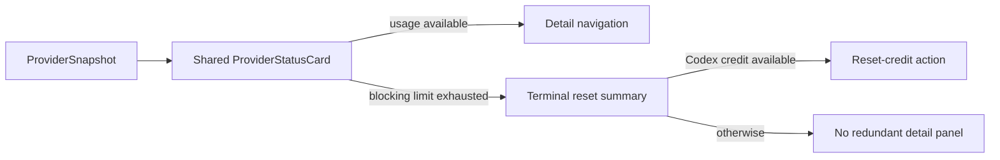
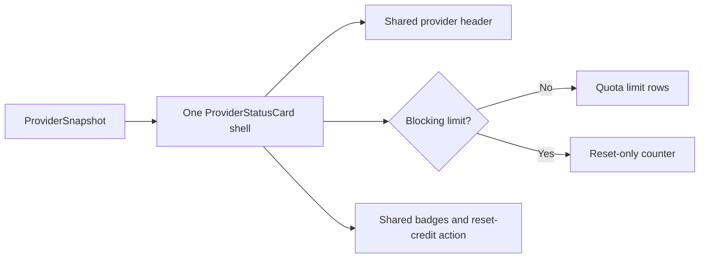

# 2026-07-15 — Finish unified provider-card terminal state

## Session 1: Exhausted cards, About links, and transparent window correction

**Status:** Complete; PR CI pending

### Affected components

- Popover and dashboard provider-card interactions
- In-dashboard About settings
- Dashboard window chrome
- Provider-card and settings smoke coverage

### What was done

- Centralized exhausted-card navigation policy in `ProviderStatusCard`, so every host suppresses hover, disclosure, and selection when a blocking limit is exhausted.
- Removed detail navigation from the exhausted Codex reset-credit variant while preserving the reset-credit action itself.
- Added the GitHub repository and `@shipshitdev` X account to About alongside the website.
- Marked the clear dashboard `NSWindow` non-opaque, completing the transparent titlebar setup.
- Added pure navigation-policy and About-link regression coverage.

### Key decisions

- The compact exhausted card is the terminal state. Opening a second panel that repeats quota rows adds no actionable information.
- Card height may still differ by state, but the popover, dashboard overview, and limits page now use the same component and the same interaction policy.
- Codex reset credits remain visible because they can immediately unblock usage.

### Files changed

- `MeterBar/Views/MenuBarView.swift`
- `MeterBar/Views/Settings/AboutSettingsView.swift`
- `MeterBar/Views/UsageDashboardView.swift`
- `MeterBarTests/LimitRowTests.swift`
- `MeterBarTests/SettingsViewSmokeTests.swift`

### Verification

- SwiftLint strict: zero violations on all changed Swift files.
- `git diff --check`: clean.
- Local tests/build intentionally not run per MacBook policy; use PR CI.

### Next steps

- [ ] Confirm PR CI and merge when the visual review is accepted.

## Session 2: Remove the second visual provider-card implementation

**Status:** Complete; installed visual verification passed

### Root cause

The previous consolidation renamed the surviving Swift type but kept two full
outer view trees: `compactExhaustedCard` and `expandedCard`. The code had one
type while the rendered app still had two visibly different card designs.

### What changed

- Deleted the compact exhausted card, its duplicate header, and the glass morph
  between card types.
- Kept one `DashboardTile` shell for every provider and every state.
- Limited exhausted-state branching to the middle body: a blocking reset counter
  replaces quota rows, while the shared header, status, badges, and optional
  Codex reset-credit footer remain unchanged.
- Retained terminal interaction behavior: blocked cards do not open a redundant
  detail panel.
- Updated regression test language to describe the single-shell contract.

### Verification

- SwiftLint strict: zero violations on all changed Swift files.
- Xcode Debug clean build succeeded for arm64.
- Installed and ad-hoc signed `/Applications/MeterBar Dev.app`; deep signature
  verification passed and the installed process launched successfully.
- Opened the real dashboard and captured visual evidence confirming both provider
  states now use the same card shell.

## Session 3: Remove opaque cards, terminal login cards, and Tahoe sidebar pill

**Status:** Complete; installed visual verification passed

### Root causes

- `ProviderStatusCard.allowsDetailNavigation` only checked exhaustion, so a
  no-data/login card still opened an empty secondary panel.
- Normal dashboard/settings cards used opaque `controlBackgroundColor`, while
  provider cards used a separate Liquid Glass surface. Both violated the single
  card-surface contract and produced dark-gray slabs over the tinted window.
- Tahoe's `NavigationSplitView` owns its floating sidebar container; clipping the
  nested `List` does not change that outer oversized radius.

### What changed

- Detail navigation now requires actual provider metrics in addition to an
  available selection action and a non-exhausted quota.
- Removed `DashboardTileSurface` and the provider-only glass branch. Every
  `DashboardTile` now uses the same `meterBarCardSurface` implementation.
- Replaced opaque normal card fills with one adaptive blue-green translucent
  tint that remains visibly non-gray on the dark popover shell, retaining an
  opaque semantic fallback only when Reduce Transparency is enabled.
- Initially replaced the floating split-view sidebar with a custom 8pt shell.
  Live user review showed that this changed the sidebar's material, selection,
  toolbar placement, and collapse behavior—not just its radius. Reverted that
  overreach and restored the exact native `NavigationSplitView` sidebar.
- Updated surface/navigation regression coverage and the design contract.

### Verification

- SwiftLint strict: zero violations on all changed Swift files.
- `git diff --check`: clean.
- Clean arm64 Debug build succeeded.
- Installed and ad-hoc signed `/Applications/MeterBar Dev.app`; deep signature
  verification passed.
- Captured the real active dashboard after restoring the native sidebar and
  retaining the shared translucent card surfaces.

## Session 4: Remove the toolbar band and isolate Claude account failures

**Status:** Complete; rebuilt and installed

### Root causes

- The detail background's accent gradient stopped at the safe area while a
  soft scroll-edge effect and the window toolbar each painted their own layer.
  That produced the visible horizontal band even with a transparent titlebar.
- The enabled `shipshitdev` Claude profile is logged out. Its headless `/usage`
  output is a cost summary with no quota windows, so parsing correctly fails for
  that account. `ClaudeCodeLocalService` incorrectly published that secondary
  account failure as the provider-wide error after the default profile had
  refreshed successfully.

### What changed

- Hid the window-toolbar background and the top scroll-edge effect while keeping
  the refresh, settings, and back controls in the native toolbar.
- Extended the same detail material/tint through the titlebar safe area.
- Restricted the shared Claude connection/error state to the default profile;
  custom-profile failures remain represented by their own offline/no-data card.
- Added regression coverage for the default-only shared-state policy.

### Verification

- SwiftLint strict: zero violations.
- `git diff --check`: clean.
- Xcode Debug build succeeded with signing disabled after the normal signed
  build reported missing local development provisioning profiles.
- Reinstalled and ad-hoc signed `/Applications/MeterBar Dev.app`; deep signature
  verification passed and the installed process launched successfully.

## Session 5: Restore compact terminal states and deterministic hover dismissal

**Status:** Complete; rebuilt, reinstalled, and visually verified

### Root causes

- Provider-card hover only opened the secondary panel; neither window owned the
  matching leave event, so the panel remained visible after the pointer left.
- The shared-card refactor preserved one outer surface but accidentally expanded
  terminal weekly and logged-out states back into multi-row cards.
- Weekly exhaustion filtered only the session window from detail surfaces,
  leaving model-specific quota bars visible even though none could restore use.
- General settings controls used unrelated local widths, so their visible
  trailing edges did not share one alignment column.

### What changed

- Added shared hover ownership across the source card and secondary panel, with
  a short bridge delay for crossing the physical gap between the two windows.
- Kept the unified `DashboardTile` surface while collapsing weekly-exhausted and
  logged-out providers to one-line terminal rows.
- Removed login instructions from logged-out popover cards; they now show only
  the provider name and `Offline`.
- Made weekly exhaustion expose only the weekly limit everywhere, including
  Settings > Providers.
- Added a fixed right-edge control column for General settings and removed menu
  picker frames that were visually centering their controls.
- Added regression coverage for two-panel hover ownership and weekly-only limit
  filtering.

### Verification

- SwiftLint strict: zero violations.
- `git diff --check`: clean.
- Xcode Debug build succeeded with signing disabled.
- Reinstalled and ad-hoc signed `/Applications/MeterBar Dev.app`; deep signature
  verification passed and the installed process launched successfully.
- Live dashboard and popover inspection confirmed weekly-exhausted and logged-out
  providers render as one-line cards; General settings controls share a clear
  right edge.
- Tests were updated but not run locally per MacBook policy.

## Session 6: Isolate Claude profile quota sources

**Status:** Complete; rebuilt, reinstalled, and live profile routing verified

### Root cause

Two independently authenticated Claude profiles returned different raw weekly
reset times, but MeterBar rendered the `shipshitdev` reset for both. The default
`genfeedai` row preferred the legacy global OAuth Keychain item even though the
app process explicitly selected `~/.claude-genfeedai`; that global credential
belonged to `shipshitdev`. The default-row reconnect script compounded the issue
by unsetting `CLAUDE_CONFIG_DIR` instead of targeting the directory displayed in
Settings.

### What changed

- Disabled global OAuth routing when an explicit `CLAUDE_CONFIG_DIR` selects the
  default profile, forcing usage through that profile's correctly scoped CLI.
- Made default-profile reconnect scripts export the effective displayed config
  directory, including an explicit `~/.claude` path when no override exists.
- Added source-selection and reconnect-target regression coverage.

### Verification

- SwiftLint strict: zero violations.
- `git diff --check`: clean.
- Xcode Debug build succeeded with signing disabled.
- Reinstalled and ad-hoc signed `/Applications/MeterBar Dev.app`; deep signature
  verification passed and the installed process launched successfully.
- Direct Claude CLI checks returned distinct weekly resets: `genfeedai` at
  Jul 17 21:59 and `shipshitdev` at Jul 17 06:59 (Europe/Malta).
- Live dashboard verification showed `genfeedai` corrected from the shared
  `shipshitdev` countdown to its own approximately 2d 11h reset.
- Tests were updated but not run locally per MacBook policy.

## Session 7: Make the default Claude config directory editable

**Status:** Implementation complete; CI verification pending

### Root cause

The settings row explicitly rendered the default account path as a read-only
field, and `ClaudeCodeAccountStore.updateAccount` discarded every directory
change for the default account. The displayed path came only from `~/.claude`
or the app process's `CLAUDE_CONFIG_DIR`, so it could not be managed like a
secondary profile.

### What changed

- Made the default Claude row use the same editable path field and directory
  picker as secondary rows.
- Persisted a default-account config override and routed usage refreshes,
  reconnects, activity probes, and Session Wake through the saved path.
- Kept global Keychain OAuth limited to an unscoped default account. A saved
  directory selects that profile's CLI instead, preventing cross-account quota
  contamination.
- Added account-store persistence and OAuth source-selection regression
  coverage.

### Verification

- Local tests/build intentionally not run per MacBook policy; use PR CI.
