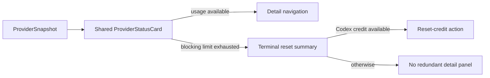

# 2026-07-15 — Finish unified provider-card terminal state

## Session 1: Exhausted cards, About links, and transparent window correction

**Status:** Complete; PR CI pending

### Affected components

- Popover and dashboard provider-card interactions
- In-dashboard About settings
- Dashboard window chrome
- Provider-card and settings smoke coverage

### What was done

- Centralized exhausted-card navigation policy in `ProviderStatusCard`, so every host suppresses hover, disclosure, and selection when a blocking limit is exhausted.
- Removed detail navigation from the exhausted Codex reset-credit variant while preserving the reset-credit action itself.
- Added the GitHub repository and `@shipshitdev` X account to About alongside the website.
- Marked the clear dashboard `NSWindow` non-opaque, completing the transparent titlebar setup.
- Added pure navigation-policy and About-link regression coverage.

### Key decisions

- The compact exhausted card is the terminal state. Opening a second panel that repeats quota rows adds no actionable information.
- Card height may still differ by state, but the popover, dashboard overview, and limits page now use the same component and the same interaction policy.
- Codex reset credits remain visible because they can immediately unblock usage.

### Files changed

- `MeterBar/Views/MenuBarView.swift`
- `MeterBar/Views/Settings/AboutSettingsView.swift`
- `MeterBar/Views/UsageDashboardView.swift`
- `MeterBarTests/LimitRowTests.swift`
- `MeterBarTests/SettingsViewSmokeTests.swift`

### Verification

- SwiftLint strict: zero violations on all changed Swift files.
- `git diff --check`: clean.
- Local tests/build intentionally not run per MacBook policy; use PR CI.

### Next steps

- [ ] Confirm PR CI and merge when the visual review is accepted.
