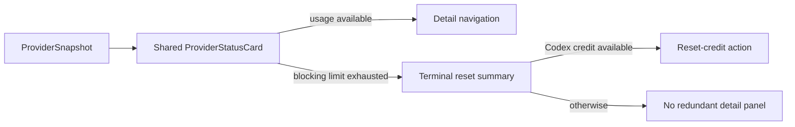
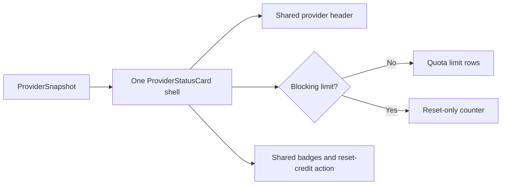

# 2026-07-15 — Finish unified provider-card terminal state

## Session 1: Exhausted cards, About links, and transparent window correction

**Status:** Complete; PR CI pending

### Affected components

- Popover and dashboard provider-card interactions
- In-dashboard About settings
- Dashboard window chrome
- Provider-card and settings smoke coverage

### What was done

- Centralized exhausted-card navigation policy in `ProviderStatusCard`, so every host suppresses hover, disclosure, and selection when a blocking limit is exhausted.
- Removed detail navigation from the exhausted Codex reset-credit variant while preserving the reset-credit action itself.
- Added the GitHub repository and `@shipshitdev` X account to About alongside the website.
- Marked the clear dashboard `NSWindow` non-opaque, completing the transparent titlebar setup.
- Added pure navigation-policy and About-link regression coverage.

### Key decisions

- The compact exhausted card is the terminal state. Opening a second panel that repeats quota rows adds no actionable information.
- Card height may still differ by state, but the popover, dashboard overview, and limits page now use the same component and the same interaction policy.
- Codex reset credits remain visible because they can immediately unblock usage.

### Files changed

- `MeterBar/Views/MenuBarView.swift`
- `MeterBar/Views/Settings/AboutSettingsView.swift`
- `MeterBar/Views/UsageDashboardView.swift`
- `MeterBarTests/LimitRowTests.swift`
- `MeterBarTests/SettingsViewSmokeTests.swift`

### Verification

- SwiftLint strict: zero violations on all changed Swift files.
- `git diff --check`: clean.
- Local tests/build intentionally not run per MacBook policy; use PR CI.

### Next steps

- [ ] Confirm PR CI and merge when the visual review is accepted.

## Session 2: Remove the second visual provider-card implementation

**Status:** Complete; installed visual verification passed

### Root cause

The previous consolidation renamed the surviving Swift type but kept two full
outer view trees: `compactExhaustedCard` and `expandedCard`. The code had one
type while the rendered app still had two visibly different card designs.

### What changed

- Deleted the compact exhausted card, its duplicate header, and the glass morph
  between card types.
- Kept one `DashboardTile` shell for every provider and every state.
- Limited exhausted-state branching to the middle body: a blocking reset counter
  replaces quota rows, while the shared header, status, badges, and optional
  Codex reset-credit footer remain unchanged.
- Retained terminal interaction behavior: blocked cards do not open a redundant
  detail panel.
- Updated regression test language to describe the single-shell contract.

### Verification

- SwiftLint strict: zero violations on all changed Swift files.
- Xcode Debug clean build succeeded for arm64.
- Installed and ad-hoc signed `/Applications/MeterBar Dev.app`; deep signature
  verification passed and the installed process launched successfully.
- Opened the real dashboard and captured visual evidence confirming both provider
  states now use the same card shell.

## Session 3: Remove opaque cards, terminal login cards, and Tahoe sidebar pill

**Status:** Complete; installed visual verification passed

### Root causes

- `ProviderStatusCard.allowsDetailNavigation` only checked exhaustion, so a
  no-data/login card still opened an empty secondary panel.
- Normal dashboard/settings cards used opaque `controlBackgroundColor`, while
  provider cards used a separate Liquid Glass surface. Both violated the single
  card-surface contract and produced dark-gray slabs over the tinted window.
- Tahoe's `NavigationSplitView` owns its floating sidebar container; clipping the
  nested `List` does not change that outer oversized radius.

### What changed

- Detail navigation now requires actual provider metrics in addition to an
  available selection action and a non-exhausted quota.
- Removed `DashboardTileSurface` and the provider-only glass branch. Every
  `DashboardTile` now uses the same `meterBarCardSurface` implementation.
- Replaced opaque normal card fills with one adaptive blue-green translucent
  tint that remains visibly non-gray on the dark popover shell, retaining an
  opaque semantic fallback only when Reduce Transparency is enabled.
- Initially replaced the floating split-view sidebar with a custom 8pt shell.
  Live user review showed that this changed the sidebar's material, selection,
  toolbar placement, and collapse behavior—not just its radius. Reverted that
  overreach and restored the exact native `NavigationSplitView` sidebar.
- Updated surface/navigation regression coverage and the design contract.

### Verification

- SwiftLint strict: zero violations on all changed Swift files.
- `git diff --check`: clean.
- Clean arm64 Debug build succeeded.
- Installed and ad-hoc signed `/Applications/MeterBar Dev.app`; deep signature
  verification passed.
- Captured the real active dashboard after restoring the native sidebar and
  retaining the shared translucent card surfaces.
