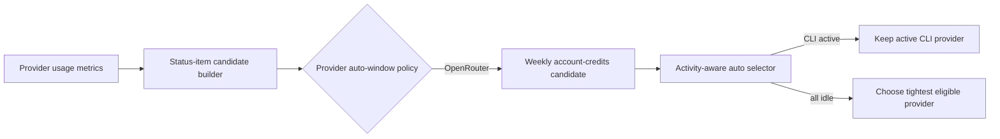

# 2026-07-16 — Restore OpenRouter automatic selection

## Session 1: OpenRouter menu-bar auto eligibility

**Status:** Complete; PR CI pending

### Affected components

- Menu-bar quota candidate construction
- Automatic provider selection policy
- Focused selector regression coverage

### What was done

- Added a testable provider-to-auto-window policy that keeps Claude/Codex on session,
  Cursor on weekly, and makes OpenRouter account credits eligible through weekly.
- Extracted the existing candidate-seed construction from `AppDelegate` so production
  wiring can be covered without exposing AppKit lifecycle code.
- Added coverage proving OpenRouter participates in the idle fallback while active
  CLI providers retain selection priority.

### Key decisions

- OpenRouter remains activity-neutral because it has no local CLI activity signal;
  successful API refresh time would make it permanently active.
- Grok remains excluded from automatic selection because no existing auto window is
  defined for it.

### Files changed

- `MeterBar/App/MeterBarApp.swift`
- `MeterBar/Models/StatusItemLimitSelector.swift`
- `MeterBarTests/StatusItemLimitSelectorTests.swift`

### Verification

- SwiftLint strict passed on all changed Swift files.
- `git diff --check` passed.
- Local SwiftFormat was unavailable.
- Local tests and builds were intentionally not run per the MacBook policy; PR CI is
  the execution gate.

### Next steps

- [ ] Confirm PR CI and review the automatic-selection behavior.
