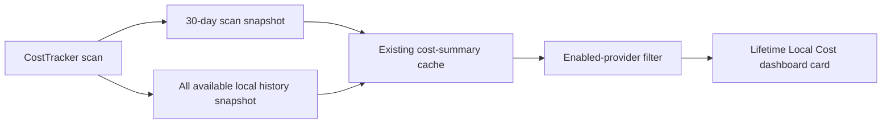
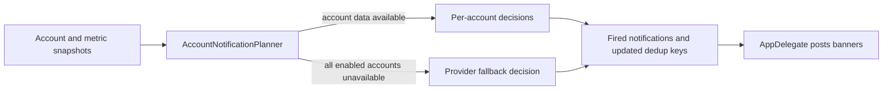
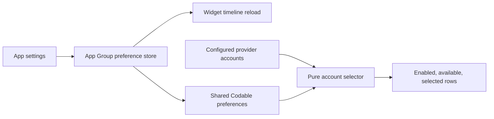

# Sessions: 2026-07-18

**Summary:** Lifetime local cost summary for issue #137

---

## Session 1: Add Lifetime Cost Summary

**Duration:** ~1 hour
**Status:** Complete; PR CI pending

### System Flow

### Affected Components

| Layer | Components |
|-------|------------|
| Models | `CostSummary`, `LifetimeCostSummary`, `LifetimeProviderCost` |
| Services | `CostTracker` local Claude and Codex scanning |
| UI | Costs dashboard lifetime summary card |
| Tests | Lifetime aggregation and cache compatibility |

### What was done

- [x] Added a pure lifetime aggregation with provider subtotals and tracked date range.
- [x] Rebuilt lifetime history from available local logs on every scan, replacing the cached snapshot instead of accumulating overlapping scans.
- [x] Stored lifetime data in the existing cost-summary cache with backward-compatible decoding.
- [x] Added a dashboard card for the lifetime total, provider reconciliation, loading, legacy-cache, and zero-history states.
- [x] Added focused model tests for multi-provider aggregation, empty and zero-cost histories, repeated scans, filtering, and cache compatibility.

### Files changed

- `MeterBar/Models/TokenCost.swift` - Added lifetime summary models and provider-aware filtering.
- `MeterBar/Services/CostTracker.swift` - Added all-history scanning and legacy-cache backfill.
- `MeterBar/Views/DashboardCostCards.swift` - Added the lifetime dashboard card.
- `MeterBar/Views/UsageDashboardView.swift` - Integrated the card into Costs.
- `MeterBarTests/LifetimeCostSummaryTests.swift` - Added focused aggregation and persistence coverage.

### Key decisions

- **Decision:** Keep the 30-day summary unchanged and add a lifetime snapshot to the same cache.
  - **Context:** Existing charts, provider breakdowns, and CLI windows rely on the current 30-day semantics.
  - **Rationale:** This preserves behavior while avoiding a second persistence path or a cache migration.
- **Decision:** Re-scan all available history and replace the lifetime snapshot.
  - **Context:** Merging overlapping 30-day scans cannot reliably deduplicate history without persisting event identities.
  - **Rationale:** A point-in-time rebuild uses the scanners' existing event deduplication and cannot compound totals across refreshes.

### Mistakes and fixes

- **Mistake:** The initial card treated a legacy cache with no lifetime field as a genuine zero-history result.
- **Fix:** Added a distinct scan-needed state and automatic background backfill for legacy caches.
- **Prevention:** Keep absence, loading, and valid-empty states explicit when extending persisted summaries.
- **Mistake:** The first local commit body preserved newline escape characters literally.
- **Fix:** Corrected the unpushed commit message before publication.

### Verification

- `swiftlint lint --strict --quiet` on all changed Swift files passed.
- `git diff --check` passed.
- Swift tests and builds were not run locally under the MacBook resource policy; PR CI is the execution gate.
- SwiftFormat is not installed locally.

### Next steps

- [ ] Let PR CI compile and run the focused lifetime-summary coverage.
- [ ] Review the lifetime card in light and dark appearances.
# 2026-07-18 — Extract account notification planning

## Session 1: Pure multi-account notification planner

**Status:** Complete; PR CI pending

### What was done

- Moved Claude and Codex account iteration, fallback selection, enablement cleanup,
  and sequential dedup-key threading into a pure service.
- Defined a no-duplicate namespace transition policy: switching between provider
  fallback and per-account data primes the new namespace without posting the same
  quota state again.
- Left `AppDelegate` as the side-effect adapter that gathers snapshots and posts
  returned notifications.
- Added focused coverage for account identity, fallback behavior, namespace
  transitions, provider/account disablement, stale data, unavailable accounts,
  and Claude-to-Codex key threading.

### Files changed

- `MeterBar/Services/AccountNotificationPlanner.swift`
- `MeterBar/Services/NotificationDecider.swift`
- `MeterBar/App/MeterBarApp.swift`
- `MeterBarTests/AccountNotificationPlannerTests.swift`

### Verification

- SwiftLint strict passed for all changed Swift files.
- `git diff --check` passed.
- Swift tests, typechecks, and builds were intentionally left to GitHub Actions
  under issue #224's CI-only verification contract.
# 2026-07-18 — Session Wake event hooks

## Session 1: Bounded local hooks for quota transitions

**Status:** Complete; PR CI pending

### What was done

- Added an opt-in executable path, literal argument vector, and separate toggles for quota exhausted, quota reset, and wake complete.
- Added a direct `Process` runner with an absolute-path requirement, sanitized environment, bounded stdout/stderr capture, timeout enforcement, and metadata-only diagnostics.
- Deduplicated quota transitions across watcher retries and serialized qualifying hook launches without allowing failures to change watcher state.
- Propagated hook configuration through the in-app watcher and managed launch agent with backward-compatible agent configuration decoding.
- Added Automation settings for exact executable/argv review, per-event enablement, and a bounded test run.
- Added focused coverage for persistence, opt-in behavior, literal argv, transition deduplication, output bounds, timeouts, and launch failures.

### Files changed

- `MeterBar/SessionWake/WakeEventHook.swift`
- `MeterBar/SessionWake/SessionWakeSettingsStore.swift`
- `MeterBar/SessionWake/SessionWakeController.swift`
- `MeterBar/SessionWake/SessionWakeAgent.swift`
- `MeterBar/SessionWake/SessionWakeAgentState.swift`
- `MeterBar/Views/SessionWakeSettingsView.swift`
- `MeterBar/Models/StorageKeys.swift`
- `MeterBarTests/WakeEventHookTests.swift`
- `MeterBarTests/SessionWakeAgentTests.swift`

### Decisions

- User arguments remain exact argv entries; event and provider metadata use fixed environment variables and are never interpolated.
- Automatic hooks inherit only a small non-secret environment instead of the app's complete process environment.
- Hook failures remain diagnostic-only and cannot stop, fail, or delay the Session Wake state machine.

### Verification

- `swiftlint lint --strict --quiet` passed for every changed app Swift file.
- `git diff --check` passed.
- Local tests and builds were intentionally not run under the MacBook verification policy; PR CI is the execution gate.
# Sessions: 2026-07-18

**Summary:** Shared widget preferences and deterministic account selection

---

## Session 1: Shared widget preference domain

**Duration:** ~30 minutes
**Status:** Complete

### System flow

### Affected components

- Shared app/widget preference model and App Group store
- Pure widget account filtering and ordering
- SwiftPM regression coverage

### What was done

- Added select-all and explicit stable account selection.
- Added used/remaining display mode, visible quota windows, reset/freshness details, and provider/urgency ordering.
- Added a pure selector that filters disabled or unavailable providers and accounts without deleting persisted intent.
- Added an injectable timeline-reload seam that fires once for each changed preference.
- Preserved the existing widget presentation as the default and left the cached-metrics wire contract unchanged.
- Added focused coverage for defaults, persistence, selection, filtering, ordering, stable identifiers, reloads, and older encodings.

### Files changed

- `Packages/MeterBarShared/Sources/MeterBarShared/WidgetPreferences.swift` - Shared preference domain, selector, and App Group store.
- `MeterBarTests/WidgetPreferencesStoreTests.swift` - Focused domain and persistence coverage.
- `.agents/sessions/2026-07-18.md` - Session record.

### Key decisions

- **Decision:** Store widget preferences in `MeterBarShared`.
  - **Context:** Both the app and widget extension must decode the same values without duplicating a contract.
  - **Rationale:** One module and one Codable representation prevent cross-target drift.
- **Decision:** Keep explicit identifiers when accounts become disabled, unavailable, or removed.
  - **Context:** Temporary account changes should not erase user intent.
  - **Rationale:** The pure selector can ignore ineligible rows now and restore them automatically if they return.
- **Decision:** Preserve weekly percentage-used provider ordering as the default.
  - **Context:** Issue #217 must not change current widget rendering before #218 applies preferences.
  - **Rationale:** Existing users retain the exact pre-preference behavior.

### Mistakes and fixes

- **Mistake:** Two initial test assertions chained a multiline selector call directly into `map`.
- **Fix:** Bound each selection result to a local value before mapping, satisfying the repository SwiftLint rule.

### Verification

- `swiftlint lint --strict --quiet Packages/MeterBarShared/Sources/MeterBarShared/WidgetPreferences.swift MeterBarTests/WidgetPreferencesStoreTests.swift` - passed.
- `git diff --check` - passed.
- SwiftFormat - unavailable locally.
- Swift tests, typechecks, and builds were not run locally per the issue's CI-only verification contract and MacBook resource policy.

### Next steps

- [ ] Let PR CI run focused tests, coverage, SwiftLint, and app/widget builds.

---

**Total sessions today:** 1
