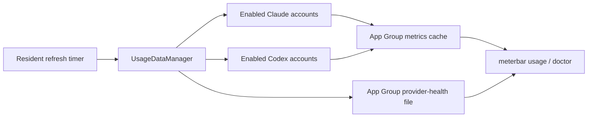
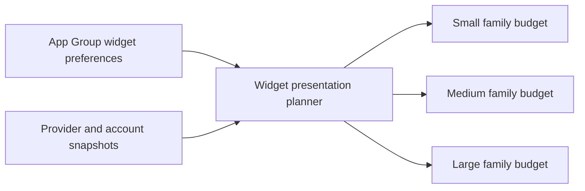

# 2026-07-19 — Provider freshness fault

## Session 1: Diagnose stale CLI provider snapshots

**Status:** Implementation complete; PR CI pending

### Affected components

- Provider refresh orchestration
- Shared app-group usage cache
- `meterbar doctor --json` and `meterbar usage --json` freshness reporting

### Root causes

- A failed default Claude fetch set the service's published `hasAccess` flag false.
  `UsageDataManager` then used that mutable result as a pre-fetch gate, so every
  later timer tick skipped Claude instead of retrying the real OAuth/CLI source.
- Provider health was written through App Group `UserDefaults`, but the unentitled
  bundled CLI resolved the ordinary preferences domain for the same suite name.
  The app and CLI therefore read different health records.
- Freshness was derived only from the health record's `lastSuccess`, allowing a
  newly written metrics payload to remain incorrectly marked stale.
- PR #227 already fixes ten-minute resident cadence, overlap protection, and wake
  catch-up. This fix stays complementary and does not duplicate that scheduler.

### What was done

- Removed the Claude `hasAccess` circuit-breaker from refresh orchestration; enabled
  accounts now retry through the authoritative fetch path and preserve cached data
  on failure.
- Added an injectable Claude provider seam and regression coverage for retrying when
  published access is false.
- Mirrored provider health to an atomic JSON file in the App Group container, with
  preference fallback/migration for existing installs.
- Made diagnostics reconcile health timestamps with the actual cached metrics
  `lastUpdated` value and replace contradictory "no refresh errors" copy when the
  persisted latest attempt failed.
- Added focused tests for cross-process preference divergence, fresh-payload
  precedence, and persisted refresh-failure reporting.

### Files changed

- `Packages/MeterBarShared/Sources/MeterBarShared/SharedMetricsStore.swift`
- `MeterBar/Services/ProviderParseHealthStore.swift`
- `MeterBar/Services/ProviderReadinessInspector.swift`
- `MeterBar/Services/UsageDataManager.swift`
- `MeterBarTests/ProviderParseHealthTests.swift`
- `MeterBarTests/ProviderReadinessInspectorTests.swift`
- `MeterBarTests/UsageDataManagerTests.swift`

### Verification

- Focused SwiftLint strict passed on every changed Swift file.
- `git diff --check` passed.
- Live installed-binary diagnosis confirmed the App Group metrics file was current
  while the CLI-read ordinary preferences record remained stale.
- Local Swift tests and builds were skipped per the MacBook policy; PR CI is the
  execution gate.
- SwiftFormat is unavailable locally.

### Mistakes and fixes

- **Mistake:** The first CI run found a missing explicit `return` in the
  multi-statement diagnostics `map` closure.
- **Fix:** Returned the constructed `ProviderReadiness` value explicitly and
  republished the branch for CI verification.

### Next steps

- [ ] Publish a ready-for-review pull request.
- [ ] Confirm tests, coverage, lint, secret scan, and app/widget/CLI builds in CI.

## Session 2: Restore CLI access to refreshed app metrics

**Status:** Implementation complete; PR CI pending

### Root cause

- The app refreshed Claude and Codex successfully, but a locally built CLI has
  no App Group entitlement. Its call to
  `containerURL(forSecurityApplicationGroupIdentifier:)` returned `nil`, so
  `meterbar usage --json` could not read the app's newly written metrics file.
- During live verification, the per-user `cfprefsd` process also wedged on an
  unrelated Session Wake preference write. Restarting that daemon restored
  normal app startup; no product workaround for the environmental fault was
  retained.

### What was done

- Kept the entitlement-resolved App Group container as the preferred location.
- Added a fallback to the existing canonical
  `~/Library/Group Containers/group.dev.meterbar.app` directory for
  non-sandboxed local builds and the installed CLI.
- Refused to create or assume a missing fallback directory.
- Added focused resolver coverage for entitlement preference, existing
  canonical fallback, and a missing-container result.

### Verification

- Focused SwiftLint strict and `git diff --check` passed.
- Explicitly requested Release app and CLI builds completed successfully.
- The signed app refreshed the shared file, and the rebuilt CLI reported fresh
  Claude and Codex timestamps from that file.
- `meterbar doctor --json` now reports both Claude and Codex healthy with recent
  successful refreshes.

### Next steps

- [ ] Publish and merge the focused pull request after CI passes.
- [ ] Rebuild and reinstall the app and CLI from merged `master`.

## Session 3: Deterministic widget preference rendering

**Status:** Implementation complete; PR CI pending

### What was done

- Added one pure shared planner for account selection, provider/urgency ordering,
  quota-window filtering, staleness, display modes, and exact overflow counts.
- Applied the planner to every widget family, including reset/freshness metadata,
  non-healthy indicators, and actionable no-selection and unavailable states.
- Bridged enabled Claude account snapshots into the existing shared account cache
  and persisted their per-account fallback data across launches.
- Kept the legacy OpenRouter remaining-balance text until the user explicitly
  chooses a display mode.
- Added focused regression coverage for all family budgets, detail-aware layout,
  ordering and display modes, selected windows, stale/missing data, overflow,
  and multi-account cache recovery.

### Decisions

- **Pure presentation policy:** WidgetKit views render planner output rather than
  independently selecting or sorting rows.
  - **Rationale:** One deterministic policy prevents family-specific drift and is
    directly testable without WidgetKit or new network access.
- **One unavailable placeholder per missing account:** Missing account data does
  not manufacture a row for every selected quota window.
  - **Rationale:** Unavailable placeholders stay honest without hiding healthy
    accounts behind artificial overflow.
- **Detail-aware row budgets:** Reset/freshness metadata lowers medium and large
  row capacity.
  - **Rationale:** Metadata remains visible without clipping system family layouts.

### Verification

- Repository and explicit changed-file SwiftLint strict checks passed with zero
  violations.
- `git diff --check` passed.
- Local Swift tests, typechecks, and builds were skipped per the MacBook policy;
  PR CI is the execution gate.
- SwiftFormat is unavailable locally.

### Mistakes and fixes

- **Mistake:** The first CI compile could not infer `ServiceType` for several
  shorthand dictionary keys in the new presentation tests.
- **Fix:** Added explicit `[ServiceType: UsageMetrics]` annotations to those
  fixtures and republished the branch.

### Next steps

- [ ] Publish the ready-for-review pull request for #218.
- [ ] Confirm app, widget, package, and focused test coverage in CI.
