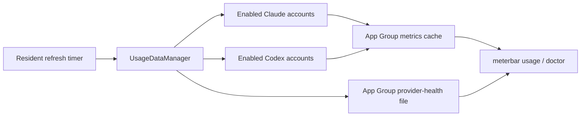

# 2026-07-19 — Provider freshness fault

## Session 1: Diagnose stale CLI provider snapshots

**Status:** Implementation complete; PR CI pending

### Affected components

- Provider refresh orchestration
- Shared app-group usage cache
- `meterbar doctor --json` and `meterbar usage --json` freshness reporting

### Root causes

- A failed default Claude fetch set the service's published `hasAccess` flag false.
  `UsageDataManager` then used that mutable result as a pre-fetch gate, so every
  later timer tick skipped Claude instead of retrying the real OAuth/CLI source.
- Provider health was written through App Group `UserDefaults`, but the unentitled
  bundled CLI resolved the ordinary preferences domain for the same suite name.
  The app and CLI therefore read different health records.
- Freshness was derived only from the health record's `lastSuccess`, allowing a
  newly written metrics payload to remain incorrectly marked stale.
- PR #227 already fixes ten-minute resident cadence, overlap protection, and wake
  catch-up. This fix stays complementary and does not duplicate that scheduler.

### What was done

- Removed the Claude `hasAccess` circuit-breaker from refresh orchestration; enabled
  accounts now retry through the authoritative fetch path and preserve cached data
  on failure.
- Added an injectable Claude provider seam and regression coverage for retrying when
  published access is false.
- Mirrored provider health to an atomic JSON file in the App Group container, with
  preference fallback/migration for existing installs.
- Made diagnostics reconcile health timestamps with the actual cached metrics
  `lastUpdated` value and replace contradictory "no refresh errors" copy when the
  persisted latest attempt failed.
- Added focused tests for cross-process preference divergence, fresh-payload
  precedence, and persisted refresh-failure reporting.

### Files changed

- `Packages/MeterBarShared/Sources/MeterBarShared/SharedMetricsStore.swift`
- `MeterBar/Services/ProviderParseHealthStore.swift`
- `MeterBar/Services/ProviderReadinessInspector.swift`
- `MeterBar/Services/UsageDataManager.swift`
- `MeterBarTests/ProviderParseHealthTests.swift`
- `MeterBarTests/ProviderReadinessInspectorTests.swift`
- `MeterBarTests/UsageDataManagerTests.swift`

### Verification

- Focused SwiftLint strict passed on every changed Swift file.
- `git diff --check` passed.
- Live installed-binary diagnosis confirmed the App Group metrics file was current
  while the CLI-read ordinary preferences record remained stale.
- Local Swift tests and builds were skipped per the MacBook policy; PR CI is the
  execution gate.
- SwiftFormat is unavailable locally.

### Mistakes and fixes

- **Mistake:** The first CI run found a missing explicit `return` in the
  multi-statement diagnostics `map` closure.
- **Fix:** Returned the constructed `ProviderReadiness` value explicitly and
  republished the branch for CI verification.

### Next steps

- [ ] Publish a ready-for-review pull request.
- [ ] Confirm tests, coverage, lint, secret scan, and app/widget/CLI builds in CI.
