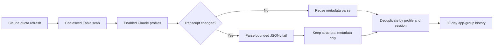

# 2026-07-20

## Session 1: Profile-attributed Fable session tracking

**Status:** Complete; PR CI and Fleet Review pending

### Affected components

- Claude multi-profile refresh orchestration
- Local Claude JSONL metadata scanning
- App-group persistence
- Focused scanner, store, privacy, and orchestration tests

### What was done

- Decomposed broad issue #232 into bounded child #242 and claimed only the child.
- Added per-profile Fable 5 discovery with bounded transcript tails, model normalization, profile/session deduplication, and active/completed/unknown lifecycle states.
- Added unchanged-file caching, non-overlapping background scheduling, and no-op persistence writes so quota refresh latency is unaffected.
- Added 30-day restart-safe history with defensive duplicate repair and stale-active aging.
- Persisted only source session ID, profile identity/name, normalized model, timestamps, and state; prompt/response content, credentials, cwd, and git metadata are discarded.
- Isolated unavailable or malformed profiles and exposed content-free diagnostics without blocking valid profiles.
- Added focused fixtures for attribution, model variants, lifecycle states, malformed/unavailable profiles, caching, persistence, duplicate repair, retention, privacy, path resolution, and refresh wiring.

### Key decisions

- Use the existing local Claude `projects/**/*.jsonl` source and existing model normalization rather than adding a provider API or CLI subprocess.
- Treat recent observations as active; inactive terminal stop reasons as completed; truncated, malformed, or otherwise incomplete observations as unknown.
- Key persistence by profile UUID plus source session ID so identical source IDs in separate profiles never collide.
- Keep presentation and CLI output out of #242; those remain follow-up work under parent #232.

### Files changed

- `MeterBar/Services/ClaudeFableSessionTracker.swift`
- `MeterBar/Services/UsageDataManager.swift`
- `MeterBar/Models/StorageKeys.swift`
- `MeterBarTests/ClaudeFableSessionTrackerTests.swift`
- `MeterBarTests/UsageDataManagerTests.swift`
- `.agents/SYSTEM/ARCHITECTURE.md`
- `.agents/SESSIONS/2026-07-20.md`

### Verification

- Strict SwiftLint passed with zero violations across all changed Swift files.
- `git diff --check` passed.
- Structured Fable review found three blockers; actor isolation, duplicate-persistence crash, and synchronous rescanning were fixed. Re-review passed with no blockers.
- The first PR CI run exposed an optional-to-`Any` conversion error in a JSON test fixture; the fixture now explicitly erases the optional string before falling back to `NSNull`.
- Local tests, typecheck, and builds were intentionally skipped under the MacBook verification policy; PR CI is the execution gate.
- SwiftFormat was unavailable locally.

### Next steps

- [ ] Let PR CI run Swift tests, coverage, lint, app/widget builds, and CLI build.
- [ ] Fleet Review must perform the exact-head gate before merge.
