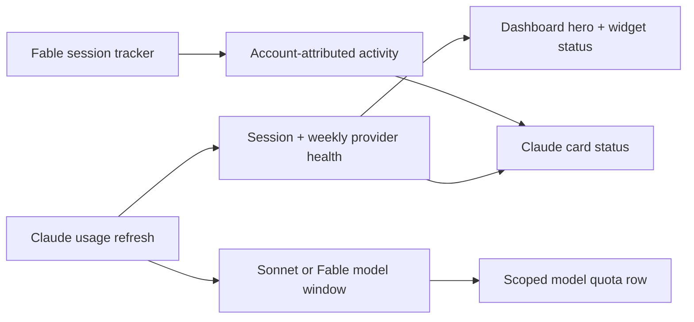

# 2026-07-23

## Session 1: Neutral macOS card and metric colors

**Status:** Complete

**What was done:**
- Replaced the custom cyan content-card wash with semantic AppKit background colors.
- Moved dashboard metric tint from the value to its indicator icon; values now use primary text.
- Kept quota and optimization status color where it communicates state.
- Updated the surface regression coverage and design guidance.

**Files changed:**
- `MeterBar/Views/MeterBarTheme.swift` - one neutral semantic content surface.
- `MeterBar/Views/DashboardCard.swift` - primary metric values and tinted indicator icons.
- `MeterBar/Views/UsageDashboardView.swift` - removed decorative green/blue metric tints.
- `MeterBar/Views/OptimizeInsightsView.swift` - adopted the indicator-tint API.
- `MeterBarTests/LiquidGlassP1RegressionTests.swift` - verifies native semantic surface colors.
- `.agents/DESIGN.md` - aligned the documented color system with the implementation.

**Decisions:**
- Use the already-opaque `NSColor.controlBackgroundColor` for cards in every transparency mode.
- Do not keep unused surface tokens or a separate Reduce Transparency branch when both paths render identically.
- Reserve semantic color for compact indicators rather than large metric typography.

**Next steps:**
- [x] Run SwiftLint and inspect the final diff.
- [ ] Use PR CI for tests/build verification.

## Session 2: Stabilize Share preview while scrolling

**Status:** Implementation complete; PR CI pending

### Root cause

- The Share receipt preview derives its height from the width proposed by the dashboard's vertical `ScrollView`.
- macOS can claim or release horizontal space for the vertical scroll indicator while scrolling.
- That gutter change altered the preview's proposed width, so its fixed 16:9 aspect ratio made the entire receipt appear to zoom.

### What was done

- Kept the dashboard's native scroll indicators and the user's system scrollbar preference intact.
- Derived an explicit preview width and height from the stable detail viewport rather than the scroll view's changing content proposal.
- Reserved the legacy vertical-scroller width so "Show scroll bars: Always" cannot overlap or resize the preview.
- Added regression coverage for responsive, capped, and constrained preview geometry.

### Verification

- Fable planning was unavailable due to quota, and the Opus fallback returned no usable result; the implementation used the recorded Sol fallback plan.
- Local builds, tests, and typechecks were skipped under the MacBook verification policy.
- Focused SwiftLint and `git diff --check` are the local gates; PR CI is the execution gate.

### Next steps

- [ ] Confirm tests and app build in PR CI.
- [ ] Complete exact-head Opus verification before merge.

## Session 3: Claude model status and Fable card activity

**Status:** Implementation complete; repaired CI test-target import and awaiting final gates

### Affected components

- Shared usage cache contract and widget presentation
- Claude OAuth and CLI usage mapping
- Popover/dashboard provider cards and dashboard hero
- CLI usage labels and quota notifications
- Fable session presentation

### What was done

- Created issue #252 after confirming the original Fable tracking/presentation issues #242 and #246 were closed.
- Separated provider-wide health from model-scoped quota severity: session and weekly windows drive the Claude card, dashboard hero, settings facts, and widget status; the Sonnet/Fable row retains its own exhausted state.
- Preserved the provider-reported model-window label through the shared cache so Fable is no longer hardcoded back to Sonnet; legacy caches decode without the additive optional field and render the neutral `Model` fallback.
- Added a compact account-attributed Fable 5 line to the shared Claude card with Active, Recent, and No activity states.
- Reused the existing tracker snapshot and 15-minute active-window policy without changing transcript scanning, retention, privacy, Settings history, or Fable CLI history output.
- Added regression coverage for status scope, global aggregation, widget state, label parsing/round-trips, legacy cache decode, notifications, account attribution, lifecycle aging, and card rendering.

### Key decisions

- A model quota can constrain that model without making the Claude provider unavailable; provider-level status therefore excludes model-scoped windows.
- Keep `codeReviewLimit` as the stable cache key and add only optional label metadata, avoiding a breaking shared-cache migration.
- Surface Fable activity on the existing shared provider card so popover and dashboard stay consistent; retain the detailed history under Settings.

### Verification

- Fable planning was unavailable because the Fable quota was exhausted; the required single Opus 4.8 fallback returned a usable structured plan.
- Strict SwiftLint passed with zero violations using `--no-cache`.
- `git diff --check` passed.
- SwiftFormat was unavailable locally.
- The first exact-head Opus review rejected the OAuth mapper because it only decoded `seven_day_sonnet`; the repair adds `seven_day_fable`, preserves the matched label, and adds OAuth contract coverage.
- Exact-head Opus reviews passed after the OAuth repair and the documentation-only ordering repair.
- The first PR CI run exposed a missing `MeterBarShared` import in the new Fable card rendering test. The production target compiled; the test-target import was repaired and pushed for a fresh CI run and exact-head review.
- Local tests, typechecks, and builds were skipped under the MacBook verification policy; PR CI is the execution gate.

### Mistakes and fixes

- **Mistake:** The first implementation preserved Fable labels from Claude CLI output but assumed the OAuth model window was always Sonnet.
- **Fix:** Decode both `seven_day_fable` and `seven_day_sonnet`, map the selected window and label together, and prefer Fable when the response contains it.
- **Mistake:** The new rendering test referenced shared usage types without importing the package module that owns them.
- **Fix:** Import `MeterBarShared` explicitly in `FableSessionHistoryTests`.

### Files changed

- `Packages/MeterBarShared/Sources/MeterBarShared/UsageMetrics.swift`
- `Packages/MeterBarShared/Sources/MeterBarShared/WidgetPresentation.swift`
- `MeterBar/Services/ClaudeCodeCLIUsageService.swift`
- `MeterBar/Services/ClaudeCodeLocalService.swift`
- `MeterBar/Services/NotificationDecider.swift`
- `MeterBar/Models/ClaudeFableSessionPresentation.swift`
- `MeterBar/Views/ProviderSnapshot.swift`
- `MeterBar/Views/MenuBarView.swift`
- `MeterBar/Views/UsageDashboardView.swift`
- `MeterBar/Views/Settings/ProviderSettingsView.swift`
- `MeterBarCLI/Sources/MeterBarCLI.swift`
- Focused tests under `MeterBarTests/`
- `.agents/SYSTEM/ARCHITECTURE.md`
- `.agents/SESSIONS/2026-07-23.md`

### Next steps

- [ ] Require green CI on the repaired head.
- [ ] Require an exact-head Opus PASS on the repaired head before merge.
