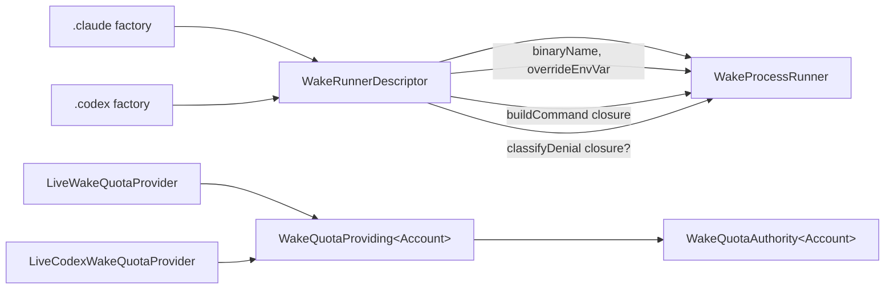

# 2026-07-24

## Session 1: DRY the Session Wake provider runners

**Status:** Implementation complete; SwiftLint clean; PR CI + exact-head Opus verification pending

### Affected components

- Session Wake process-execution seam (`WakeExecuting`)
- Session Wake quota-authority seam (fail-closed gate)
- Provider runtimes (Claude, Codex) and their orchestration call sites
- Wake unit tests

### Root cause / motivation

- Two near-identical provider runners (`WakeProcessRunner` for Claude, `CodexWakeProcessRunner` for Codex) shared ~170 lines of structure — revalidate cwd, take the lock, spawn with an argv, enforce timeout, honor cancellation, record a metadata-only log line — differing only along four axes: binary name, override env var, command builder, and an optional denial classifier.
- Two near-identical quota authorities (`WakeQuotaAuthority`, `CodexWakeQuotaAuthority`) differed only by account type.

### What was done

- Introduced `WakeRunnerDescriptor` — a `Sendable` value holding exactly the four axes that differ: `binaryName`, `overrideEnvVar`, a `@Sendable buildCommand` closure, and an optional `@Sendable classifyDenial` closure.
- Collapsed both runners into one generic `WakeProcessRunner: WakeExecuting` parameterized by a descriptor; added `.claude(...)` and `.codex(...)` static factories preserving every prior default argument.
- Made the quota seam generic: `WakeQuotaProviding<Account>` (primary associated type) and `WakeQuotaAuthority<Account>`, with `LiveWakeQuotaProvider` (Claude) and `LiveCodexWakeQuotaProvider` (Codex) as the two providers.
- Folded the Claude permission-denial classification into the Claude descriptor's `classifyDenial`; Codex's classifier is `nil` (its `approval_policy=never` runs can't stop at a permission gate, so a non-zero exit is always a plain failure).
- Repurposed `CodexWakeProcessRunner.swift` and `CodexWakeQuotaAuthority.swift` in place (removed their now-redundant types, kept the files) so all three build systems — the Xcode project's explicit membership, the root `Package.swift` glob, and the CLI `Package.swift` glob — stay in sync without any `.pbxproj`/manifest edits.
- Updated every call site (`ClaudeWakeRuntime`, `CodexWakeRuntime`, `WakeCLIEngine`, `WakeCoordinator`, `SessionWakeController`, `SessionWakeAgent`, `SessionWakeCLI`) to the generic authority type and the runner factories.
- Kept and adapted the existing wake tests; added focused descriptor-shape tests plus a Codex-runner argv/env/denial-as-failure test.

### Key decisions

- Parameterize only the four axes that genuinely differ — no speculative abstraction over the shared spawn/lock/timeout/log spine.
- Preserve behavior bug-for-bug: the Claude denial gate keys off the **raw requested** `permissionMode` (not the effective/acknowledged mode), so that exact `permissionMode != .bypass` guard lives inside the Claude classifier.
- Retain the lossy UTF-8 decode (with its `swiftlint:disable optional_data_string_conversion` wrap) for the bounded capture — strict decoding would drop a whole capture truncated mid-multibyte, disabling classification in exactly the long-output case the bounded sink exists for.
- Repurpose-in-place rather than delete files, to avoid touching three separate build manifests and risking drift between them.

### Verification

- Implementation delegated to Codex GPT-5.6 Sol at high effort with a self-contained contract (Codex is blind to the session); the main model planned, designed, and verified.
- `swiftlint lint --strict --quiet` (the exact CI command) passed with exit 0, no output.
- Full `git diff` reviewed against `master`: 16 modified files only; no added/deleted/untracked files; no `.pbxproj`/`Package.swift` changes.
- Outcome strings confirmed byte-for-byte preserved for both providers (`<bin> exited with status N`, `<bin> terminated by signal N`, `session timed out`, `<bin> binary not found`).
- Removed symbols (`CodexWakeProcessRunner`, `CodexWakeQuotaAuthority`, `CodexWakeQuotaProviding`) and the legacy `mapOutcome(_:permissionMode:)` confirmed fully absent.
- Local builds, tests, and typechecks skipped under the MacBook verification policy; PR CI is the execution gate.

### Files changed

- `MeterBar/SessionWake/WakeProcessRunner.swift` — generic runner + descriptor + `.claude` factories.
- `MeterBar/SessionWake/CodexWakeProcessRunner.swift` — repurposed to Codex descriptor + `.codex` factory (struct removed, file retained).
- `MeterBar/SessionWake/WakeQuotaAuthority.swift` — generic `WakeQuotaProviding<Account>` + `WakeQuotaAuthority<Account>`.
- `MeterBar/SessionWake/CodexWakeQuotaAuthority.swift` — repurposed to `LiveCodexWakeQuotaProvider` only (protocol + authority removed, file retained).
- `MeterBar/SessionWake/ClaudeWakeRuntime.swift`, `CodexWakeRuntime.swift`, `WakeCLIEngine.swift`, `WakeCoordinator.swift` — generic authority typing + runner factory wiring.
- `MeterBar/SessionWake/SessionWakeController.swift`, `SessionWakeAgent.swift`, `SessionWakeCLI.swift` — runner factory call sites.
- `MeterBarTests/WakeRunnerTests.swift`, `CodexWakeQuotaTests.swift`, `WakeCLIEngineTests.swift`, `WakeCoordinatorTests.swift`, `CodexSessionDiscoveryTests.swift` — adapted + new coverage.
- `.agents/SESSIONS/2026-07-24.md`

### Next steps

- [ ] Require green CI on the pushed head.
- [ ] Require an exact-head Opus 4.8 PASS before merge.
