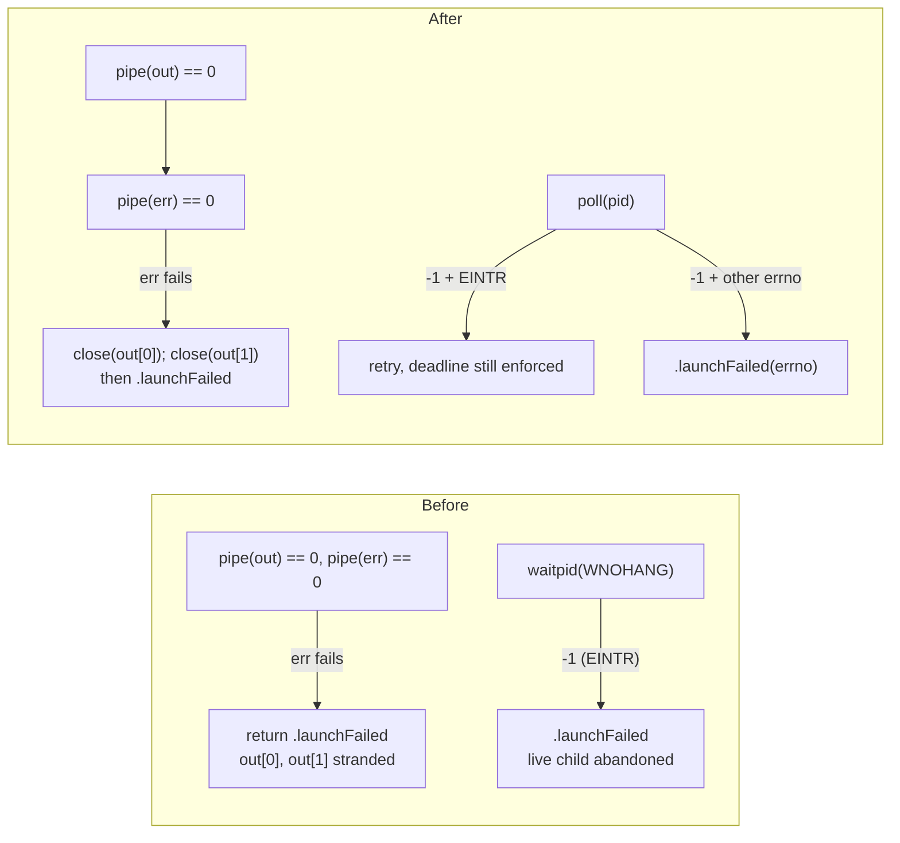
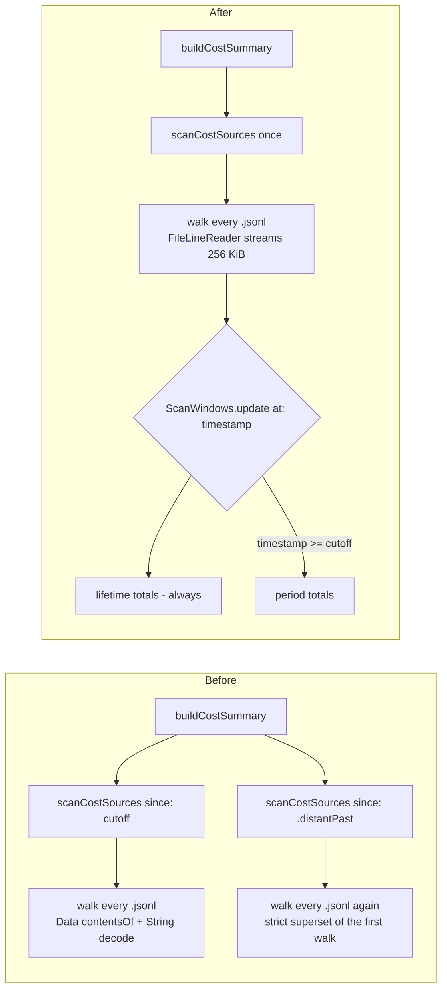
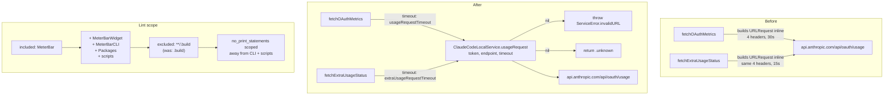

# 2026-07-25

## Session 1: Per-account menu bar status items and a merged account switcher (#266)

**Status:** Implementation complete; focused test target green (53 tests); SwiftLint clean; PR CI + exact-head verification pending

```mermaid
flowchart LR
    Claude[ClaudeCodeAccountStore] --> Catalog[MenuBarAccountCatalog]
    Codex[CodexAccountStore] --> Catalog
    Vis[ProviderVisibilityStore] --> Catalog
    Catalog -->|sanitized MenuBarAccountIdentity| Planner[MenuBarStatusItemPlanner]
    Store[MenuBarAccountSelectionStore] -->|mode + keys + mergedKey| Planner
    Planner --> Plan[MenuBarStatusItemPlan]
    Plan --> Diff[MenuBarStatusItemDiff]
    Diff --> Ctrl[MenuBarStatusItemController]
    Ctrl -->|one NSStatusItem per entry| Bar[Menu bar]
    Cand[StatusLimitCandidate] --> Filter[MenuBarStatusItemCandidateFilter]
    Plan --> Filter
    Filter --> Sel[StatusItemLimitSelector]
    Sel -->|per-item title| Bar
    Ctrl -->|right-click| Switcher[MenuBarAccountSwitcher]
> Sessions 1–10 of this day are documented in the sibling audit-follow-through PRs
> (#259–#284), each of which carries its own entry for the same file. This branch
> is based on `master`, so it starts the day file at its own session; the merge
> resolution for the resulting add/add conflict is "take the superset".

## Session 11: Split `MenuBarView.swift` (audit C1c)

**Status:** Implementation complete; SwiftLint `--strict` clean; PR CI + exact-head Opus verification pending

```mermaid
flowchart TB
    subgraph before[Before — MenuBarView.swift, 958 lines]
        V1[MenuBarView<br/>4 private geometry constants<br/>3 clamp computed props]
        V2[notifyContentSize<br/>re-derives the clamp chain BY HAND]
        V3[PopoverHeaderStatusDots + summary text]
        V4[PopoverOverviewPanel]
        V5[ProviderStatusCard<br/>+ status color/text<br/>+ reset-credit alert copy<br/>+ fable activity row]
        V6[PopoverCardID / frames preference / view modifier]
        V1 -.->|two independent copies<br/>of one rule| V2
    end
    subgraph after[After — 285-line shell + 8 collaborators]
        G[MenuBarPopoverGeometry<br/>statics + 4 pure functions]
        S[MenuBarHeaderStatusDots]
        F[PopoverCardFrames]
        P[ProviderCardPresentation]
        R[ProviderCardResetCredit]
        A[ProviderCardFableActivityRow]
        O[PopoverOverviewPanel]
        C[ProviderStatusCard]
        Shell[MenuBarView<br/>state + wiring only]
        Shell --> G
        Shell --> S
        Shell --> F
        Shell --> O
        O --> C
        C --> P
        C --> R
        C --> A
        G -->|body renders with| Shell
        G -->|notifyContentSize reports with| Shell
## Session 1: Promote providers into the settings sidebar
## Session 1: Fix Codex model attribution and rollout scan coverage

**Status:** Implementation complete (TDD); SwiftLint clean; PR CI + exact-head verification pending

```mermaid
flowchart LR
    subgraph rollout[One rollout .jsonl, streamed in order]
        Meta[session_meta<br/>originator] --> Ctx[turn_context<br/>model]
        Ctx --> Tok[event_msg/token_count<br/>usage only, no model]
    end
    Meta -->|carried forward| RC[CodexRolloutContext]
    Ctx -->|carried forward| RC
    RC --> Attr[addCodexTokenCountLine]
    Tok --> Attr
    Attr --> Ctxt[CodexScanContext<br/>modelTotals / originTotals]
    Arch[$CODEX_HOME/archived_sessions] --> Scan[scanCodexRollouts]
    Live[$CODEX_HOME/sessions/YYYY/MM/DD] --> Scan
    Scan --> Attr
    Ctxt --> BD[makeBreakdowns<br/>pricingForName: ModelPricing.codex for:]
## Session 1: Promote Grok Build to a first-class provider (#267)

**Status:** Implementation complete; PR CI + exact-head verification pending

```mermaid
flowchart TD
    Svc[GrokCLIUsageService] -->|spawn| Agent[GrokAgentProcess]
    Agent -->|own process group, 512 KB cap| Buf[GrokLineBuffer]
    Buf --> RPC[GrokBillingRPC.TranscriptReader]
    RPC -->|initialize / authenticate / _x.ai billing| Result[GrokBillingResult]
    RPC -->|transport failure| Fail[GrokRefreshFailure]
    Result -->|tolerant decode| Map[GrokCLIUsageService.map]
    Map -->|session + weekly + ExtraUsageStatus| Metrics[UsageMetrics]
    Map -->|no readable percent| Parse[ServiceError.parsingError]
    Parse --> Health[ProviderParseHealthStore]
    Fail --> Sanitize[ProviderReadinessInspector.sanitize]
    Sanitize --> Ready[ProviderReadinessEvaluator.grok]
    Ready --> Dash[Diagnostics view]
    Ready --> Doctor[meterbar doctor]
## Session 1: Centralize on-disk permission policy (audit S1, S2, D3, B4)

**Status:** Implementation complete; SwiftLint clean; PR CI + exact-head Opus verification pending

```mermaid
flowchart LR
    Sidebar[Settings sidebar List] --> Item[SettingsSidebarItem]
    Item -->|.section| Page[Settings pages]
    Item -->|.provider| Detail[ProviderSettingsView service:]
    Nav[DashboardNavigationStore] --> Item
    Enabled[ProviderVisibilityStore.enabledServices] --> Rows[Provider rows]
    Rows --> Sidebar
    Catalog[ProviderCatalogSettingsView] -->|All Providers row| Sidebar
    Catalog -->|toggle| Enabled
    Facts[ProviderSettingsFacts.live] --> Dot[Sidebar health dot]
    Facts --> Detail
    subgraph before[Before]
        A1[write to: options .atomic] --> A2[file published at umask 0644]
        A2 --> A3[chmod 0600]
        A3 -.->|window| Leak[Any local process can open + hold fd]
    end
    subgraph after[After]
        B1[open O_EXCL on .staging] --> B2[fchmod forces mode]
        B2 --> B3[write loop EINTR/partial safe]
        B3 --> B4[close + rename]
        B4 --> B5[never reachable at a loose mode]
    end
    Callers[CostSummaryStore / SharedDataStore / ProviderParseHealthStore<br/>ClaudeFableSessionTracker / UsageRefreshConfigurationStore<br/>ReplayLedger / ClaudeCodeReconnectService] --> SFW[SecureFileWriter]
    WakePaths --> SFW
    WakeRunLogger -->|append-only| SFW
```

### Affected components

- Menu bar status-item lifecycle (`AppDelegate`, previously a single `NSStatusItem`)
- Status-item title selection pipeline (`StatusItemLimitSelector` candidates)
- Persisted display preferences (`StorageKeys`, new selection store)
- Settings → General configuration UI
- Unit tests

### Root cause / motivation

- MeterBar already scopes usage reads per account via `CLAUDE_CONFIG_DIR` / `CODEX_HOME`, but the menu bar exposed exactly one `NSStatusItem` bound to whatever the Auto/pin heuristic picked. A user running work + personal Claude alongside Codex could see only one of them at a time.
- Menu-bar slots are positional: re-creating an `NSStatusItem` moves it to the end of the bar. Any multi-item design therefore needs identity-stable reconciliation, not teardown-and-rebuild.

### What was done

- **`MenuBarAccountSelection.swift`** — `MenuBarAccountDisplayMode` (`.single` / `.perAccount` / `.merged`), stable `MenuBarAccountKey` (`<service>:<uuid>`), `MenuBarAccountLabel` (the single sanitizing seam), `MenuBarAccountIdentity`, and `MenuBarAccountCatalog` which folds "account disabled" and "provider untracked" into one `isEnabled` flag.
- **`MenuBarStatusItemPlanner.swift`** — pure planning: `MenuBarStatusItemPlan(mode:entries:)`, a documented `maximumConcurrentItems = 4` cap, `MenuBarStatusItemDiff.between(existing:desired:)`, `MenuBarAccountSwitcher` (list + wrap-around cycle), and `MenuBarStatusItemCandidateFilter` scoping the shared candidate set to one account.
- **`MenuBarAccountSelectionStore.swift`** — UserDefaults-backed persistence with `select` / `deselect` / `setSelected` returning a `MenuBarAccountSelectionOutcome`, so a cap rejection is explained rather than silently dropped. Persisted lists are de-duplicated and capped on load.
- **`MenuBarStatusItemController.swift`** — owns the live `NSStatusItem` dictionary, reconciles add/remove only, routes clicks by plan-entry id, and exposes `primaryButton` (last-clicked, falling back to first) as the popover anchor.
- **`MeterBarApp.swift`** — replaced the single `statusItem` with the controller; per-item `shownStatusItemKeys`; `refreshStatusItemPlan()` on every selection/account change; per-item title application; the merged item's right-click account switcher; `StatusLimitSource`/`StatusLimitCandidate` gained an `accountKey`.
- **`GeneralSettingsView.swift`** — new "Menu Bar Accounts" section: layout picker, per-account toggles with the cap notice, and the merged-mode account picker.
- **`README.md`** — documented the 4-item cap in Features.

### Key decisions

- **Merged mode uses a fixed item id (`"merged"`) with a changing `accountKey`.** Switching accounts retitles the live item in place instead of destroying and recreating it, which would move it to the end of the menu bar.
- **The aggregate entry carries an empty badge.** `statusButtonTitle(badge:value:)` therefore emits exactly `" \(title)"` in `.single` mode — byte-identical to pre-#266 output, so an installation that never opts in sees no change.
- **Sanitization happens at construction, not at render.** `MenuBarAccountCatalog` builds only sanitized identities, and `statusLimitProbeRequests(in:)` sanitizes names on the tooltip path. Account names are user-supplied and frequently pasted config-dir paths; `MenuBarAccountLabel.displayName` reduces to the last path component, flattens control/whitespace scalars, collapses runs, and truncates at 18 chars — a full `CLAUDE_CONFIG_DIR` path can never reach the menu bar or a menu.
- **Disabled accounts are listed inert in the switcher, not omitted.** A `nil` action leaves the item disabled under `NSMenu.autoenablesItems`, so the menu explains why an account holds no status item.
- **Empty selection falls back to the aggregate item.** Disabling every selected account must not leave the user without a menu bar.
- **The cap is 4.** Conservative enough to fit a laptop-width menu bar (macOS silently hides overflow items) while covering the common work + personal × Claude + Codex setup.
- **New pure logic lives in `Models/` and `Services/`.** `Package.swift` excludes `App/MeterBarApp.swift` from the test target, so anything under test had to sit outside that file — hence the planner/catalog/store split and a thin, untested `AppDelegate` seam.

### Verification

- `swift test --filter "MenuBarAccountSelectionTests|MenuBarStatusItemPlannerTests|StatusItemLimitSelectorTests"` → **53 tests, 0 failures**. Tests were written before the implementation per repo policy.
  - `MenuBarAccountSelectionTests` (17): sanitization incl. an explicit "never leaks a config-directory path" case, badge derivation, catalog key stability, disabled folding, legacy defaults, persistence across relaunch, cap rejection, deselect ordering, normalization of hand-edited defaults.
  - `MenuBarStatusItemPlannerTests` (16): single/per-account/merged planning, distinct same-provider badges, disabled-account removal without disturbing the remaining items or their order, aggregate fallbacks, cap enforcement, merged slot stability across an account change, switcher listing/cycling, diff add/remove/retain, candidate scoping.
  - `StatusItemLimitSelectorTests` (20): pre-existing suite, unchanged behavior after the `accountKey` addition.
- `swiftlint lint --quiet` on all changed files → clean.
- Local builds and typechecks skipped under the MacBook verification policy. `MeterBar/App/MeterBarApp.swift` is excluded from the SwiftPM target, so its compile is covered by PR CI's Xcode build, not by the focused test run.

### Mistakes and fixes

- Assumed the account stores lived under `MeterBar/Services/`; they are in `MeterBar/Models/ClaudeCodeAccount.swift` and `CodexAccount.swift`. Found by grepping for the class declarations.
- Initially used dynamic `Self.createMenuBarIcon()` inside an escaping closure in a non-final class; changed to `AppDelegate.createMenuBarIcon()`.
- SwiftLint flagged an unneeded synthesized initializer on `MenuBarStatusItemPlanEntry`, an `array_init` violation in the store, `multiline_arguments` in the planner tests, and `attributes` placement on two `@ViewBuilder` vars. All fixed, re-linted, and re-tested.

### Files changed

- `MeterBar/Models/MenuBarAccountSelection.swift` — new: modes, keys, sanitizing label seam, identity, catalog.
- `MeterBar/Models/MenuBarStatusItemPlanner.swift` — new: plan, cap, diff, switcher, candidate filter.
- `MeterBar/Services/MenuBarAccountSelectionStore.swift` — new: persisted selection + cap outcomes.
- `MeterBar/App/MenuBarStatusItemController.swift` — new: multi-`NSStatusItem` reconciliation and click routing.
- `MeterBar/App/MeterBarApp.swift` — single-item lifecycle replaced by the controller; per-item titles; switcher menu; account-scoped candidates; sanitized tooltips.
- `MeterBar/Models/StatusItemLimitSelector.swift` — `accountKey` threaded through candidates and seeds.
- `MeterBar/Models/StorageKeys.swift` — three new menu-bar account keys.
- `MeterBar/Views/Settings/GeneralSettingsView.swift` — "Menu Bar Accounts" section.
- `MeterBarTests/MenuBarAccountSelectionTests.swift`, `MeterBarTests/MenuBarStatusItemPlannerTests.swift` — new suites.
- `README.md` — documented the 4-item cap.
- Dashboard settings shell + navigation store (`UsageDashboardView`)
- Provider settings page (`ProviderSettingsView`)
- New provider catalog page (`ProviderCatalogSettingsView`)
- General settings page (duplicate toggle list removed)
- Legacy `Settings` scene shell (`SettingsView`)

### Root cause / motivation

- Providers were selected by a horizontal segmented `Picker` **inside** the Providers settings page — two navigation layers for one hierarchy (sidebar → page → provider), and a control whose width grows with every provider added.
- The redesign had to survive scale: a segmented strip is unusable well before 10 providers, let alone 60.

### What was done

- Added `SettingsSidebarItem` (`.section` | `.provider`) so the sidebar's `List(selection:)` can address pages and providers with one binding, plus `SettingsSidebarModel` holding the pure row-composition rules (ordering, app pages, catalog page) so they're testable without hosting a view.
- Extended `DashboardNavigationStore` with `selectedSettingsProvider`, `settingsSidebarItem`, `selectSettingsItem(_:)`, and `settingsProvidersChanged(enabledServices:)`; `openSettings(_:)` now clears any focused provider.
- Rewrote the settings sidebar as two groups: **Settings** (app pages) and **Providers** (one row per *tracked* provider — logo, name, health dot — followed by an **All Providers** row).
- Gave `ProviderSettingsView` a `let service: ServiceType` and deleted the segmented picker and its `selectedProviderTab` state; the page now renders whichever provider the sidebar selected.
- Extracted `ProviderSettingsFacts.live(for:snapshots:)` — the single `ServiceType` switch over live provider state — shared by the provider page's Status row and the sidebar's health dot.
- Added `ProviderCatalogSettingsView`: every provider in `ServiceType.allCases`, each with a summary, live status, tracking toggle, and a chevron into its page (shown only for tracked providers, since only those have a sidebar row to highlight).
- Removed the now-duplicate "Tracked Providers" toggle list from the General page; its per-provider copy moved to the catalog.
- Repointed the legacy `Settings` scene's Providers tab at the catalog, so no nested provider picker survives anywhere.
- Wrote `SettingsSidebarNavigationTests` first (TDD): row composition, catalog completeness, tag-identity collisions, and every navigation-store transition, plus render smoke tests for both new/changed views.

### Key decisions

- **Sidebar rows come from `enabledServices`, not `allCases`.** The Providers group stays a handful of rows at any catalog size; the catalog page is what scales. This is the same code at 5 providers and at 60.
- **`SettingsSection.providers` was repurposed rather than removed** — it now backs the "All Providers" catalog page. Keeps `SettingsSection.allCases` (and `WidgetSettingsTests`' assertion on it) intact, and gives the two existing `showSettings(.providers)` deep links from the menu bar a better destination than before: a page you can enable a provider from.
- **Untracked providers are not selectable.** The catalog's chevron is hidden/disabled when a provider is off, so the sidebar can never hold a selection it has no row for; turning the selected provider off from its own page falls back to All Providers.
- **One facts builder, not two switches.** The sidebar dot and the page's Status row derive from the same `ProviderSettingsFacts.live`, so they cannot drift and adding a provider touches one switch.
- **Deferred:** the searchable "Add provider…" flow and `.searchable` on the sidebar — not worth the surface at 5 providers; revisit around 10.

### Verification

- SwiftLint clean across `MeterBar` and `MeterBarTests` (exit 0).
- New files land in both build systems without manifest edits: the Xcode project syncs the `MeterBar` folder (`PBXFileSystemSynchronizedRootGroup`) and `Package.swift` targets are path-based.
- Confirmed no remaining references to the removed picker state or the duplicated facts switch; confirmed both `showSettings(.providers)` call sites still resolve sensibly.
- Local builds, tests, and typechecks skipped under the MacBook verification policy; PR CI is the execution gate.

### Files changed

- `MeterBar/Views/UsageDashboardView.swift` — `SettingsSidebarItem`, `SettingsSidebarModel`, navigation-store provider selection, two-group sidebar, provider/page content split.
- `MeterBar/Views/Settings/ProviderSettingsView.swift` — takes a `service`; picker and duplicated facts switch removed.
- `MeterBar/Views/Settings/ProviderSettingsFacts+Live.swift` — new shared live-facts builder.
- `MeterBar/Views/Settings/ProviderCatalogSettingsView.swift` — new All Providers catalog page.
- `MeterBar/Views/Settings/GeneralSettingsView.swift` — duplicate tracked-provider toggles removed.
- `MeterBar/Views/SettingsView.swift` — legacy Providers tab points at the catalog.
- `MeterBarTests/SettingsSidebarNavigationTests.swift` — new coverage.
- `CostTracker` Codex rollout scan and per-model/per-origin attribution
- Shared pricing table (`MeterBarShared.ModelPricing`)
- Usage dashboard "Spend by model" / "Spend by origin" breakdowns (downstream, unchanged code)

### Root cause / motivation

Two questions about the 30 Day Spend card:

1. **"Why is June empty?"** — Not a bug. The window is 30 calendar days ending today (Jun 26 → Jul 25), so Jun 1–25 was never in scope. Inside the window, Jun 27 – Jul 6 is genuinely empty *on disk*: verified at entry-timestamp level (Claude entries Jun 26 = 108, Jun 27–Jul 6 = 0, Jul 8 = 2,312, Jul 9 = 11,574; Codex token events Jun 26 = 270, Jun 27–Jul 6 = 0, Jul 7 = 1,555). Oldest surviving Claude transcript anywhere is 2026-06-10. Logs were pruned/rotated; unrecoverable.
2. **"Why is everything 'Unknown model'?"** — Real bug, three compounding causes:
   - A Codex `token_count` event carries **no model**. The model is declared in a separate `turn_context` event. `codexModelName` only inspected the usage event itself, so it returned `nil` for 100% of real Codex spend → `"Unknown model"`.
   - The scan only walked `$CODEX_HOME/archived_sessions`. Codex archives a rollout **only when the session closes**, so every still-open session was silently dropped — 247 files in `$CODEX_HOME/sessions`, zero filename overlap, 4,992 in-window events across Jul 12/13/15/16/19/23/24.
   - The origin label was hardcoded `"Codex CLI"` while the real `session_meta.originator` values are `Codex Desktop` (480 files), `codex_exec` (118) and `Claude Code` (2).

### What was done

- Added `CodexRolloutContext` — per-file attribution state (`turnModel`, `sessionModel`, `originator`), reset on every rollout so one file never labels another's spend.
- Renamed `scanCodexArchivedSessions` → `scanCodexRollouts` and made it stream each file in order: non-usage lines update the rollout context, `token_count` lines are attributed against it.
- Added `codexRolloutDirectories(in:)` returning `archived_sessions` + `sessions`; `scanCodexSessions` now loops over both. `FileManager.enumerator` recurses, so the nested `sessions/YYYY/MM/DD/` layout is covered.
- Read `originator` from `session_meta` instead of hardcoding `"Codex CLI"` (the hardcoded string survives only as the no-context fallback).
- Added named `gpt-5.6-sol` / `-terra` / `-luna` rows and a `ModelPricing.codex(for:)` lookup; wired it into `makeBreakdowns` via a new optional `pricingForName` resolver.
- Tests written **first** (TDD): 7 new `CostTracker` tests + 1 new `ModelPricing` test; 3 existing tests renamed to the new entry point.

### Key decisions

- **Cross-directory dedup rides the existing `eventKeys` content hash**, not filename skipping. A rollout can exist *partially* in both directories mid-archive; hashing each event (`timestamp-session-input-cached-output-reasoning`) is correct in that case, filename skipping is not.
- **Event-level model still wins over `turn_context`.** Older rollouts stamped the model inside `info`; precedence is event → `turn_context` → `session_meta`. This also keeps the pre-existing (unrealistic) `codexTokenLine` fixture meaningful as a legacy-path regression test rather than deleting it.
- **`session_meta.model` is read even though it is `null` in all 600 sampled rollouts** — it costs one line and pre-turn events get named the day Codex populates it.
- **Per-model pricing wired into `makeBreakdowns` only, not the aggregate total.** Every published Codex slug bills at the same rate today, so rows still reconcile exactly with the provider total; the named rows exist so a future divergence is a one-line table edit instead of a re-plumb.
- **Mid-session model switches are real** — 2 of 200 sampled files carry two distinct `turn_context` models — so attribution follows the *last seen* model rather than a single per-file value. Covered by `testScanCodexRolloutsFollowsMidSessionModelSwitch`.

### Verification

- Empirics gathered directly from `~/.codex` before writing code: line ordering (`session_meta` 0 → `turn_context` 8 → `token_count` 16+), distinct-model-per-file histogram, originator histogram, null-`session_meta.model` check, directory overlap.
- `swiftlint lint --quiet` passed with exit 0, no output.
- New scan path matches the existing codebase pattern — `MeterBar/SessionWake/CodexSessionDiscovery.swift:47` already resolves `<CODEX_HOME>/sessions`.
- No stale `scanCodexArchivedSessions` references remain in Swift source (only in historical docs/session logs, left as point-in-time records).
- Local builds, tests, and typechecks skipped under the MacBook verification policy; PR CI is the execution gate.

### Mistakes and fixes

- **Mistake:** SourceKit reported `Cannot call value of non-function type 'TokenPricing'` at the `ModelPricing.codex(for:)` call sites.
- **Fix:** Judged to be stale indexing of the just-edited `MeterBarShared` module, not a real error — a static property `codex` and a static method `codex(for:)` have distinct declaration names and legally coexist (Foundation ships `URL.path` alongside `URL.path(percentEncoded:)`). Left the API as designed; CI settles it.
- **Prevention:** Treat a diagnostic that appears only in a freshly-edited local package module, with no corresponding language rule, as index lag — confirm against a shipping stdlib precedent before renaming a public API around it.

### Files changed

- `MeterBar/Services/CostTracker.swift` — `CodexRolloutContext`; `codexRolloutDirectories(in:)`; `scanCodexRollouts` (renamed, now streaming); `updateCodexRolloutContext`; `addCodexTokenCountLine`; `codexEventPayload(in:type:)`; `makeBreakdowns` `pricingForName` parameter and the Codex call site.
- `Packages/MeterBarShared/Sources/MeterBarShared/ModelPricing.swift` — three named Codex slugs + `codex(for:)`.
- `MeterBarTests/CostTrackerTests.swift` — 5 realistic rollout fixture helpers, 3 renames, 7 new tests.
- `MeterBarTests/ModelPricingTests.swift` — `testCodexLookupResolvesNamedModelsAndFallsBack`.
- `.agents/SYSTEM/ARCHITECTURE.md` — Codex scan scope corrected to both rollout directories + the attribution model.
- Grok usage service and its ACP stdio transport
- Shared readiness evaluation (`MeterBarShared`)
- Diagnostics surfaces (dashboard report + `meterbar doctor`)
- Parse-health tracking
- Provider visibility defaults and settings copy

### Root cause / motivation

- Grok Build was opt-in and lightly integrated: a single flat percent, no reset
  times, no `ExtraUsageStatus`, no readiness hints, and an unsupervised
  subprocess. Any upstream schema drift either crashed the decode or reported a
  fabricated 0%, which is worse than reporting nothing.
- Every other provider (Claude, Codex, Cursor) already degrades to an honest
  unknown, feeds `ProviderParseHealthStore`, and produces a specific recovery
  hint. Grok did none of it.

### What was done

- **Tolerant decoding.** `GrokCodingKey` (dynamic keys + camel→snake variants),
  `GrokNumber` (bare, quoted, and wrapper-object numbers keyed `val`/`value`/
  `amount`/`usd`/`cents`), and `GrokDecoding` helpers where an unreadable field
  is *absent* rather than fatal. The billing config is found under `config`,
  `billingConfig`, `billing`, or the outer object itself.
- **Shared window model.** Quota periods are classified by their declared type
  token, falling back to duration (`<= 24h` → session, else weekly), and mapped
  onto `UsageLimit` with real `resetTime` + `windowSeconds` so pace and
  projection work. `creditUsagePercent` may back-fill the *weekly* window only —
  synthesizing a session percent from an account-wide number is exactly the
  fabricated reading this mapping exists to avoid.
- **`ExtraUsageStatus`.** Prepaid balance and on-demand credits map onto the
  shared extra-usage model, including the `unknown` state when the fields are
  missing.
- **Honest unknown.** When no window carries a readable percent, `map` throws
  `.invalidResponse` → `ServiceError.parsingError`, which `UsageDataManager`
  already records as a shape mismatch in `ProviderParseHealthStore`.
- **Readiness hints.** New closed enum `GrokRefreshFailure` (not signed in,
  agent start failed, agent timed out, unparseable response, unsupported
  version, request failed) with constant, interpolation-free messages plus a
  recovery step. `ProviderReadinessEvaluator.grok` was split into
  installed/auth/data checks keyed off that failure, so both the dashboard and
  `meterbar doctor` get a specific next action.
- **Bounded, supervised subprocess.** New `GrokAgentProcess`: `posix_spawn` into
  its own process group, bounded concurrent stdout/stderr drains, a 512 KB line
  buffer with overflow detection, a 10 s deadline, SIGTERM → grace →
  `kill(-pgid, SIGKILL)`, a weak registry, and an app-termination sweep from
  `applicationWillTerminate`.
- **Promotion.** Grok is now tracked by default; `grokProviderEnabled` records an
  explicit opt-out only, and the legacy implicit hidden-list entry is cleared on
  load.

### Key decisions

- **Fixed strings across the `ServiceError` boundary.** Transport failures carry
  constant messages so `ProviderReadinessInspector.sanitize` can whitelist them
  verbatim without ever letting provider text into a pasteable report. A value
  that cannot be built from provider output cannot carry a token, account id, or
  response body. `notSignedIn`/`unparseableResponse` deliberately reuse the
  strings `sanitize` already emits for `.notAuthenticated`/`.parsingError`, so
  the round-trip stays lossless.
- **Throw rather than report zero.** No readable percent is an error, not a 0%
  reading — this is what makes parse-health visible instead of silent.
- **`-32601` is evidence, not a guess.** JSON-RPC "method not found" on the
  billing request is the only signal that distinguishes "too old" from "broken",
  so it gets its own failure case and its own hint.
- **Token files are presence-checked only.** `~/.grok/auth.json` is never read,
  decoded, logged, or persisted. Grok CLI stderr is drained and discarded
  because it can carry account metadata.
- **Auto-update disabled in-process** (`--no-auto-update`, `NO_COLOR`,
  `TERM=dumb`) so a refresh can never turn into an install.

### Verification

- TDD: fixture tests were written first and are the spec — 19 tests across
  mapping, transport, and readiness hand-off, covering the current response
  shape, an unknown-field/snake_case shape with wrapper-object numbers, a
  truncated response, a non-object result, a logged-out transcript, a `-32601`
  response, and an agent that exits without answering.
- Added 7 readiness-hint tests and 5 provider-visibility tests for the flipped
  default.
- Implementation re-read in full and cross-checked line-by-line against the
  tests: every symbol, signature, and fixture expectation lines up.
- Every Grok call site audited for opt-in-era wording; the widget's
  `.openRouter || .grok` branch confirmed to be an icon-asset fallback, not
  gating.
- Local builds, tests, and typechecks skipped under the MacBook verification
  policy; PR CI is the execution gate.

### Files changed

- `MeterBar/Services/GrokCLIUsageService.swift` — tolerant decoding, window
  mapping, `ExtraUsageStatus`, throwing `map`, ACP request sequence, replay seam.
- `MeterBar/Services/GrokAgentProcess.swift` *(new)* — bounded line buffer +
  supervised process-group subprocess.
- `Packages/MeterBarShared/Sources/MeterBarShared/GrokRefreshFailure.swift`
  *(new)* — closed failure set with constant messages and recovery steps.
- `Packages/MeterBarShared/Sources/MeterBarShared/ProviderReadiness.swift` —
  failure-aware Grok installed/auth/data checks.
- `MeterBar/Services/ProviderReadinessInspector.swift` — whitelist the Grok
  failure strings through `sanitize`.
- `MeterBar/Services/ProviderVisibilityStore.swift` — Grok on by default;
  explicit opt-out only.
- `MeterBar/App/MeterBarApp.swift` — terminate any surviving agent on quit.
- `MeterBar/Models/StorageKeys.swift`,
  `MeterBar/Views/Settings/GeneralSettingsView.swift` — post-promotion copy.
- `MeterBarTests/GrokCLIUsageServiceTests.swift`, `ProviderReadinessTests.swift`,
  `ProviderVisibilityStoreTests.swift` — new coverage.
- `.agents/SYSTEM/ARCHITECTURE.md`, `.agents/SESSIONS/2026-07-25.md`.
- New shared service: `SecureFileWriter` (the app's single owner of file/directory permission policy)
- Persistence call sites: cost cache, shared App Group store, parse-health store, Fable session tracker, usage-refresh config
- Session Wake: replay ledger, run logger, path resolver
- Claude Code reconnect script generation + app launch lifecycle

### Root cause / motivation

Follow-through on the repo audit's fix order, items #1–#2 of the security/DRY set:

- **S1 (MED) — TOCTOU on an executed script.** `ClaudeCodeReconnectService` wrote a `.command` file and then `chmod`ed it to 0700. `Data.write(to:options:.atomic)` stages the payload at the process umask (0644 for a default macOS session) and renames it into place, so the *complete* script is world-readable for the interval before the `chmod` lands — and this file is subsequently handed to Terminal for execution.
- **S2 (LOW/MED) — inconsistent file permissions.** Six persistence sites wrote app state at the default 0644 with no tightening at all.
- **D3 — permission policy was per-call-site.** Every writer decided its own mode (or didn't), so there was no single place to audit or change.
- **B4 (LOW) — reconnect scripts were never deleted.** Generated scripts accumulated in the temp directory for the life of the machine.

### What was done

- Added `MeterBar/Services/SecureFileWriter.swift`, a `nonisolated enum` following the repo's stateless-namespace idiom (`WakePaths`, `AppLog`, `CLIBinaryLocator`):
  - `write(_:to:permissions:)` (`Data` and `String` overloads) creates a same-directory staging file with `open(O_WRONLY|O_CREAT|O_EXCL|O_CLOEXEC)`, forces the final mode with `fchmod` on the *descriptor* before any byte is written, writes through an `EINTR`/partial-write-safe loop, `close`s, then `rename`s. The publish stays atomic; the loose-mode window is gone.
  - `ensurePrivateDirectory(_:)` creates at 0700 **or tightens an existing directory** — an older build's 0755 directory would otherwise stay 0755 forever.
  - `ensurePrivateFile(at:)` for append-only logs, where a whole-file replace is the wrong shape. Best-effort by design.
  - `SecureFileWriterError` carries the errno and path, formatted with `String(cString: strerror(code))` — the repo's existing idiom (`WakeLock.swift`).
- Rewrote `ClaudeCodeReconnectService.writeReconnectScript(for:)` to route through the writer at `privateExecutable` (0700), with an injectable directory for tests. `shellQuoted` and the script body builder were already correct and were left untouched.
- Added `purgeReconnectScripts(in:olderThan:now:)` with a 24-hour retention, restricted to `.command` files, run both on every write and once at `applicationDidFinishLaunching`.
- Adopted the writer at all six S2 sites: `CostSummaryStore`, `SharedDataStore` (both `saveMetrics` and `saveAccountMetrics`), `ProviderParseHealthStore`, `ClaudeFableSessionTracker`, `UsageRefreshConfigurationStore` (its `try?` semantics preserved).
- Collapsed `ReplayLedger.persist()`'s write-then-chmod pair into a single call, and made `WakePaths.ensurePrivateDirectory` delegate to the writer (D3: one implementation, one policy).
- Replaced `WakeRunLogger.appendData`'s hardcoded create/`setAttributes` 0600 pair with `ensurePrivateFile(at:)`.
- Tests written **first**, per the project TDD policy:
  - `MeterBarTests/SecureFileWriterTests.swift` — 13 tests covering default 0600, explicit 0700, mode-survives-a-restrictive-umask, tightening an existing loose file, no scratch file left on success, scratch unlinked and target preserved on failure, missing parent directory, a 4 MiB payload through the partial-write loop, directory create + tighten, and the two `ensurePrivateFile` cases.
  - `MeterBarTests/ClaudeCodeReconnectServiceTests.swift` — added 7 tests for owner-only script + directory, tightening a pre-existing 0755 directory, replacing a stale script for the same account, purging expired scripts, keeping recent ones, leaving non-`.command` files alone, and tolerating a missing directory. The 4 existing pure-string tests were kept unchanged.

### Key decisions

- **`fchmod` on the descriptor, not `chmod` on the path.** `open`'s mode argument is masked by the umask, so the requested mode is not guaranteed to land; and a path-based `chmod` reintroduces exactly the swap the type exists to prevent. The discriminating test requests 0640 under `umask(0o077)` — a mode the umask would strip — so asserting 0640 proves the mode is *forced*, not merely requested. Asserting plain 0600 would have passed under the buggy implementation too.
- **`UsageDashboardView`'s PNG export was deliberately left at umask semantics**, with the reasoning recorded in code. The user picks that destination through a save panel specifically in order to share the card; forcing owner-only there would be wrong. It is now the only direct `.write(to:)` left in production.
- **A retention sweep rather than delete-after-launch for B4.** Removing the script right after `open -a Terminal` races the shell that is about to read it. 24 hours is long enough for a login flow still in progress, short enough that scripts do not accumulate indefinitely.
- **0600 on App Group files is safe.** The app and the widget run as the same UID, so tightening the shared container does not break widget reads.
- **The writer lives in the app target, not `Packages/MeterBarShared`.** The shared package writes no files at all (`git grep "write(to:\|createFile" -- 'Packages/*.swift'` is empty), so hoisting it there would be speculative.
- **No `.pbxproj` or `Package.swift` edit was needed.** `MeterBar/` and `MeterBarTests/` are `PBXFileSystemSynchronizedRootGroup`s, and the root manifest globs `path: "MeterBar"` with an explicit `exclude:` list that does not cover the new file.

### Verification

- `swiftlint lint --strict --quiet` (the exact CI command) passed with exit 0, no output.
- `git grep` confirms zero remaining hardcoded `posixPermissions` in production sources, and exactly one remaining direct `.write(to:)` — the deliberate PNG export.
- All 12 `SecureFileWriter` call sites reviewed individually against the behavior they replaced (`try?` vs `try` preserved per site).
- Local builds, tests, and typechecks skipped under the MacBook verification policy; PR CI is the execution gate. SourceKit reports `Cannot find 'SecureFileWriter' in scope` at every call site — assessed as stale-index lag, since the file is covered by both the synchronized root group and the SwiftPM glob. **This assessment is unverified locally and CI is what will settle it.**

### Files changed

- `MeterBar/Services/SecureFileWriter.swift` — **new**; the writer, the directory/file helpers, and the error type.
- `MeterBar/Services/ClaudeCodeReconnectService.swift` — secure write path, injectable directory, retention sweep.
- `MeterBar/App/MeterBarApp.swift` — launch-time reconnect-script sweep.
- `MeterBar/Models/CostSummaryStore.swift`, `MeterBar/Services/SharedDataStore.swift`, `MeterBar/Services/ProviderParseHealthStore.swift`, `MeterBar/Services/ClaudeFableSessionTracker.swift`, `MeterBar/UsageRefresh/UsageRefreshConfigurationStore.swift` — S2 adoption.
- `MeterBar/SessionWake/ReplayLedger.swift`, `MeterBar/SessionWake/WakePaths.swift`, `MeterBar/SessionWake/WakeRunLogger.swift` — D3 consolidation.
- `MeterBar/Views/UsageDashboardView.swift` — documented exception only.
- `MeterBarTests/SecureFileWriterTests.swift` — **new**, 13 tests.
- `MeterBarTests/ClaudeCodeReconnectServiceTests.swift` — 7 added tests.
- `.agents/SESSIONS/2026-07-25.md`

### Next steps

- [ ] Require green CI (tests + Xcode build) on the pushed head — `MeterBarApp.swift` compiles only there.
- [ ] Require an exact-head verifier PASS before merge.
- [ ] Require green CI on the pushed head.
- [ ] Require green CI on the pushed head (also confirms the `codex` property/method overload compiles).
- [ ] Require an exact-head verifier PASS before merge.
- [ ] Unrelated, still open: `scanCodexSQLiteLogs` returns 0 rows against the current `logs_2.sqlite` — its format changed and the query was never updated.

---

**Total sessions today:** 1
- [ ] Require green CI on the pushed head.
- [ ] Require an exact-head verifier PASS before merge.
- [ ] Require an exact-head Opus PASS before merge.
- [ ] Audit fix #2 — `ManagedProcess` fd leak on partial pipe-creation failure (B2) and `waitpid` `EINTR` retry in the WNOHANG poll (B3). Note PR #259 adds a new `ManagedProcess` caller; merge order matters.
- [ ] Audit fix #3 — single-pass cost summary scan (O2) and streaming reads for the two whole-file loads (O3) in `CostTracker`.
- [ ] Audit fix #4 — extract the duplicated Anthropic usage request in `ClaudeCodeLocalService` preserving **both** timeouts (30 s and 15 s), and extend `.swiftlint.yml` coverage to `Packages`, `MeterBarCLI`, and `MeterBarWidget` (C2).

---

## Session 2: Descriptor hygiene and interrupt-safe waiting in `ManagedProcess` (audit B2, B3)

**Status:** implemented on `fix/managed-process-fd-and-eintr`, awaiting CI + exact-head review.

### System flow



### Affected components

- Menu-bar popover shell: `MeterBar/Views/MenuBarView.swift`
- New pure-logic units: popover geometry, status-dot summary text, provider-card presentation, reset-credit alert mapping
- New view units: header status dots, overview panel, provider status card, fable activity row, card-frame reporting
- Tests: `MeterBarTests/MenuBarViewSplitTests.swift` (5 suites, 28 cases)

### Root cause / motivation

Audit item **C1** — four files over 950 lines. This is the third of four (C1a `UsageDashboardView` → #283, C1b `MeterBarApp` → #284, C1d `CostTracker` next).

The split was not cosmetic. `MenuBarView` owned four private geometry constants and three private clamp properties, and `notifyContentSize` **re-derived the same clamp chain by hand** — so the height the popover *rendered* at and the height it *reported* to the menu-bar window controller were two independent copies of one rule, free to drift. Hoisting the math into `MenuBarPopoverGeometry` means `body` and `notifyContentSize` now call literally the same two functions, and the agreement is assertable without hosting a view.

### What was done

- [x] Wrote the API-contract test file first (TDD), then implemented against it
- [x] Extracted `MenuBarPopoverGeometry` — 7 statics + `maximumHeight`/`scrollHeight`/`popoverHeight`/`contentSize`
- [x] Extracted `ProviderStatusDotsSummary` + `PopoverHeaderStatusDots` (widened from `private` to internal — it now lives in its own file)
- [x] Extracted `PopoverCardID`, `PopoverCardFramesPreferenceKey`, `reportPopoverCardFrame(id:)`
- [x] Extracted `ProviderCardPresentation` (status color/text, detail-navigation and reset-credit predicates, fable a11y label)
- [x] Extracted `ProviderCardResetCreditOutcome` (alert mapping)
- [x] Extracted `ProviderCardFableActivityRow`, `PopoverOverviewPanel`, `ProviderStatusCard`
- [x] Rewrote the shell: 958 → 285 lines
- [x] Verified every external call site (`UsageDashboardView`, 7 test files, `MeterBarMenuPanelController`) compiles against unchanged signatures

### Key decisions

- **Extract collaborators, not cross-file extensions.** Swift `private` is file-scoped, so splitting a type across extension files would force weakening every `private` member. Extracting child views and pure-logic types with explicit inputs keeps encapsulation intact and makes the logic testable without a host view.
- **New files use 4-space indent; the `MenuBarView` shell keeps its 2-space indent.** 4 spaces matches `.swiftformat --indent 4` and the C1a/C1b precedent. Leaving the shell at 2 keeps its diff a pure deletion rather than a whole-file reformat that would hide what actually changed.
- **Declined to merge the three status-summary sites.** `ProviderStatusDotsSummary.text`, `MenuBarStatusDetailContent.summaryText`, and `DashboardStatusSection.summary` look similar but differ materially — the detail content adds a "checking" state, a full-sweep guard, and a different fallback; the dashboard section uses entirely different strings. Merging would mean a parameter per divergence. The reasoning is recorded in `ProviderStatusDotsSummary`'s doc comment so it isn't rediscovered.
- **`ProviderStatusCard.init` puts `onSelect` last** so existing trailing-closure call sites keep binding to it unchanged.
- **`PopoverOverviewPanel` carries a hand-written `init`.** Its `private` `@State`/`@StateObject` storage would lower the synthesized memberwise initializer to file-private, breaking the test target's construction.
- **Deleted `ProviderStatusCard.updatedText`** — a one-line passthrough; the call site now reads `snapshot.updatedText` directly.
- **`ProviderCardFableActivityRow` is its own view** so its 60-second `TimelineView` ticker doesn't invalidate the rest of the card on every minute boundary.

### Files changed

| File | Change |
|---|---|
| `MeterBar/Views/MenuBarView.swift` | 958 → 285 lines |
| `MeterBar/Views/MenuBarPopoverGeometry.swift` | new, 47 |
| `MeterBar/Views/MenuBarHeaderStatusDots.swift` | new, 67 |
| `MeterBar/Views/PopoverCardFrames.swift` | new, 29 |
| `MeterBar/Views/ProviderCardPresentation.swift` | new, 61 |
| `MeterBar/Views/ProviderCardResetCredit.swift` | new, 32 |
| `MeterBar/Views/ProviderCardFableActivityRow.swift` | new, 55 |
| `MeterBar/Views/PopoverOverviewPanel.swift` | new, 236 |
| `MeterBar/Views/ProviderStatusCard.swift` | new, 351 |
| `MeterBarTests/MenuBarViewSplitTests.swift` | new, 340 |

No `project.pbxproj` edit: `MeterBar/` and `MeterBarTests/` are `PBXFileSystemSynchronizedRootGroup`s.

### Mistakes and fixes

- **BSD `sed` has no `\s`.** The first mechanical declaration-diff used `sed -E 's/^\s+//'`, which on macOS matches a literal `s` — it mangled `struct PopoverHeaderStatusDots` into `truct …` and never stripped leading whitespace, so the 2→4-space re-indent registered nearly every declaration as simultaneously dropped and added (~100 lines of noise). Re-ran with POSIX classes (`[[:space:]]`). Standing rule: assume BSD, not GNU, for every macOS text utility.
- **Re-indent line-length trap.** Moving a line from 6-space to 12-space indent adds 6 characters; one `BlockingLimitResetCounter.selectBlockingWindow` call crossed the 120-char limit only after the move. Every long moved line now hand-counted; SwiftLint confirms.
- **SourceKit reported 10 "Cannot find X in scope" errors** on `MenuBarView.swift`. Known stale-index artifact for freshly-created untracked files (same as C1a/C1b) — every symbol was verified to exist exactly once by grep, and SwiftLint passes. Not chased.

### Verification

- SwiftLint `--strict --quiet` across all 9 changed/new source paths: **exit 0**
- Mechanical declaration diff old-vs-new: 12 declarations absent from the new shell, **all 12 accounted for** — 4 locals inside the deleted hand-rolled clamp chain, 4 geometry constants (now statics), `fableActivityRow`, `fableActivityAccessibilityLabel`, `PopoverHeaderStatusDots`, `updatedText`. Nothing dropped accidentally.
- Symbol-uniqueness sweep across `MeterBar`, `MeterBarTests`, `Packages` for all 14 new/moved names: each declared exactly once
- **Tests, typecheck, and build NOT run locally — MacBook policy. PR CI is the gate.**

### Next steps

- C1d: split `CostTracker.swift` (954 lines). Must stack — `CostTracker.swift` is already rewritten by #262 (`fix/cost-tracker-single-pass-scan`, +265/−300) and touched by #283. Pick the stack base before writing code.
- Restore the reserved Session 6 draft (stashed) into the day file.
- **App:** `MeterBar/SessionWake/ManagedProcess.swift` — the only child-process launcher after PR #259 consolidated `ClaudeCodeCLIUsageService` onto it.
- **Callers (unchanged):** `SessionWakeAgent`, and — once #259 lands — `ClaudeCodeCLIUsageService`. No public API, no `Result` shape change.

### Root cause

- **B2** — `guard pipe(outPipe) == 0, pipe(errPipe) == 0 else { … }` short-circuits. When the first pipe succeeds and the second fails, the two live descriptors have no owner: nothing is spawned, no drain is running, and the `defer` frees the pointer *memory* rather than the descriptors. Every such call stranded a pair for the life of the process — self-accelerating, since descriptor pressure is exactly what makes the second `pipe()` fail.
- **B3** — the WNOHANG poll treated every `-1` as terminal. `EINTR` says only that a signal reached this thread; the child is still running and still ours to reap, so `.launchFailed` abandoned a live process group. The same file already handled `EINTR` correctly in `escalateTimeout`, so the file contradicted itself.

### What was done

- [x] Split the pipe guard; close `outPipe[0]`/`outPipe[1]` on the stderr-pipe failure path, mirroring the already-correct `posix_spawn`-failure path directly below it.
- [x] Retry the poll on `EINTR`, keeping every other errno fatal, and fall through to the existing deadline check so an unending interrupt stream still times out instead of spinning.
- [x] Carry the errno into the failure message (`waitpid failed (10)`) — previously unrecoverable waits were indistinguishable.
- [x] Added a `WaitPoll` seam plus an injectable `escalate`, both defaulted, so the retry contract is asserted directly.
- [x] 6 tests: descriptor-leak probe under an exhausted table, EINTR retry, fatal-errno, unending-EINTR timeout, signalled classification, cancellation precedence.

### Key decisions

- **Seam over signal racing.** The obvious B3 test — spam signals at the waiting thread — is not discriminating: `waitpid(WNOHANG)` returns almost instantly while the loop spends ~20 ms per iteration in `usleep`, so nearly every signal lands in the sleep. Injecting the poll asserts the actual contract deterministically.
- **`wait` and `escalateTimeout` widened from `private` to internal.** Required because a default argument must be at least as visible as the function declaring it. Documented in-file so it does not read as accidental.
- **Descriptor-leak test frees the table before asserting.** A failing assertion needs descriptors to report itself; the probe result is captured first, the hogged descriptors are released, and only then are assertions made. It `XCTSkip`s rather than fails where the table cannot be exhausted safely.
- **Kept `"pipe() failed"` verbatim.** Not worth churning a string the audit did not flag.

### Verification

- `swiftlint lint --strict --quiet` — clean (the exact CI invocation).
- No local build or test run: the MacBook constraint stands, PR CI is the gate.
- **Disclosure:** SourceKit reports `'wait' is inaccessible due to 'private'` against the test file. The on-disk declaration is internal (verified by grep); this is the same stale-index lag seen in Session 1 and is **unverified** until CI compiles it.

### Files changed

- `MeterBar/SessionWake/ManagedProcess.swift` — pipe cleanup, EINTR retry, poll/escalate seam, visibility widening.
- `MeterBarTests/ManagedProcessTests.swift` — 6 added tests.
- `.agents/SESSIONS/2026-07-25.md`

### Next steps

- [ ] Require green CI on the pushed head.
- [ ] Require an exact-head Opus PASS before merge.
- [ ] Revisit the searchable "Add provider…" catalog flow around ~10 providers.
- [ ] Merge order: PR #259 adds a new `ManagedProcess` caller without touching the file, so #259 and this branch are independent — but both should land before further `ManagedProcess` work.
- [ ] `.agents/SESSIONS/2026-07-25.md` exists on `fix/secure-file-writes` (PR #260) too; whichever merges second resolves add/add by taking the superset.
- [ ] Audit fix #3 — single-pass cost summary scan (O2) and streaming reads (O3) in `CostTracker`.
- [ ] Audit fix #4 — dedupe the Anthropic usage request preserving both timeouts (D2) and widen `.swiftlint.yml` coverage (C2).

---

## Session 3: Single-pass, streaming cost summary scan (audit O2, O3)

**Status:** Implementation complete; SwiftLint clean; PR CI + exact-head Opus verification pending



### Affected components

- New shared utility: `FileLineReader` (bounded streaming line reader)
- New value types: `ScanWindows`, `ClaudeSessionTotals`, `CostScanResult` (`CostScanWindows.swift`), plus `CodexScanContext` / `TokenAccumulator` relocated there
- `CostTracker`: Claude Code transcript scan, Codex archived-session scan, Codex SQLite log scan, summary assembly

### Root cause / motivation

Audit fix order items #3, covering two optimization findings in the same code path:

- **O2 (HIGH) — the cost scan ran twice.** `buildCostSummary` called `scanCostSources` once for the reporting window and once with `.distantPast` for the lifetime figure. The lifetime pass reads a strict superset of what the period pass had just read, so every transcript in `~/.claude/projects` and `~/.codex/archived_sessions` was walked and parsed twice for numbers that a single traversal can produce.
- **O3 (MED) — whole-file loads.** Each transcript was read with `Data(contentsOf:)` and then decoded with `String(data:encoding:)` before splitting on newlines, putting two full copies of the largest file in memory at once.

### What was done

- [x] Tests first: 10 for `FileLineReader` (chunk-boundary reassembly, CRLF, blank lines, `chunkSize: 1`, arbitrary chunk sizes agreeing with the default, empty file, missing file) and 6 pinning the window split in `CostTrackerTests`.
- [x] `FileLineReader.forEachLine(in:chunkSize:_:)` — 256 KiB buffer, newline scan, rebased `Data` per line.
- [x] `ScanWindows<Totals>` with `update(at:_:)` applying a body to `lifetime` always and to `period` only inside the window.
- [x] Claude path: `parseSessionWindows(at:since:)` streams once and fills both windows; `parseSessionFile(at:since:)` kept as a period-only wrapper; tallying extracted to `tally(keyed:unkeyed:)`.
- [x] Codex path: `scanCodexSessions`, `scanCodexArchivedSessions`, `scanCodexSQLiteLogs`, and `addCodexUsage` all thread `inout ScanWindows<CodexScanContext>`; a `(directory:since:context:)` overload is retained for single-window callers.
- [x] Removed the now-dead `mergeDailyTotals` / `mergeNamedTotals` helpers.

### Key decisions

- **Deduplication stays per window.** Two events can share a `messageID:requestID` key while straddling the cutoff. One shared dedup map would let the pre-cutoff copy overwrite the in-window one and silently change the period total — i.e. the money figure. Each window keeps its own map, which is exactly what two separate scans did. Pinned by `testParseSessionWindowsDeduplicatesWithinEachWindow`.
- **The per-file mtime prefilter was dropped, not ported.** It was already redundant: an event's timestamp is never newer than the file holding it, so the per-event timestamp check subsumes it — and the lifetime pass used `.distantPast`, so its mtime filter admitted everything anyway.
- **The cutoff travels inside `ScanWindows`.** Passing it as a separate argument would push `addCodexUsage` to seven parameters, and SwiftLint's `function_parameter_count` warns at six with CI linting `--strict`.
- **`forEachLine`'s body is a real function parameter, not a stored closure.** The Codex scan captures an `inout` accumulator inside it; capturing `inout` is only legal in a non-escaping closure. This is also why the planned `readLines:` injection seam was dropped — a closure nested in a function *type* is escaping by default.
- **`ScanWindows` is conditionally `Sendable`.** An unconditional conformance would force `TokenCost` and `DailyTokenUsage` to be `Sendable` just to name `ScanWindows<CostScanResult>`.
- **`"token_count"` prefilter kept as bytes.** Moving from `String` lines to `Data` lines would have lost the cheap pre-`JSONSerialization` filter that makes the Codex scan affordable; a static `Data` marker plus `contains` preserves it.

### Verification

- `swiftlint lint --strict --quiet` — clean (the exact CI invocation).
- No local build or test run: the MacBook constraint stands, PR CI is the gate.
- **Disclosure:** SourceKit reports `Cannot find type 'ScanWindows' in scope` and siblings against `CostTracker.swift`. Every named symbol is defined in the new `CostScanWindows.swift`; this is the same stale-index lag seen in Sessions 1 and 2 and is **unverified** until CI compiles it.
- **Disclosure:** single-traversal is now structural — one `scanCostSources` call — rather than asserted by a test, because the injection seam was incompatible with the `inout` capture above.

### Side effect worth noting

Decoding moved from whole-file to per-line, so a single malformed byte no longer fails the entire UTF-8 decode and silently zeroes a whole session's usage. Only the affected line is skipped.

### Files changed

- `MeterBar/Services/FileLineReader.swift` — new.
- `MeterBar/Services/CostScanWindows.swift` — new; window types plus the relocated `CodexScanContext` / `TokenAccumulator`.
- `MeterBar/Services/CostTracker.swift` — single-pass dual-window scan across both providers; dead merge helpers removed.
- `MeterBarTests/FileLineReaderTests.swift` — new, 10 tests.
- `MeterBarTests/CostTrackerTests.swift` — 6 added tests.
- `.agents/SESSIONS/2026-07-25.md`

### Next steps

- [ ] Require green CI on the pushed head.
- [ ] Require an exact-head Opus PASS before merge.
- [ ] `.agents/SESSIONS/2026-07-25.md` is added by PRs #260, #261, and this one; whichever merges later resolves add/add by taking the superset.
- [ ] Audit fix #4 — dedupe the Anthropic usage request preserving both timeouts, 30 s and 15 s (D2), and widen `.swiftlint.yml` coverage to `MeterBarCLI` / `MeterBarWidget` / `Packages` (C2).

---

## Session 4: Shared Anthropic usage request + repo-wide lint coverage (audit D2, C2)

**Status:** implemented, lint-clean, pushed. Not merged.



### Affected components

- **Service layer** — `ClaudeCodeLocalService` (Anthropic OAuth usage endpoint).
- **Tooling/config** — `.swiftlint.yml`, and the four Swift targets it had never been looking at.
- **Fixes surfaced by the widened lint** — `MeterBarCLI/Sources/Wake.swift`, `Packages/MeterBarShared` (`UsageLimit`, `ProviderReadiness`), `scripts/render-readme-screenshots.swift`.

### Root cause / motivation

**D2.** Two methods on the same type built the same `GET` against the same URL with the same four headers (`Authorization`, `Accept`, `Content-Type`, `anthropic-beta`). They differed in exactly one field — `timeoutInterval`, 30 s vs 15 s. Any header change had to be made twice by hand, and nothing enforced it.

**C2.** `.swiftlint.yml` had `included: [MeterBar]`. The widget extension, the CLI, the shared package, and the helper scripts were all outside it — four of the five first-party targets shipped unlinted. CI runs `swiftlint lint --strict --quiet`, so the gate was real but pointed at one directory.

### What was done

- [x] Extracted `ClaudeCodeLocalService.usageRequest(token:endpoint:timeout:) -> URLRequest?` and rewired both callers.
- [x] Named the two timeouts as constants — `usageRequestTimeout` (30 s) and `extraUsageRequestTimeout` (15 s) — instead of leaving them as bare literals at the call sites.
- [x] 3 tests written first: header set, endpoint rejection, and a test that pins the two timeouts as *different* values.
- [x] Widened `included:` to `MeterBarWidget`, `MeterBarCLI`, `Packages`, `scripts`.
- [x] Fixed `excluded:` — `.build` → `**/.build`.
- [x] Scoped `no_print_statements` away from `MeterBarCLI` and `scripts`.
- [x] Fixed all 11 real violations the widening surfaced.

### Key decisions

**The 30 s / 15 s split was preserved, not unified.** The metrics fetch is the user-visible reading and is worth waiting on; the extra-usage probe is best-effort, resolves to `.unknown` on any failure, and must not stall a refresh behind a hung connection. Collapsing them would have been a behaviour change wearing a dedupe's clothes. `timeout` is therefore a **required** parameter with no default, so no future caller can silently inherit the wrong one, and `testUsageRequestKeepsCallerTimeoutsDistinct` fails if anyone unifies them.

**`nil` is returned, not thrown.** The two callers already had different failure modes (`throw ServiceError.invalidURL` vs `return .unknown`). The builder stays neutral and each caller maps `nil` onto its own.

**`excluded: .build` was the whole reason the numbers looked absurd.** Widening `included:` produced **1,960** violations, **1,704** of them attributed to `MeterBarCLI` — impossible for a target with 767 tracked lines. `.build` matches only the repo-root path; `MeterBarCLI/.build/checkouts/swift-argument-parser/**` and `Packages/MeterBarShared/.build` were being linted as if they were ours. The glob `**/.build` took 1,960 → **332**.

**`no_print_statements` was scoped, not disabled.** 75 of the remaining violations were in `MeterBarCLI`, where the rule's own message ("Use os_log or Logger instead of print") is inverted: stdout *is* the product — box-drawing headers, progress bars, JSON output. A `custom_rules` entry accepts `excluded:` as path regexes, so the rule still fires in `MeterBar` and `MeterBarWidget` and is silent in `MeterBarCLI`/`scripts`. Verified on SwiftLint 0.65.0.

**`MeterBarTests` was deliberately left out of `included:`.** It accounts for **246** of the 332 violations — 57 `multiline_arguments`, 36 `line_length`, 33 `force_unwrapping`, 75 prints, and so on. Almost all mechanical, but landing them here would bury four production-code fixes under ~30 files of test churn, and the audit's C2 finding named only the shipping targets. Recorded as a follow-up in a config comment carrying the measured count.

**`MeterBarWidget` was already clean** — zero violations under the widened config. Worth stating, because "we widened the net and caught nothing here" is a real result.

### Verification

- `swiftlint lint --strict --quiet` → **exit 0**, no output, across all five newly-linted paths.
- Nothing was built, typechecked, or tested locally (machine policy). **CI is the gate.**

### Mistakes and fixes

- Wrapping the over-long `--config-dir` help text as `"a" + "b"` broke the build: `ArgumentHelp` is `ExpressibleByStringLiteral`, so a bare *literal* implicitly converts but a concatenated *expression* does not. It cascaded into `Type 'Wake' does not conform to protocol 'Decodable'` because ArgumentParser synthesizes `Decodable` from the properties. Fixed by wrapping explicitly in `ArgumentHelp(...)`.
- The two Main-actor isolation warnings in `Wake.swift` are pre-existing; this change only shifted their line numbers.

### Files changed

- `MeterBar/Services/ClaudeCodeLocalService.swift` — shared `usageRequest` builder, two named timeout constants, both callers rewired.
- `MeterBarTests/ClaudeCodeOAuthUsageTests.swift` — 3 added tests.
- `.swiftlint.yml` — `included:` widened, `**/.build` exclude, `no_print_statements` scoped.
- `MeterBarCLI/Sources/Wake.swift` — `line_length`.
- `Packages/MeterBarShared/Sources/MeterBarShared/UsageLimit.swift` — 4 × `implicit_return`.
- `Packages/MeterBarShared/Sources/MeterBarShared/ProviderReadiness.swift` — `orphaned_doc_comment`, `line_length`.
- `scripts/render-readme-screenshots.swift` — `convenience_type`, 2 × `implicit_return`, `line_length`.
- `.agents/SESSIONS/2026-07-25.md`

### Next steps

- [ ] Require green CI on the pushed head.
- [ ] Require an exact-head Opus PASS before merge.
- [ ] `.agents/SESSIONS/2026-07-25.md` is now added by four PRs (#260, #261, #262, and this one); whichever merges later resolves add/add by taking the superset.
- [ ] Follow-up: add `MeterBarTests` to `included:` — 246 mechanical violations, measured, deliberately deferred.
- [ ] Not scheduled from the audit: S3 (`kSecAttrAccessible` on Keychain items), S4 (latent AppleScript injection surface), O4 (notification poll decoupled from refresh), D4 (browser-spoof headers duplicated between `CursorLocalService` and `CodexCliLocalService`), C1 (four files over 950 lines).

---

## Session 5: Keychain accessibility class + osascript argv hardening (S3, S4)

Two of the five audit leftovers, taken directly rather than deferred again.

### System flow

```
save(key:value:)                       postCompletionNotification(summary:provider:)
  └─ save(data:key:service:)             ├─ completionNotificationBody(summary:provider:)  ← pure, tested
       ├─ update(query, attributes)      └─ notificationArguments(body:title:)             ← pure, tested
       │    └─ +kSecAttrAccessible            └─ ["-e", <constant script>, body, title]
       └─ add(query)                                             │
            └─ +kSecAttrAccessible                               └─ osascript reads them as `argv`,
                                                                    never as script source
  baseQuery() — identity only, NO kSecAttrAccessible
       └─ reused by copyMatching / delete, where the attribute
          would act as a match predicate
```

### Affected components

- **Data / credentials:** `KeychainManager` write path
- **Background agent:** `SessionWakeAgent` completion banner
- **Tests:** `KeychainManagerTests`, `SessionWakeAgentTests`

### What was done

- [x] **S3** — every item this manager writes now carries
      `kSecAttrAccessibleAfterFirstUnlockThisDeviceOnly`.
- [x] Attribute applied on **both** write paths (add *and* update), so an item
      written by an older build hardens on its next save.
- [x] Attribute deliberately kept **out of** `baseQuery()`.
- [x] **S4** — `osascript` now receives the banner text as trailing `argv`
      against a constant `on run argv … end run` handler.
- [x] `appleScriptEscaped` deleted — the argv form makes escaping unnecessary
      and therefore makes the helper dead code.
- [x] Extracted `completionNotificationBody` and `notificationArguments` so both
      halves are testable without launching a process.
- [x] 8 tests written before the implementation (4 Keychain, 4 wake agent).
- [x] `swiftlint --strict` clean on both changed production files.

### Key decisions

| Decision | Rationale |
|---|---|
| `AfterFirstUnlock`, not `WhenUnlocked` | Quota refresh runs in the background; `WhenUnlocked` would fail to read the admin key with the screen locked. |
| `ThisDeviceOnly` | Org-wide admin API keys must never be iCloud-Keychain-synced or restored onto another device from backup. |
| Attribute on write path only | On `SecItemCopyMatching`/`SecItemDelete` it is a **match predicate** — adding it to `baseQuery()` would silently stop resolving every item written before this change. A dedicated test pins that copy/delete queries omit it. |
| No read-path migration pass | Reading the current class needs `kSecReturnAttributes`, which changes `KeychainBackend`'s result shape from `Data` to a dictionary and breaks the in-memory fake. Disproportionate for a LOW finding; items harden on next save instead. |
| argv over better escaping | Escaping is a property you have to keep getting right at every call site. Passing argv removes the interpolation entirely — the script text is a compile-time constant. |
| Kept the body/title split public-to-tests | Lets the hostile-input test assert the script source is byte-identical for benign and malicious bodies. |

### Files changed

- `MeterBar/Services/KeychainManager.swift`
- `MeterBar/SessionWake/SessionWakeAgent.swift`
- `MeterBarTests/KeychainManagerTests.swift`
- `MeterBarTests/SessionWakeAgentTests.swift`

### Known gaps

- Pre-existing items in the **current** service keep their old accessibility
  class until the user next saves that key. Accepted, stated, and cheap to
  revisit if the finding is ever re-rated above LOW.
- S4 was **latent**, not exploitable: the body is built from integers plus a
  fixed provider display name, and was already escaped. This removes the class
  of bug, not a live bug.

### Next steps

- [ ] Green CI on the pushed head.
- [ ] Exact-head Opus PASS before merge.
- [ ] `.agents/SESSIONS/2026-07-25.md` is now added by **five** PRs (#260–#263 and
      this one); whichever merges later resolves add/add by taking the superset.
- [ ] Still unscheduled: **O4** (poll/refresh decoupling — audit's cited path
      `MeterBar/MeterBarApp.swift:517` does not resolve, needs re-locating),
      **D4** (largely stale — both services already share
      `ServiceSupport.browserUserAgent`; only `CodexCliLocalService`'s internal
      `Referer`/`Origin`/`Accept` duplication remains), **C1** (1097 / 958 / 954
      line files — a multi-session refactor, needs an explicit call).

---

## Session 7: O4 — notification checks fire on committed refreshes, not a 5-minute poll

### System flow

```
BEFORE
  monitorUsage()
    refreshAll()
    loop forever:
      checkAndNotify()        <-- unconditional, every 5 min
      sleep 5 min             <-- up to 5 min lag after a real limit crossing

AFTER
  UsageDataManager
    any mutation of `metrics` ──> publishMetrics()
                                    saveCachedData()
                                    saveCachedAccountMetrics()
                                    saveSharedData(metrics)
                                    refreshGeneration &+= 1   (@Published)

  AppDelegate.observeNotificationTriggers()   (installed before the launch refresh)
    $refreshGeneration                 ─┐
    Claude account add/dir/enable      ─┤
    Codex account add/enable           ─┼─> Task { @MainActor in checkAndNotify() }
    $hiddenServices                    ─┤
    isEnabled / warning / critical     ─┘

  monitorTask = just the launch refreshAll()
```

### Affected components

- **Data layer** — `UsageDataManager` gains a monotonic `refreshGeneration`
  counter and a single `publishMetrics()` funnel.
- **App layer** — `AppDelegate` swaps a polling loop for Combine subscriptions.

### What was done

- [x] TDD: five tests written **before** the implementation covering
      once-per-commit, no-bump-on-skipped-overlap, bump-on-disabled-clear,
      bump-on-codex-reset-credit, and per-commit delivery to a subscriber.
- [x] `@Published private(set) var refreshGeneration: UInt64` on
      `UsageDataManager` (`&+=` so it wraps rather than traps).
- [x] Collapsed **7** identical
      `saveCachedData()/saveCachedAccountMetrics()/saveSharedData(...)` triples
      into `publishMetrics()` — a DRY win the audit had not separately filed.
- [x] Closed a latent hole: the `refresh(service:)` catch branch restored
      `metrics[service]` from disk **without** saving or publishing. It now
      publishes, so *every* mutation of `metrics` is observable.
- [x] `observeNotificationTriggers()` on the existing `cancellables`, installed
      **before** the launch refresh so the first committed snapshot is observed
      rather than raced past.
- [x] Deleted the `while !Task.isCancelled { checkAndNotify(); sleep(5 min) }`
      loop; `monitorTask` is now just the launch refresh.

### Key decisions

| Decision | Rationale |
|---|---|
| Delete the poll outright rather than lengthen it | `NotificationDecider` reads `now` in exactly one place — the staleness gate `now - lastUpdated <= threshold`. Elapsed time can only flip a provider deliverable → stale, never the reverse. So a pure time tick can never *newly* fire a notification, and the loop was strictly redundant work. |
| A generation counter, not `objectWillChange` | `objectWillChange` fires on *every* `@Published` write including `isLoading`, so it would trigger a check twice per refresh with nothing committed. Repo-wide, `objectWillChange` appears once and only in a test — it isn't the production subscription idiom here. |
| Subscribe to the full input set of `checkAndNotify()`, not just `$refreshGeneration` | Lowering the warning threshold 90% → 70% while sitting at 75% is notification-worthy with **no** metrics change; under `.manual` refresh it would otherwise never fire. Same for enabling an account or unhiding a provider. `notifiedLimitKeys` makes redundant invocations free. |
| Publish on the cache-restore path too | Re-saving restored content is idempotent, and it makes "notification checks are driven by `refreshGeneration`" airtight instead of nearly-true. |
| Sink bodies wrapped in `Task { @MainActor in ... }` | `@Published` fires in `willSet`, so reading other properties synchronously in a sink sees pre-change values. This is the pattern `observeUsageMetrics()` already uses. |
| Named locals for each `Publishers.Merge*` | `Publishers.Merge3(...).eraseToAnyPublisher()` trips SwiftLint's `multiline_function_chains`. |

### Files changed

- `MeterBar/Services/UsageDataManager.swift`
- `MeterBar/App/MeterBarApp.swift`
- `MeterBarTests/UsageDataManagerTests.swift`

### Mistakes and fixes

- Recorded the triple-save sites as 8; `git grep` says **7**. Counted, not
  recalled, before editing.
- First draft inlined `.eraseToAnyPublisher()` onto multiline `Merge3` calls →
  three `multiline_function_chains` errors. Hoisted to named locals.

### Verification

- `swiftlint lint --strict --quiet` on all three changed files → **exit 0**.
- Tests/typecheck/build **not** run locally (MacBook policy). PR CI is the gate.

### Next steps

- [ ] Green CI on the pushed head.
- [ ] Exact-head Opus PASS before merge.
- [ ] `.agents/SESSIONS/2026-07-25.md` is now added by **six** PRs (#260–#263,
      #273 and this one); whichever merges later resolves add/add by taking the
      superset.
- [ ] Remaining audit leftovers: **D4** (header centralization) and **C1** (four
      950+ line files, one PR each).

---

## Session 8: D4 — centralize browser-spoof headers

Audit item **D4**. Cursor and Codex both call provider dashboard APIs that
reject plain API clients, so each request has to look like it came from the
provider's own web page. That header block was hand-written at **three** sites.

### Flow

```
before                                  after
------                                  -----
CursorLocalService.buildHeaders    ┐
CodexCli.fetchUsageMetrics (inline) ├─▶  ServiceSupport.BrowserSite
CodexCli.makeCodexRequest          ┘         .cursorDashboard / .chatGPT
   each: Accept + Origin +                     │
         Referer + User-Agent                  ├─▶ browserHeaders(for:accept:)
         + timeoutInterval 30.0                └─▶ applyBrowserHeaders(to:for:accept:)
                                                     (+ usageRequestTimeout)
```

### Affected components

- **Services** — `ServiceSupport`, `CursorLocalService`, `CodexCliLocalService`
- **Tests** — new `MeterBarTests/BrowserRequestHeadersTests.swift`
- No UI, data-model, or external-contract change. Bytes on the wire are identical.

### What was done

- [x] Swept the whole repo for header sites before touching anything —
      `forHTTPHeaderField` / `allHTTPHeaderFields` / `timeoutInterval`. Exactly
      **three** are browser-spoof; the rest are auth/content headers.
- [x] Added `ServiceSupport.BrowserSite` (`.cursorDashboard`, `.chatGPT`),
      `browserHeaders(for:accept:)`, `applyBrowserHeaders(to:for:accept:)`,
      and `usageRequestTimeout`.
- [x] `CursorLocalService.buildHeaders` → static `dashboardHeaders(userId:token:)`
      layering `Cookie` + `Content-Type` on the shared set.
- [x] `makeCodexRequest` gained `accept:` and now delegates to the helper.
- [x] `fetchUsageMetrics` stopped hand-rebuilding a request `makeCodexRequest`
      already produces — **~15 duplicated lines removed**, the real find of
      this pass and not something the original audit had filed.
- [x] Tests written **first**: shared-builder unit tests plus two
      `StubURLProtocol` tests asserting what actually reaches the wire.

### Key decisions

| Decision | Rationale |
|---|---|
| `Origin`/`Referer` paired in one `BrowserSite` value | The provider validates them together; two loose strings at a call site can drift apart. |
| `accept` is a parameter, not per-site | It is the *only* field that legitimately differs: usage wants `*/*`, everything else JSON. |
| `applyBrowserHeaders` iterates `browserHeaders` | One implementation, so the dict form and the request form can never disagree. |
| `setValue`, never `addValue` | `addValue` comma-joins on re-apply and would break the `Origin` check. Pinned by a test. |
| Left `ApiUsageService`, `ClaudeCodeLocalService`, `OpenRouterService`, `ProviderStatusMonitor` alone | Those are auth/content headers, not spoofing. `ClaudeCodeLocalService`'s 15s timeout is deliberately different. |
| `dashboardHeaders` / `formatAuthCookie` made `static` | Lets the header contract be asserted without a live service — same shape as the existing `mapSummary` seam. |

### Files changed

- `MeterBar/Services/ServiceSupport.swift`
- `MeterBar/Services/CursorLocalService.swift`
- `MeterBar/Services/CodexCliLocalService.swift`
- `MeterBarTests/BrowserRequestHeadersTests.swift` (new)

### Mistakes and fixes

- First draft of the tests used `nonisolated(unsafe)` on the stub's `handler`
  and on local capture vars. The existing `CodexResetCreditsTests` needs
  neither — matched the established harness instead of inventing a variant.
- Initial usage-endpoint fixture omitted `rate_limit_reset_credits` and would
  have failed to decode. Reused the payload the existing suite already proves.
- Wrote a test against `consumeResetCredit` expecting the POST to fire; with an
  empty credit list it never does. Retargeted at the GET that actually goes out
  and renamed the test to say so.

### Verification

- `swiftlint lint --strict --quiet` on all three changed source files → **exit 0**.
- `MeterBarTests/` is outside the config's `included:` path, so CI does not lint it.
- Tests/typecheck/build **not** run locally (MacBook policy). PR CI is the gate.

### Next steps

- [ ] Green CI on the pushed head.
- [ ] Exact-head Opus PASS before merge.
- [ ] `.agents/SESSIONS/2026-07-25.md` is now added by **seven** PRs; whichever
      merges later resolves add/add by taking the superset.
- [ ] Last audit leftover: **C1** — four files over 950 lines
      (`UsageDashboardView` 1097, `MeterBarApp` 974, `MenuBarView` 958,
      `CostTracker` 954), one PR each.

---

## Session 9: C1a — split `UsageDashboardView.swift` into shell + per-page sections

### System flow

```
BEFORE                                    AFTER
UsageDashboardView.swift (1097)           DashboardNavigation.swift (233)
├─ UsageDashboardWindowController         ├─ UsageDashboardWindowController
├─ DashboardSection / SettingsSection     ├─ DashboardSection (+ RefreshTarget)
├─ EnabledQuotaSourceCounter              ├─ SettingsSection (+ available(_:))
├─ DashboardNavigationStore               ├─ EnabledQuotaSourceCounter
├─ shell (split view / toolbar / sidebar) └─ DashboardNavigationStore
├─ overviewContent    + OverviewSummary   DashboardOverviewSection.swift (136)
├─ costsContent       + costTrendCard     DashboardCostsSection.swift (141)
├─ statusPagesContent + openStatusPage    DashboardStatusSection.swift (75)
├─ diagnosticsContent + 4 helpers         DashboardDiagnosticsSection.swift (126)
└─ shareContent       + 4 helpers         DashboardShareSection.swift (194)
                                          UsageDashboardView.swift (369) ← shell only
```

### Affected components

- Frontend only. No data, service, or persistence change.

### What was done

- [x] Moved the four navigation types out of the view file verbatim.
- [x] Extracted the five content pages into child `View` structs that take
      explicit inputs, matching the existing `ProviderStatusCard` /
      `ProviderStatusTable` / `DashboardCostCards` precedent.
- [x] Replaced three hand-maintained section→refresh switches with one
      `DashboardSection.refreshTarget` (+ `refreshesApiUsage`) mapping.
- [x] Lifted `SettingsSection`'s feature gate into `available(sessionWakeEnabled:)`.
- [x] 18 new tests in `MeterBarTests/DashboardSectionSplitTests.swift`.

### Key decisions

- **Child views, not cross-file extensions.** `private` is file-scoped in Swift,
  so extension-splitting would have forced all 15 `@StateObject` stores to
  internal. Extracting views with explicit inputs keeps them private and matches
  how the popover already shares cards with the dashboard.
- **Explicit `init`s on the sections that mix inputs with private state.** A
  synthesized memberwise init is private when any stored property is private, so
  `DashboardCostsSection` and `DashboardShareSection` would not have been
  constructible from the test target without one.
- **Behavior change (documented in-file): the readiness sweep no longer runs
  twice.** The shell kicked `runDiagnostics()` from `onChange(of:selectedSection)`
  *and* the page carried its own `.task(id:)`, so opening Diagnostics started two
  concurrent passes of keychain / file / SQLite I/O — the `.task` path bypassed
  the in-flight guard. The page now owns the single entry point.
- **No in-flight guard on the new entry point.** `.task(id:)` cancels the old run
  and starts the new one before the old one's `defer` unwinds, so a guard would
  make the new run bail. Overlap is prevented by the Re-run button's
  `.disabled(isRunningDiagnostics)` instead.
- **Refresh semantics preserved exactly.** `.costs` still refreshes API usage,
  `.share`/`.optimize` still only rescan costs, everything else still refreshes
  usage — now expressed once instead of in three parallel switches.
- Static helpers (`refreshStatusText`, `summary`, `enabledSourceLabels`) exist so
  the string logic is assertable without hosting a page against live singletons.
- The audit's negative result stands: the view layer has no meaningful
  duplication. The only DRY win taken here is `stampedContent()`, collapsing the
  three-line re-stamp preamble repeated across the share exports.

### Files changed

- `MeterBar/Views/UsageDashboardView.swift` (1097 → 369)
- `MeterBar/Views/DashboardNavigation.swift` (new)
- `MeterBar/Views/DashboardOverviewSection.swift` (new)
- `MeterBar/Views/DashboardCostsSection.swift` (new)
- `MeterBar/Views/DashboardStatusSection.swift` (new)
- `MeterBar/Views/DashboardDiagnosticsSection.swift` (new)
- `MeterBar/Views/DashboardShareSection.swift` (new)
- `MeterBarTests/DashboardSectionSplitTests.swift` (new)

No `project.pbxproj` edit: `MeterBar/` and `MeterBarTests/` are
`PBXFileSystemSynchronizedRootGroup`s, so new files are picked up automatically.

### Mistakes and fixes

- Nearly routed the new diagnostics `.task(id:)` through the original *guarded*
  `runDiagnostics()`. That would have regressed into silent no-ops on every input
  change, because of the cancellation ordering above. Caught before writing.
- `DashboardShareSection` first drafted without an explicit `init` — same
  private-memberwise trap as `DashboardCostsSection`. Fixed pre-emptively,
  including `self._generatedAt = generatedAt` for the `Binding`.

### Verification

- `swiftlint lint --strict --quiet` on all seven changed/new source files → **exit 0**.
- Verified each moved declaration now exists exactly once repo-wide.
- Diff review confirms the kept shell regions (split view, toolbar, sidebar,
  `limitsContent`, snapshot builders) are byte-identical to before.
- Tests/typecheck/build **not** run locally (MacBook policy). PR CI is the gate.

### Next steps

- [ ] Green CI on the pushed head.
- [ ] Exact-head Opus PASS before merge.
- [ ] Remaining C1 files, one PR each: `MeterBarApp` 974, `MenuBarView` 958,
      `CostTracker` 954.

## Session 10: C1b — split `MeterBarApp.swift` into shell + menu-bar collaborators

### System flow

```
BEFORE                                  AFTER
MeterBarApp.swift (1006)                MenuBarIconRenderer.swift (64)
├─ MeterBarApp / MeterBarCommands       ├─ meterIcon() / statusDot(for:)
├─ createMenuBarIcon / statusDotImage   └─ statusDotColor(for:)
├─ makeStatusMenu + 4 menu helpers      StatusMenuBuilder.swift (199)
├─ updateStatusItem                     ├─ Actions / StatusSnapshot (inputs)
│  ├─ statusLimitProbeRequest(s)        └─ makeMenu / provider submenus
│  ├─ claudeMetrics / codexMetrics      StatusLimitProbeRequests.swift (176)
│  ├─ applyStatusItemSelection          ├─ StatusLimitProbeRequest / Source
│  ├─ setStatusButtonTitle              └─ requests / candidates / metrics
│  └─ applyParseHealthAppearance        StatusItemPresenter.swift (159)
├─ observeUsageMetrics (8 × .sink)      ├─ update / apply / setTitle
├─ setupNotifications                   └─ pure label / tooltip / a11y statics
│  ├─ observeNotificationTriggers       StatusItemRefreshTrigger.swift (58)
│  ├─ checkAndNotify                    └─ sources() (8) → publisher()
│  ├─ postNotification                  UsageNotificationCoordinator.swift (243)
│  ├─ observeSessionWakeCompletion      ├─ start / observeNotificationTriggers
│  └─ sendNotification                  ├─ checkAndNotify / postNotification
└─ lifecycle + @objc menu actions       └─ Session Wake completion banners
                                        MeterBarApp.swift (333) ← shell only
```

### Affected components

- App lifecycle and menu-bar surface only. No provider, persistence, or network
  change; no user-visible behavior change intended.

### What was done

- [x] Extracted six collaborators from `AppDelegate`, each taking explicit
      inputs rather than reaching for singletons where practical.
- [x] Collapsed `observeUsageMetrics()`'s eight near-identical `.sink`s into one
      subscription over `StatusItemRefreshTrigger.publisher()`.
- [x] Moved the status-item probe fan-out behind
      `StatusLimitProbeRequestBuilder`, widening two `private` helpers to
      internal so the fallback rules are unit-testable.
- [x] Collapsed the two byte-identical account→`AccountNotificationIdentity`
      mapping closures behind a `NotificationAccountIdentity` protocol.
- [x] New tests in `MeterBarTests/AppDelegateSplitTests.swift` covering the menu
      builder, the label/tooltip/accessibility statics, the metric fallbacks,
      the probe fan-out, and the trigger source count.

### Key decisions

- **Collaborators with explicit inputs, not cross-file extensions.** Same
  reasoning as C1a: `private` is file-scoped in Swift, so extension-splitting
  would have forced every stored property internal.
- **`StatusMenuBuilder` takes a `StatusSnapshot` value.** It never reads
  `ProviderStatusMonitor.shared`, so the menu is assertable without live state.
  The lazy `refreshAllIfNeeded()` kick deliberately stays in `AppDelegate` —
  building a menu should not start network work as a side effect.
- **The eight-sink collapse is behavior-preserving.** Each old sink ignored its
  value and re-read `UsageDataManager.shared.metrics`. `@Published` fires on
  `willSet`, so the read has to happen one main-actor hop later — the new sink
  keeps that `Task { @MainActor in … }` hop, which is what makes "emit `Void`,
  re-read the singleton" identical to "emit the value".
- **`StatusItemPresenter` reaches the button through a provider closure**, not a
  stored `NSStatusItem`: the status item does not exist until
  `applicationDidFinishLaunching` and can be torn down independently.
- **The Codex/Claude trigger asymmetry was preserved verbatim.** The status-item
  refresh fan-in watches three Claude account publishers but only one Codex one;
  the notification fan-in watches two Codex ones. That asymmetry predates this
  split and is left exactly as found — a pure move is not the place to change
  which publishers drive a refresh.
- **Behavior deltas are limited to three, all documented in-file:** the launch
  refresh is now a stored cancellable task instead of an orphaned unstructured
  one; the flat-service filter is a named `flatNotificationServices`; the two
  account mappings share one initializer.

### Files changed

- `MeterBar/App/MeterBarApp.swift` (1006 → 333)
- `MeterBar/App/MenuBarIconRenderer.swift` (new)
- `MeterBar/App/StatusMenuBuilder.swift` (new)
- `MeterBar/App/StatusItemPresenter.swift` (new)
- `MeterBar/App/StatusLimitProbeRequests.swift` (new)
- `MeterBar/App/StatusItemRefreshTrigger.swift` (new)
- `MeterBar/App/UsageNotificationCoordinator.swift` (new)
- `MeterBarTests/AppDelegateSplitTests.swift` (new)

No `project.pbxproj` edit: `MeterBar/App/` is inside a
`PBXFileSystemSynchronizedRootGroup`, so new files are picked up automatically.

### Mistakes and fixes

- **Branched off the wrong base, caught before writing code.** This split moves
  exactly the notification region that `fix/notification-checks-on-refresh`
  (PR #278) rewrites. Building on `master` would have produced a large add/add
  conflict, so the branch is stacked on that one and the PR targets it, not
  `master`.
- **Truncated this session file to 0 bytes.** Ran
  `git show <branch>:<file> > <same file>` with a branch that only exists on
  `origin`; the shell truncated the redirect target before `git` failed. Restored
  from `origin/refactor/split-usage-dashboard-view`. Rule: never redirect into
  the file you are restoring without first resolving the ref.
- A test used `try? XCTUnwrap(...)` and then double-optional accesses, which
  silently passes on nil. Made the test `throws` and used `try XCTUnwrap`.

### Verification

- `swiftlint lint --strict --quiet MeterBar/App MeterBarTests/AppDelegateSplitTests.swift`
  → **exit 0**.
- Diffed every declaration in the old file against the new one; all ~95 removed
  declarations map onto one of the six extracted files.
- Repo-wide grep confirms each of the nine new type names is declared exactly
  once and collides with nothing existing.
- Tests/typecheck/build **not** run locally (MacBook policy). PR CI is the gate.
- Risk to watch on CI: `nonisolated protocol NotificationAccountIdentity` has no
  in-repo precedent. If the compiler rejects it, drop `nonisolated` first; if
  that also fails, drop the protocol and restore the two duplicated `.map`
  closures — nothing else depends on it.

### Next steps

- [ ] Green CI on the pushed head (stacked on PR #278).
- [ ] Exact-head Opus PASS before merge.
- [ ] Remaining C1 files, one PR each: `MenuBarView` 958, `CostTracker` 954.
