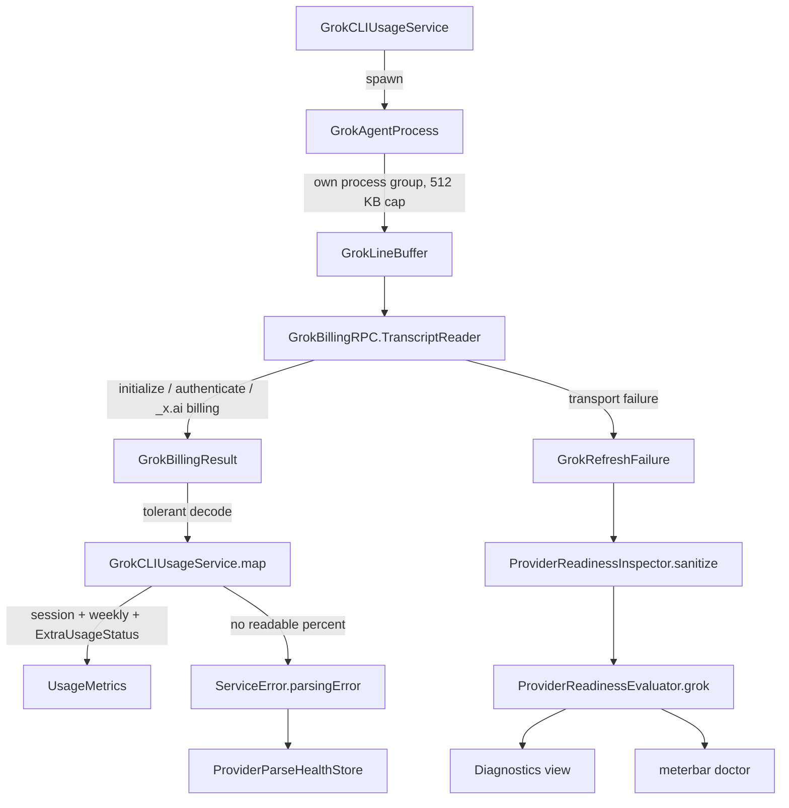

# 2026-07-25

## Session 1: Promote Grok Build to a first-class provider (#267)

**Status:** Implementation complete; PR CI + exact-head verification pending

### Affected components

- Grok usage service and its ACP stdio transport
- Shared readiness evaluation (`MeterBarShared`)
- Diagnostics surfaces (dashboard report + `meterbar doctor`)
- Parse-health tracking
- Provider visibility defaults and settings copy

### Root cause / motivation

- Grok Build was opt-in and lightly integrated: a single flat percent, no reset
  times, no `ExtraUsageStatus`, no readiness hints, and an unsupervised
  subprocess. Any upstream schema drift either crashed the decode or reported a
  fabricated 0%, which is worse than reporting nothing.
- Every other provider (Claude, Codex, Cursor) already degrades to an honest
  unknown, feeds `ProviderParseHealthStore`, and produces a specific recovery
  hint. Grok did none of it.

### What was done

- **Tolerant decoding.** `GrokCodingKey` (dynamic keys + camel→snake variants),
  `GrokNumber` (bare, quoted, and wrapper-object numbers keyed `val`/`value`/
  `amount`/`usd`/`cents`), and `GrokDecoding` helpers where an unreadable field
  is *absent* rather than fatal. The billing config is found under `config`,
  `billingConfig`, `billing`, or the outer object itself.
- **Shared window model.** Quota periods are classified by their declared type
  token, falling back to duration (`<= 24h` → session, else weekly), and mapped
  onto `UsageLimit` with real `resetTime` + `windowSeconds` so pace and
  projection work. `creditUsagePercent` may back-fill the *weekly* window only —
  synthesizing a session percent from an account-wide number is exactly the
  fabricated reading this mapping exists to avoid.
- **`ExtraUsageStatus`.** Prepaid balance and on-demand credits map onto the
  shared extra-usage model, including the `unknown` state when the fields are
  missing.
- **Honest unknown.** When no window carries a readable percent, `map` throws
  `.invalidResponse` → `ServiceError.parsingError`, which `UsageDataManager`
  already records as a shape mismatch in `ProviderParseHealthStore`.
- **Readiness hints.** New closed enum `GrokRefreshFailure` (not signed in,
  agent start failed, agent timed out, unparseable response, unsupported
  version, request failed) with constant, interpolation-free messages plus a
  recovery step. `ProviderReadinessEvaluator.grok` was split into
  installed/auth/data checks keyed off that failure, so both the dashboard and
  `meterbar doctor` get a specific next action.
- **Bounded, supervised subprocess.** New `GrokAgentProcess`: `posix_spawn` into
  its own process group, bounded concurrent stdout/stderr drains, a 512 KB line
  buffer with overflow detection, a 10 s deadline, SIGTERM → grace →
  `kill(-pgid, SIGKILL)`, a weak registry, and an app-termination sweep from
  `applicationWillTerminate`.
- **Promotion.** Grok is now tracked by default; `grokProviderEnabled` records an
  explicit opt-out only, and the legacy implicit hidden-list entry is cleared on
  load.

### Key decisions

- **Fixed strings across the `ServiceError` boundary.** Transport failures carry
  constant messages so `ProviderReadinessInspector.sanitize` can whitelist them
  verbatim without ever letting provider text into a pasteable report. A value
  that cannot be built from provider output cannot carry a token, account id, or
  response body. `notSignedIn`/`unparseableResponse` deliberately reuse the
  strings `sanitize` already emits for `.notAuthenticated`/`.parsingError`, so
  the round-trip stays lossless.
- **Throw rather than report zero.** No readable percent is an error, not a 0%
  reading — this is what makes parse-health visible instead of silent.
- **`-32601` is evidence, not a guess.** JSON-RPC "method not found" on the
  billing request is the only signal that distinguishes "too old" from "broken",
  so it gets its own failure case and its own hint.
- **Token files are presence-checked only.** `~/.grok/auth.json` is never read,
  decoded, logged, or persisted. Grok CLI stderr is drained and discarded
  because it can carry account metadata.
- **Auto-update disabled in-process** (`--no-auto-update`, `NO_COLOR`,
  `TERM=dumb`) so a refresh can never turn into an install.

### Verification

- TDD: fixture tests were written first and are the spec — 19 tests across
  mapping, transport, and readiness hand-off, covering the current response
  shape, an unknown-field/snake_case shape with wrapper-object numbers, a
  truncated response, a non-object result, a logged-out transcript, a `-32601`
  response, and an agent that exits without answering.
- Added 7 readiness-hint tests and 5 provider-visibility tests for the flipped
  default.
- Implementation re-read in full and cross-checked line-by-line against the
  tests: every symbol, signature, and fixture expectation lines up.
- Every Grok call site audited for opt-in-era wording; the widget's
  `.openRouter || .grok` branch confirmed to be an icon-asset fallback, not
  gating.
- Local builds, tests, and typechecks skipped under the MacBook verification
  policy; PR CI is the execution gate.

### Files changed

- `MeterBar/Services/GrokCLIUsageService.swift` — tolerant decoding, window
  mapping, `ExtraUsageStatus`, throwing `map`, ACP request sequence, replay seam.
- `MeterBar/Services/GrokAgentProcess.swift` *(new)* — bounded line buffer +
  supervised process-group subprocess.
- `Packages/MeterBarShared/Sources/MeterBarShared/GrokRefreshFailure.swift`
  *(new)* — closed failure set with constant messages and recovery steps.
- `Packages/MeterBarShared/Sources/MeterBarShared/ProviderReadiness.swift` —
  failure-aware Grok installed/auth/data checks.
- `MeterBar/Services/ProviderReadinessInspector.swift` — whitelist the Grok
  failure strings through `sanitize`.
- `MeterBar/Services/ProviderVisibilityStore.swift` — Grok on by default;
  explicit opt-out only.
- `MeterBar/App/MeterBarApp.swift` — terminate any surviving agent on quit.
- `MeterBar/Models/StorageKeys.swift`,
  `MeterBar/Views/Settings/GeneralSettingsView.swift` — post-promotion copy.
- `MeterBarTests/GrokCLIUsageServiceTests.swift`, `ProviderReadinessTests.swift`,
  `ProviderVisibilityStoreTests.swift` — new coverage.
- `.agents/SYSTEM/ARCHITECTURE.md`, `.agents/SESSIONS/2026-07-25.md`.

### Next steps

- [ ] Require green CI on the pushed head.
- [ ] Require an exact-head verifier PASS before merge.
