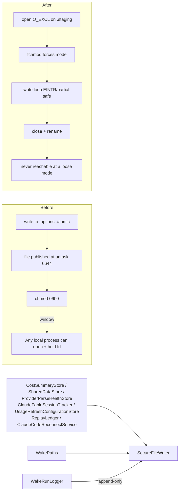

# 2026-07-25

## Session 1: Centralize on-disk permission policy (audit S1, S2, D3, B4)

**Status:** Implementation complete; SwiftLint clean; PR CI + exact-head Opus verification pending

### Affected components

- New shared service: `SecureFileWriter` (the app's single owner of file/directory permission policy)
- Persistence call sites: cost cache, shared App Group store, parse-health store, Fable session tracker, usage-refresh config
- Session Wake: replay ledger, run logger, path resolver
- Claude Code reconnect script generation + app launch lifecycle

### Root cause / motivation

Follow-through on the repo audit's fix order, items #1–#2 of the security/DRY set:

- **S1 (MED) — TOCTOU on an executed script.** `ClaudeCodeReconnectService` wrote a `.command` file and then `chmod`ed it to 0700. `Data.write(to:options:.atomic)` stages the payload at the process umask (0644 for a default macOS session) and renames it into place, so the *complete* script is world-readable for the interval before the `chmod` lands — and this file is subsequently handed to Terminal for execution.
- **S2 (LOW/MED) — inconsistent file permissions.** Six persistence sites wrote app state at the default 0644 with no tightening at all.
- **D3 — permission policy was per-call-site.** Every writer decided its own mode (or didn't), so there was no single place to audit or change.
- **B4 (LOW) — reconnect scripts were never deleted.** Generated scripts accumulated in the temp directory for the life of the machine.

### What was done

- Added `MeterBar/Services/SecureFileWriter.swift`, a `nonisolated enum` following the repo's stateless-namespace idiom (`WakePaths`, `AppLog`, `CLIBinaryLocator`):
  - `write(_:to:permissions:)` (`Data` and `String` overloads) creates a same-directory staging file with `open(O_WRONLY|O_CREAT|O_EXCL|O_CLOEXEC)`, forces the final mode with `fchmod` on the *descriptor* before any byte is written, writes through an `EINTR`/partial-write-safe loop, `close`s, then `rename`s. The publish stays atomic; the loose-mode window is gone.
  - `ensurePrivateDirectory(_:)` creates at 0700 **or tightens an existing directory** — an older build's 0755 directory would otherwise stay 0755 forever.
  - `ensurePrivateFile(at:)` for append-only logs, where a whole-file replace is the wrong shape. Best-effort by design.
  - `SecureFileWriterError` carries the errno and path, formatted with `String(cString: strerror(code))` — the repo's existing idiom (`WakeLock.swift`).
- Rewrote `ClaudeCodeReconnectService.writeReconnectScript(for:)` to route through the writer at `privateExecutable` (0700), with an injectable directory for tests. `shellQuoted` and the script body builder were already correct and were left untouched.
- Added `purgeReconnectScripts(in:olderThan:now:)` with a 24-hour retention, restricted to `.command` files, run both on every write and once at `applicationDidFinishLaunching`.
- Adopted the writer at all six S2 sites: `CostSummaryStore`, `SharedDataStore` (both `saveMetrics` and `saveAccountMetrics`), `ProviderParseHealthStore`, `ClaudeFableSessionTracker`, `UsageRefreshConfigurationStore` (its `try?` semantics preserved).
- Collapsed `ReplayLedger.persist()`'s write-then-chmod pair into a single call, and made `WakePaths.ensurePrivateDirectory` delegate to the writer (D3: one implementation, one policy).
- Replaced `WakeRunLogger.appendData`'s hardcoded create/`setAttributes` 0600 pair with `ensurePrivateFile(at:)`.
- Tests written **first**, per the project TDD policy:
  - `MeterBarTests/SecureFileWriterTests.swift` — 13 tests covering default 0600, explicit 0700, mode-survives-a-restrictive-umask, tightening an existing loose file, no scratch file left on success, scratch unlinked and target preserved on failure, missing parent directory, a 4 MiB payload through the partial-write loop, directory create + tighten, and the two `ensurePrivateFile` cases.
  - `MeterBarTests/ClaudeCodeReconnectServiceTests.swift` — added 7 tests for owner-only script + directory, tightening a pre-existing 0755 directory, replacing a stale script for the same account, purging expired scripts, keeping recent ones, leaving non-`.command` files alone, and tolerating a missing directory. The 4 existing pure-string tests were kept unchanged.

### Key decisions

- **`fchmod` on the descriptor, not `chmod` on the path.** `open`'s mode argument is masked by the umask, so the requested mode is not guaranteed to land; and a path-based `chmod` reintroduces exactly the swap the type exists to prevent. The discriminating test requests 0640 under `umask(0o077)` — a mode the umask would strip — so asserting 0640 proves the mode is *forced*, not merely requested. Asserting plain 0600 would have passed under the buggy implementation too.
- **`UsageDashboardView`'s PNG export was deliberately left at umask semantics**, with the reasoning recorded in code. The user picks that destination through a save panel specifically in order to share the card; forcing owner-only there would be wrong. It is now the only direct `.write(to:)` left in production.
- **A retention sweep rather than delete-after-launch for B4.** Removing the script right after `open -a Terminal` races the shell that is about to read it. 24 hours is long enough for a login flow still in progress, short enough that scripts do not accumulate indefinitely.
- **0600 on App Group files is safe.** The app and the widget run as the same UID, so tightening the shared container does not break widget reads.
- **The writer lives in the app target, not `Packages/MeterBarShared`.** The shared package writes no files at all (`git grep "write(to:\|createFile" -- 'Packages/*.swift'` is empty), so hoisting it there would be speculative.
- **No `.pbxproj` or `Package.swift` edit was needed.** `MeterBar/` and `MeterBarTests/` are `PBXFileSystemSynchronizedRootGroup`s, and the root manifest globs `path: "MeterBar"` with an explicit `exclude:` list that does not cover the new file.

### Verification

- `swiftlint lint --strict --quiet` (the exact CI command) passed with exit 0, no output.
- `git grep` confirms zero remaining hardcoded `posixPermissions` in production sources, and exactly one remaining direct `.write(to:)` — the deliberate PNG export.
- All 12 `SecureFileWriter` call sites reviewed individually against the behavior they replaced (`try?` vs `try` preserved per site).
- Local builds, tests, and typechecks skipped under the MacBook verification policy; PR CI is the execution gate. SourceKit reports `Cannot find 'SecureFileWriter' in scope` at every call site — assessed as stale-index lag, since the file is covered by both the synchronized root group and the SwiftPM glob. **This assessment is unverified locally and CI is what will settle it.**

### Files changed

- `MeterBar/Services/SecureFileWriter.swift` — **new**; the writer, the directory/file helpers, and the error type.
- `MeterBar/Services/ClaudeCodeReconnectService.swift` — secure write path, injectable directory, retention sweep.
- `MeterBar/App/MeterBarApp.swift` — launch-time reconnect-script sweep.
- `MeterBar/Models/CostSummaryStore.swift`, `MeterBar/Services/SharedDataStore.swift`, `MeterBar/Services/ProviderParseHealthStore.swift`, `MeterBar/Services/ClaudeFableSessionTracker.swift`, `MeterBar/UsageRefresh/UsageRefreshConfigurationStore.swift` — S2 adoption.
- `MeterBar/SessionWake/ReplayLedger.swift`, `MeterBar/SessionWake/WakePaths.swift`, `MeterBar/SessionWake/WakeRunLogger.swift` — D3 consolidation.
- `MeterBar/Views/UsageDashboardView.swift` — documented exception only.
- `MeterBarTests/SecureFileWriterTests.swift` — **new**, 13 tests.
- `MeterBarTests/ClaudeCodeReconnectServiceTests.swift` — 7 added tests.
- `.agents/SESSIONS/2026-07-25.md`

### Next steps

- [ ] Require green CI on the pushed head.
- [ ] Require an exact-head Opus PASS before merge.
- [ ] Audit fix #2 — `ManagedProcess` fd leak on partial pipe-creation failure (B2) and `waitpid` `EINTR` retry in the WNOHANG poll (B3). Note PR #259 adds a new `ManagedProcess` caller; merge order matters.
- [ ] Audit fix #3 — single-pass cost summary scan (O2) and streaming reads for the two whole-file loads (O3) in `CostTracker`.
- [ ] Audit fix #4 — extract the duplicated Anthropic usage request in `ClaudeCodeLocalService` preserving **both** timeouts (30 s and 15 s), and extend `.swiftlint.yml` coverage to `Packages`, `MeterBarCLI`, and `MeterBarWidget` (C2).
