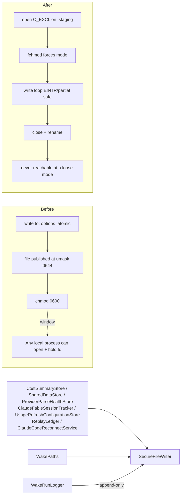
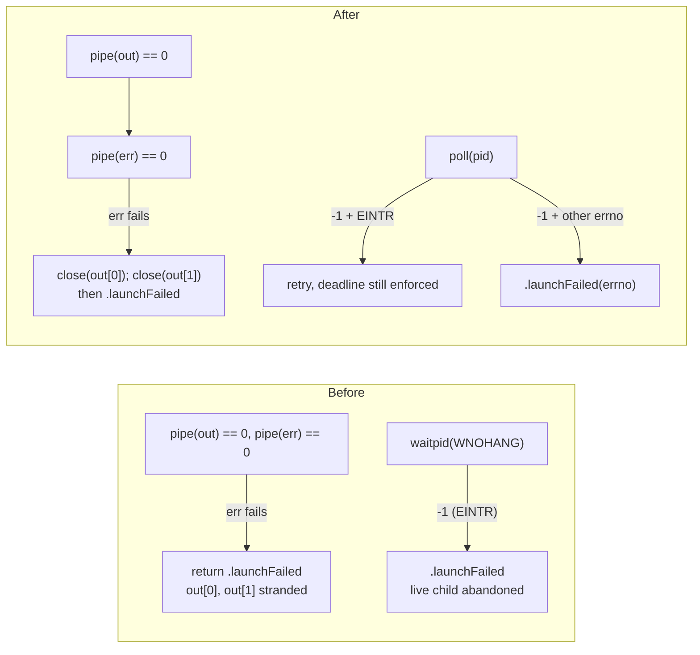
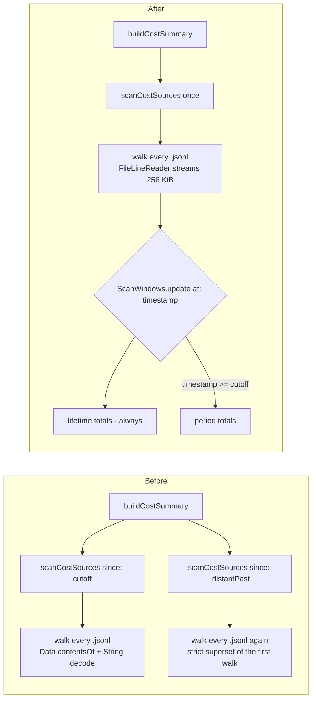

# 2026-07-25

## Session 1: Centralize on-disk permission policy (audit S1, S2, D3, B4)

**Status:** Implementation complete; SwiftLint clean; PR CI + exact-head Opus verification pending

### Affected components

- New shared service: `SecureFileWriter` (the app's single owner of file/directory permission policy)
- Persistence call sites: cost cache, shared App Group store, parse-health store, Fable session tracker, usage-refresh config
- Session Wake: replay ledger, run logger, path resolver
- Claude Code reconnect script generation + app launch lifecycle

### Root cause / motivation

Follow-through on the repo audit's fix order, items #1–#2 of the security/DRY set:

- **S1 (MED) — TOCTOU on an executed script.** `ClaudeCodeReconnectService` wrote a `.command` file and then `chmod`ed it to 0700. `Data.write(to:options:.atomic)` stages the payload at the process umask (0644 for a default macOS session) and renames it into place, so the *complete* script is world-readable for the interval before the `chmod` lands — and this file is subsequently handed to Terminal for execution.
- **S2 (LOW/MED) — inconsistent file permissions.** Six persistence sites wrote app state at the default 0644 with no tightening at all.
- **D3 — permission policy was per-call-site.** Every writer decided its own mode (or didn't), so there was no single place to audit or change.
- **B4 (LOW) — reconnect scripts were never deleted.** Generated scripts accumulated in the temp directory for the life of the machine.

### What was done

- Added `MeterBar/Services/SecureFileWriter.swift`, a `nonisolated enum` following the repo's stateless-namespace idiom (`WakePaths`, `AppLog`, `CLIBinaryLocator`):
  - `write(_:to:permissions:)` (`Data` and `String` overloads) creates a same-directory staging file with `open(O_WRONLY|O_CREAT|O_EXCL|O_CLOEXEC)`, forces the final mode with `fchmod` on the *descriptor* before any byte is written, writes through an `EINTR`/partial-write-safe loop, `close`s, then `rename`s. The publish stays atomic; the loose-mode window is gone.
  - `ensurePrivateDirectory(_:)` creates at 0700 **or tightens an existing directory** — an older build's 0755 directory would otherwise stay 0755 forever.
  - `ensurePrivateFile(at:)` for append-only logs, where a whole-file replace is the wrong shape. Best-effort by design.
  - `SecureFileWriterError` carries the errno and path, formatted with `String(cString: strerror(code))` — the repo's existing idiom (`WakeLock.swift`).
- Rewrote `ClaudeCodeReconnectService.writeReconnectScript(for:)` to route through the writer at `privateExecutable` (0700), with an injectable directory for tests. `shellQuoted` and the script body builder were already correct and were left untouched.
- Added `purgeReconnectScripts(in:olderThan:now:)` with a 24-hour retention, restricted to `.command` files, run both on every write and once at `applicationDidFinishLaunching`.
- Adopted the writer at all six S2 sites: `CostSummaryStore`, `SharedDataStore` (both `saveMetrics` and `saveAccountMetrics`), `ProviderParseHealthStore`, `ClaudeFableSessionTracker`, `UsageRefreshConfigurationStore` (its `try?` semantics preserved).
- Collapsed `ReplayLedger.persist()`'s write-then-chmod pair into a single call, and made `WakePaths.ensurePrivateDirectory` delegate to the writer (D3: one implementation, one policy).
- Replaced `WakeRunLogger.appendData`'s hardcoded create/`setAttributes` 0600 pair with `ensurePrivateFile(at:)`.
- Tests written **first**, per the project TDD policy:
  - `MeterBarTests/SecureFileWriterTests.swift` — 13 tests covering default 0600, explicit 0700, mode-survives-a-restrictive-umask, tightening an existing loose file, no scratch file left on success, scratch unlinked and target preserved on failure, missing parent directory, a 4 MiB payload through the partial-write loop, directory create + tighten, and the two `ensurePrivateFile` cases.
  - `MeterBarTests/ClaudeCodeReconnectServiceTests.swift` — added 7 tests for owner-only script + directory, tightening a pre-existing 0755 directory, replacing a stale script for the same account, purging expired scripts, keeping recent ones, leaving non-`.command` files alone, and tolerating a missing directory. The 4 existing pure-string tests were kept unchanged.

### Key decisions

- **`fchmod` on the descriptor, not `chmod` on the path.** `open`'s mode argument is masked by the umask, so the requested mode is not guaranteed to land; and a path-based `chmod` reintroduces exactly the swap the type exists to prevent. The discriminating test requests 0640 under `umask(0o077)` — a mode the umask would strip — so asserting 0640 proves the mode is *forced*, not merely requested. Asserting plain 0600 would have passed under the buggy implementation too.
- **`UsageDashboardView`'s PNG export was deliberately left at umask semantics**, with the reasoning recorded in code. The user picks that destination through a save panel specifically in order to share the card; forcing owner-only there would be wrong. It is now the only direct `.write(to:)` left in production.
- **A retention sweep rather than delete-after-launch for B4.** Removing the script right after `open -a Terminal` races the shell that is about to read it. 24 hours is long enough for a login flow still in progress, short enough that scripts do not accumulate indefinitely.
- **0600 on App Group files is safe.** The app and the widget run as the same UID, so tightening the shared container does not break widget reads.
- **The writer lives in the app target, not `Packages/MeterBarShared`.** The shared package writes no files at all (`git grep "write(to:\|createFile" -- 'Packages/*.swift'` is empty), so hoisting it there would be speculative.
- **No `.pbxproj` or `Package.swift` edit was needed.** `MeterBar/` and `MeterBarTests/` are `PBXFileSystemSynchronizedRootGroup`s, and the root manifest globs `path: "MeterBar"` with an explicit `exclude:` list that does not cover the new file.

### Verification

- `swiftlint lint --strict --quiet` (the exact CI command) passed with exit 0, no output.
- `git grep` confirms zero remaining hardcoded `posixPermissions` in production sources, and exactly one remaining direct `.write(to:)` — the deliberate PNG export.
- All 12 `SecureFileWriter` call sites reviewed individually against the behavior they replaced (`try?` vs `try` preserved per site).
- Local builds, tests, and typechecks skipped under the MacBook verification policy; PR CI is the execution gate. SourceKit reports `Cannot find 'SecureFileWriter' in scope` at every call site — assessed as stale-index lag, since the file is covered by both the synchronized root group and the SwiftPM glob. **This assessment is unverified locally and CI is what will settle it.**

### Files changed

- `MeterBar/Services/SecureFileWriter.swift` — **new**; the writer, the directory/file helpers, and the error type.
- `MeterBar/Services/ClaudeCodeReconnectService.swift` — secure write path, injectable directory, retention sweep.
- `MeterBar/App/MeterBarApp.swift` — launch-time reconnect-script sweep.
- `MeterBar/Models/CostSummaryStore.swift`, `MeterBar/Services/SharedDataStore.swift`, `MeterBar/Services/ProviderParseHealthStore.swift`, `MeterBar/Services/ClaudeFableSessionTracker.swift`, `MeterBar/UsageRefresh/UsageRefreshConfigurationStore.swift` — S2 adoption.
- `MeterBar/SessionWake/ReplayLedger.swift`, `MeterBar/SessionWake/WakePaths.swift`, `MeterBar/SessionWake/WakeRunLogger.swift` — D3 consolidation.
- `MeterBar/Views/UsageDashboardView.swift` — documented exception only.
- `MeterBarTests/SecureFileWriterTests.swift` — **new**, 13 tests.
- `MeterBarTests/ClaudeCodeReconnectServiceTests.swift` — 7 added tests.
- `.agents/SESSIONS/2026-07-25.md`

### Next steps

- [ ] Require green CI on the pushed head.
- [ ] Require an exact-head Opus PASS before merge.
- [ ] Audit fix #2 — `ManagedProcess` fd leak on partial pipe-creation failure (B2) and `waitpid` `EINTR` retry in the WNOHANG poll (B3). Note PR #259 adds a new `ManagedProcess` caller; merge order matters.
- [ ] Audit fix #3 — single-pass cost summary scan (O2) and streaming reads for the two whole-file loads (O3) in `CostTracker`.
- [ ] Audit fix #4 — extract the duplicated Anthropic usage request in `ClaudeCodeLocalService` preserving **both** timeouts (30 s and 15 s), and extend `.swiftlint.yml` coverage to `Packages`, `MeterBarCLI`, and `MeterBarWidget` (C2).

---

## Session 2: Descriptor hygiene and interrupt-safe waiting in `ManagedProcess` (audit B2, B3)

**Status:** implemented on `fix/managed-process-fd-and-eintr`, awaiting CI + exact-head review.

### System flow

### Affected components

- **App:** `MeterBar/SessionWake/ManagedProcess.swift` — the only child-process launcher after PR #259 consolidated `ClaudeCodeCLIUsageService` onto it.
- **Callers (unchanged):** `SessionWakeAgent`, and — once #259 lands — `ClaudeCodeCLIUsageService`. No public API, no `Result` shape change.

### Root cause

- **B2** — `guard pipe(outPipe) == 0, pipe(errPipe) == 0 else { … }` short-circuits. When the first pipe succeeds and the second fails, the two live descriptors have no owner: nothing is spawned, no drain is running, and the `defer` frees the pointer *memory* rather than the descriptors. Every such call stranded a pair for the life of the process — self-accelerating, since descriptor pressure is exactly what makes the second `pipe()` fail.
- **B3** — the WNOHANG poll treated every `-1` as terminal. `EINTR` says only that a signal reached this thread; the child is still running and still ours to reap, so `.launchFailed` abandoned a live process group. The same file already handled `EINTR` correctly in `escalateTimeout`, so the file contradicted itself.

### What was done

- [x] Split the pipe guard; close `outPipe[0]`/`outPipe[1]` on the stderr-pipe failure path, mirroring the already-correct `posix_spawn`-failure path directly below it.
- [x] Retry the poll on `EINTR`, keeping every other errno fatal, and fall through to the existing deadline check so an unending interrupt stream still times out instead of spinning.
- [x] Carry the errno into the failure message (`waitpid failed (10)`) — previously unrecoverable waits were indistinguishable.
- [x] Added a `WaitPoll` seam plus an injectable `escalate`, both defaulted, so the retry contract is asserted directly.
- [x] 6 tests: descriptor-leak probe under an exhausted table, EINTR retry, fatal-errno, unending-EINTR timeout, signalled classification, cancellation precedence.

### Key decisions

- **Seam over signal racing.** The obvious B3 test — spam signals at the waiting thread — is not discriminating: `waitpid(WNOHANG)` returns almost instantly while the loop spends ~20 ms per iteration in `usleep`, so nearly every signal lands in the sleep. Injecting the poll asserts the actual contract deterministically.
- **`wait` and `escalateTimeout` widened from `private` to internal.** Required because a default argument must be at least as visible as the function declaring it. Documented in-file so it does not read as accidental.
- **Descriptor-leak test frees the table before asserting.** A failing assertion needs descriptors to report itself; the probe result is captured first, the hogged descriptors are released, and only then are assertions made. It `XCTSkip`s rather than fails where the table cannot be exhausted safely.
- **Kept `"pipe() failed"` verbatim.** Not worth churning a string the audit did not flag.

### Verification

- `swiftlint lint --strict --quiet` — clean (the exact CI invocation).
- No local build or test run: the MacBook constraint stands, PR CI is the gate.
- **Disclosure:** SourceKit reports `'wait' is inaccessible due to 'private'` against the test file. The on-disk declaration is internal (verified by grep); this is the same stale-index lag seen in Session 1 and is **unverified** until CI compiles it.

### Files changed

- `MeterBar/SessionWake/ManagedProcess.swift` — pipe cleanup, EINTR retry, poll/escalate seam, visibility widening.
- `MeterBarTests/ManagedProcessTests.swift` — 6 added tests.
- `.agents/SESSIONS/2026-07-25.md`

### Next steps

- [ ] Require green CI on the pushed head.
- [ ] Require an exact-head Opus PASS before merge.
- [ ] Merge order: PR #259 adds a new `ManagedProcess` caller without touching the file, so #259 and this branch are independent — but both should land before further `ManagedProcess` work.
- [ ] `.agents/SESSIONS/2026-07-25.md` exists on `fix/secure-file-writes` (PR #260) too; whichever merges second resolves add/add by taking the superset.
- [ ] Audit fix #3 — single-pass cost summary scan (O2) and streaming reads (O3) in `CostTracker`.
- [ ] Audit fix #4 — dedupe the Anthropic usage request preserving both timeouts (D2) and widen `.swiftlint.yml` coverage (C2).

---

## Session 3: Single-pass, streaming cost summary scan (audit O2, O3)

**Status:** Implementation complete; SwiftLint clean; PR CI + exact-head Opus verification pending

### Affected components

- New shared utility: `FileLineReader` (bounded streaming line reader)
- New value types: `ScanWindows`, `ClaudeSessionTotals`, `CostScanResult` (`CostScanWindows.swift`), plus `CodexScanContext` / `TokenAccumulator` relocated there
- `CostTracker`: Claude Code transcript scan, Codex archived-session scan, Codex SQLite log scan, summary assembly

### Root cause / motivation

Audit fix order items #3, covering two optimization findings in the same code path:

- **O2 (HIGH) — the cost scan ran twice.** `buildCostSummary` called `scanCostSources` once for the reporting window and once with `.distantPast` for the lifetime figure. The lifetime pass reads a strict superset of what the period pass had just read, so every transcript in `~/.claude/projects` and `~/.codex/archived_sessions` was walked and parsed twice for numbers that a single traversal can produce.
- **O3 (MED) — whole-file loads.** Each transcript was read with `Data(contentsOf:)` and then decoded with `String(data:encoding:)` before splitting on newlines, putting two full copies of the largest file in memory at once.

### What was done

- [x] Tests first: 10 for `FileLineReader` (chunk-boundary reassembly, CRLF, blank lines, `chunkSize: 1`, arbitrary chunk sizes agreeing with the default, empty file, missing file) and 6 pinning the window split in `CostTrackerTests`.
- [x] `FileLineReader.forEachLine(in:chunkSize:_:)` — 256 KiB buffer, newline scan, rebased `Data` per line.
- [x] `ScanWindows<Totals>` with `update(at:_:)` applying a body to `lifetime` always and to `period` only inside the window.
- [x] Claude path: `parseSessionWindows(at:since:)` streams once and fills both windows; `parseSessionFile(at:since:)` kept as a period-only wrapper; tallying extracted to `tally(keyed:unkeyed:)`.
- [x] Codex path: `scanCodexSessions`, `scanCodexArchivedSessions`, `scanCodexSQLiteLogs`, and `addCodexUsage` all thread `inout ScanWindows<CodexScanContext>`; a `(directory:since:context:)` overload is retained for single-window callers.
- [x] Removed the now-dead `mergeDailyTotals` / `mergeNamedTotals` helpers.

### Key decisions

- **Deduplication stays per window.** Two events can share a `messageID:requestID` key while straddling the cutoff. One shared dedup map would let the pre-cutoff copy overwrite the in-window one and silently change the period total — i.e. the money figure. Each window keeps its own map, which is exactly what two separate scans did. Pinned by `testParseSessionWindowsDeduplicatesWithinEachWindow`.
- **The per-file mtime prefilter was dropped, not ported.** It was already redundant: an event's timestamp is never newer than the file holding it, so the per-event timestamp check subsumes it — and the lifetime pass used `.distantPast`, so its mtime filter admitted everything anyway.
- **The cutoff travels inside `ScanWindows`.** Passing it as a separate argument would push `addCodexUsage` to seven parameters, and SwiftLint's `function_parameter_count` warns at six with CI linting `--strict`.
- **`forEachLine`'s body is a real function parameter, not a stored closure.** The Codex scan captures an `inout` accumulator inside it; capturing `inout` is only legal in a non-escaping closure. This is also why the planned `readLines:` injection seam was dropped — a closure nested in a function *type* is escaping by default.
- **`ScanWindows` is conditionally `Sendable`.** An unconditional conformance would force `TokenCost` and `DailyTokenUsage` to be `Sendable` just to name `ScanWindows<CostScanResult>`.
- **`"token_count"` prefilter kept as bytes.** Moving from `String` lines to `Data` lines would have lost the cheap pre-`JSONSerialization` filter that makes the Codex scan affordable; a static `Data` marker plus `contains` preserves it.

### Verification

- `swiftlint lint --strict --quiet` — clean (the exact CI invocation).
- No local build or test run: the MacBook constraint stands, PR CI is the gate.
- **Disclosure:** SourceKit reports `Cannot find type 'ScanWindows' in scope` and siblings against `CostTracker.swift`. Every named symbol is defined in the new `CostScanWindows.swift`; this is the same stale-index lag seen in Sessions 1 and 2 and is **unverified** until CI compiles it.
- **Disclosure:** single-traversal is now structural — one `scanCostSources` call — rather than asserted by a test, because the injection seam was incompatible with the `inout` capture above.

### Side effect worth noting

Decoding moved from whole-file to per-line, so a single malformed byte no longer fails the entire UTF-8 decode and silently zeroes a whole session's usage. Only the affected line is skipped.

### Files changed

- `MeterBar/Services/FileLineReader.swift` — new.
- `MeterBar/Services/CostScanWindows.swift` — new; window types plus the relocated `CodexScanContext` / `TokenAccumulator`.
- `MeterBar/Services/CostTracker.swift` — single-pass dual-window scan across both providers; dead merge helpers removed.
- `MeterBarTests/FileLineReaderTests.swift` — new, 10 tests.
- `MeterBarTests/CostTrackerTests.swift` — 6 added tests.
- `.agents/SESSIONS/2026-07-25.md`

### Next steps

- [ ] Require green CI on the pushed head.
- [ ] Require an exact-head Opus PASS before merge.
- [ ] `.agents/SESSIONS/2026-07-25.md` is added by PRs #260, #261, and this one; whichever merges later resolves add/add by taking the superset.
- [ ] Audit fix #4 — dedupe the Anthropic usage request preserving both timeouts, 30 s and 15 s (D2), and widen `.swiftlint.yml` coverage to `MeterBarCLI` / `MeterBarWidget` / `Packages` (C2).
