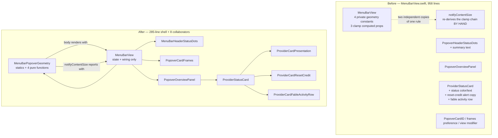

# 2026-07-25

> Sessions 1–10 of this day are documented in the sibling audit-follow-through PRs
> (#259–#284), each of which carries its own entry for the same file. This branch
> is based on `master`, so it starts the day file at its own session; the merge
> resolution for the resulting add/add conflict is "take the superset".

## Session 11: Split `MenuBarView.swift` (audit C1c)

**Status:** Implementation complete; SwiftLint `--strict` clean; PR CI + exact-head Opus verification pending

### Affected components

- Menu-bar popover shell: `MeterBar/Views/MenuBarView.swift`
- New pure-logic units: popover geometry, status-dot summary text, provider-card presentation, reset-credit alert mapping
- New view units: header status dots, overview panel, provider status card, fable activity row, card-frame reporting
- Tests: `MeterBarTests/MenuBarViewSplitTests.swift` (5 suites, 28 cases)

### Root cause / motivation

Audit item **C1** — four files over 950 lines. This is the third of four (C1a `UsageDashboardView` → #283, C1b `MeterBarApp` → #284, C1d `CostTracker` next).

The split was not cosmetic. `MenuBarView` owned four private geometry constants and three private clamp properties, and `notifyContentSize` **re-derived the same clamp chain by hand** — so the height the popover *rendered* at and the height it *reported* to the menu-bar window controller were two independent copies of one rule, free to drift. Hoisting the math into `MenuBarPopoverGeometry` means `body` and `notifyContentSize` now call literally the same two functions, and the agreement is assertable without hosting a view.

### What was done

- [x] Wrote the API-contract test file first (TDD), then implemented against it
- [x] Extracted `MenuBarPopoverGeometry` — 7 statics + `maximumHeight`/`scrollHeight`/`popoverHeight`/`contentSize`
- [x] Extracted `ProviderStatusDotsSummary` + `PopoverHeaderStatusDots` (widened from `private` to internal — it now lives in its own file)
- [x] Extracted `PopoverCardID`, `PopoverCardFramesPreferenceKey`, `reportPopoverCardFrame(id:)`
- [x] Extracted `ProviderCardPresentation` (status color/text, detail-navigation and reset-credit predicates, fable a11y label)
- [x] Extracted `ProviderCardResetCreditOutcome` (alert mapping)
- [x] Extracted `ProviderCardFableActivityRow`, `PopoverOverviewPanel`, `ProviderStatusCard`
- [x] Rewrote the shell: 958 → 285 lines
- [x] Verified every external call site (`UsageDashboardView`, 7 test files, `MeterBarMenuPanelController`) compiles against unchanged signatures

### Key decisions

- **Extract collaborators, not cross-file extensions.** Swift `private` is file-scoped, so splitting a type across extension files would force weakening every `private` member. Extracting child views and pure-logic types with explicit inputs keeps encapsulation intact and makes the logic testable without a host view.
- **New files use 4-space indent; the `MenuBarView` shell keeps its 2-space indent.** 4 spaces matches `.swiftformat --indent 4` and the C1a/C1b precedent. Leaving the shell at 2 keeps its diff a pure deletion rather than a whole-file reformat that would hide what actually changed.
- **Declined to merge the three status-summary sites.** `ProviderStatusDotsSummary.text`, `MenuBarStatusDetailContent.summaryText`, and `DashboardStatusSection.summary` look similar but differ materially — the detail content adds a "checking" state, a full-sweep guard, and a different fallback; the dashboard section uses entirely different strings. Merging would mean a parameter per divergence. The reasoning is recorded in `ProviderStatusDotsSummary`'s doc comment so it isn't rediscovered.
- **`ProviderStatusCard.init` puts `onSelect` last** so existing trailing-closure call sites keep binding to it unchanged.
- **`PopoverOverviewPanel` carries a hand-written `init`.** Its `private` `@State`/`@StateObject` storage would lower the synthesized memberwise initializer to file-private, breaking the test target's construction.
- **Deleted `ProviderStatusCard.updatedText`** — a one-line passthrough; the call site now reads `snapshot.updatedText` directly.
- **`ProviderCardFableActivityRow` is its own view** so its 60-second `TimelineView` ticker doesn't invalidate the rest of the card on every minute boundary.

### Files changed

| File | Change |
|---|---|
| `MeterBar/Views/MenuBarView.swift` | 958 → 285 lines |
| `MeterBar/Views/MenuBarPopoverGeometry.swift` | new, 47 |
| `MeterBar/Views/MenuBarHeaderStatusDots.swift` | new, 67 |
| `MeterBar/Views/PopoverCardFrames.swift` | new, 29 |
| `MeterBar/Views/ProviderCardPresentation.swift` | new, 59 |
| `MeterBar/Views/ProviderCardResetCredit.swift` | new, 32 |
| `MeterBar/Views/ProviderCardFableActivityRow.swift` | new, 55 |
| `MeterBar/Views/PopoverOverviewPanel.swift` | new, 236 |
| `MeterBar/Views/ProviderStatusCard.swift` | new, 315 |
| `MeterBarTests/MenuBarViewSplitTests.swift` | new, 326 |

No `project.pbxproj` edit: `MeterBar/` and `MeterBarTests/` are `PBXFileSystemSynchronizedRootGroup`s.

### Mistakes and fixes

- **BSD `sed` has no `\s`.** The first mechanical declaration-diff used `sed -E 's/^\s+//'`, which on macOS matches a literal `s` — it mangled `struct PopoverHeaderStatusDots` into `truct …` and never stripped leading whitespace, so the 2→4-space re-indent registered nearly every declaration as simultaneously dropped and added (~100 lines of noise). Re-ran with POSIX classes (`[[:space:]]`). Standing rule: assume BSD, not GNU, for every macOS text utility.
- **Re-indent line-length trap.** Moving a line from 6-space to 12-space indent adds 6 characters; one `BlockingLimitResetCounter.selectBlockingWindow` call crossed the 120-char limit only after the move. Every long moved line now hand-counted; SwiftLint confirms.
- **SourceKit reported 10 "Cannot find X in scope" errors** on `MenuBarView.swift`. Known stale-index artifact for freshly-created untracked files (same as C1a/C1b) — every symbol was verified to exist exactly once by grep, and SwiftLint passes. Not chased.

### Verification

- SwiftLint `--strict --quiet` across all 9 changed/new source paths: **exit 0**
- Mechanical declaration diff old-vs-new: 12 declarations absent from the new shell, **all 12 accounted for** — 4 locals inside the deleted hand-rolled clamp chain, 4 geometry constants (now statics), `fableActivityRow`, `fableActivityAccessibilityLabel`, `PopoverHeaderStatusDots`, `updatedText`. Nothing dropped accidentally.
- Symbol-uniqueness sweep across `MeterBar`, `MeterBarTests`, `Packages` for all 14 new/moved names: each declared exactly once
- **Tests, typecheck, and build NOT run locally — MacBook policy. PR CI is the gate.**

### Next steps

- C1d: split `CostTracker.swift` (954 lines). Must stack — `CostTracker.swift` is already rewritten by #262 (`fix/cost-tracker-single-pass-scan`, +265/−300) and touched by #283. Pick the stack base before writing code.
- Restore the reserved Session 6 draft (stashed) into the day file.
