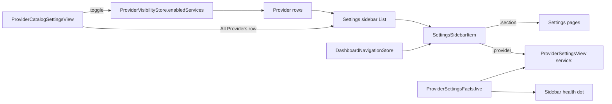

# 2026-07-25

## Session 1: Promote providers into the settings sidebar

**Status:** Implementation complete; SwiftLint clean; PR CI + exact-head Opus verification pending

### Affected components

- Dashboard settings shell + navigation store (`UsageDashboardView`)
- Provider settings page (`ProviderSettingsView`)
- New provider catalog page (`ProviderCatalogSettingsView`)
- General settings page (duplicate toggle list removed)
- Legacy `Settings` scene shell (`SettingsView`)

### Root cause / motivation

- Providers were selected by a horizontal segmented `Picker` **inside** the Providers settings page — two navigation layers for one hierarchy (sidebar → page → provider), and a control whose width grows with every provider added.
- The redesign had to survive scale: a segmented strip is unusable well before 10 providers, let alone 60.

### What was done

- Added `SettingsSidebarItem` (`.section` | `.provider`) so the sidebar's `List(selection:)` can address pages and providers with one binding, plus `SettingsSidebarModel` holding the pure row-composition rules (ordering, app pages, catalog page) so they're testable without hosting a view.
- Extended `DashboardNavigationStore` with `selectedSettingsProvider`, `settingsSidebarItem`, `selectSettingsItem(_:)`, and `settingsProvidersChanged(enabledServices:)`; `openSettings(_:)` now clears any focused provider.
- Rewrote the settings sidebar as two groups: **Settings** (app pages) and **Providers** (one row per *tracked* provider — logo, name, health dot — followed by an **All Providers** row).
- Gave `ProviderSettingsView` a `let service: ServiceType` and deleted the segmented picker and its `selectedProviderTab` state; the page now renders whichever provider the sidebar selected.
- Extracted `ProviderSettingsFacts.live(for:snapshots:)` — the single `ServiceType` switch over live provider state — shared by the provider page's Status row and the sidebar's health dot.
- Added `ProviderCatalogSettingsView`: every provider in `ServiceType.allCases`, each with a summary, live status, tracking toggle, and a chevron into its page (shown only for tracked providers, since only those have a sidebar row to highlight).
- Removed the now-duplicate "Tracked Providers" toggle list from the General page; its per-provider copy moved to the catalog.
- Repointed the legacy `Settings` scene's Providers tab at the catalog, so no nested provider picker survives anywhere.
- Wrote `SettingsSidebarNavigationTests` first (TDD): row composition, catalog completeness, tag-identity collisions, and every navigation-store transition, plus render smoke tests for both new/changed views.

### Key decisions

- **Sidebar rows come from `enabledServices`, not `allCases`.** The Providers group stays a handful of rows at any catalog size; the catalog page is what scales. This is the same code at 5 providers and at 60.
- **`SettingsSection.providers` was repurposed rather than removed** — it now backs the "All Providers" catalog page. Keeps `SettingsSection.allCases` (and `WidgetSettingsTests`' assertion on it) intact, and gives the two existing `showSettings(.providers)` deep links from the menu bar a better destination than before: a page you can enable a provider from.
- **Untracked providers are not selectable.** The catalog's chevron is hidden/disabled when a provider is off, so the sidebar can never hold a selection it has no row for; turning the selected provider off from its own page falls back to All Providers.
- **One facts builder, not two switches.** The sidebar dot and the page's Status row derive from the same `ProviderSettingsFacts.live`, so they cannot drift and adding a provider touches one switch.
- **Deferred:** the searchable "Add provider…" flow and `.searchable` on the sidebar — not worth the surface at 5 providers; revisit around 10.

### Verification

- SwiftLint clean across `MeterBar` and `MeterBarTests` (exit 0).
- New files land in both build systems without manifest edits: the Xcode project syncs the `MeterBar` folder (`PBXFileSystemSynchronizedRootGroup`) and `Package.swift` targets are path-based.
- Confirmed no remaining references to the removed picker state or the duplicated facts switch; confirmed both `showSettings(.providers)` call sites still resolve sensibly.
- Local builds, tests, and typechecks skipped under the MacBook verification policy; PR CI is the execution gate.

### Files changed

- `MeterBar/Views/UsageDashboardView.swift` — `SettingsSidebarItem`, `SettingsSidebarModel`, navigation-store provider selection, two-group sidebar, provider/page content split.
- `MeterBar/Views/Settings/ProviderSettingsView.swift` — takes a `service`; picker and duplicated facts switch removed.
- `MeterBar/Views/Settings/ProviderSettingsFacts+Live.swift` — new shared live-facts builder.
- `MeterBar/Views/Settings/ProviderCatalogSettingsView.swift` — new All Providers catalog page.
- `MeterBar/Views/Settings/GeneralSettingsView.swift` — duplicate tracked-provider toggles removed.
- `MeterBar/Views/SettingsView.swift` — legacy Providers tab points at the catalog.
- `MeterBarTests/SettingsSidebarNavigationTests.swift` — new coverage.
- `.agents/SESSIONS/2026-07-25.md`

### Next steps

- [ ] Require green CI on the pushed head.
- [ ] Require an exact-head Opus PASS before merge.
- [ ] Revisit the searchable "Add provider…" catalog flow around ~10 providers.
