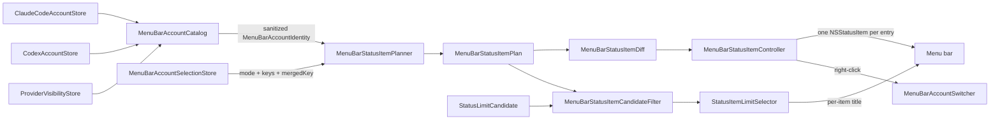

# 2026-07-25

## Session 1: Per-account menu bar status items and a merged account switcher (#266)

**Status:** Implementation complete; focused test target green (53 tests); SwiftLint clean; PR CI + exact-head verification pending

### Affected components

- Menu bar status-item lifecycle (`AppDelegate`, previously a single `NSStatusItem`)
- Status-item title selection pipeline (`StatusItemLimitSelector` candidates)
- Persisted display preferences (`StorageKeys`, new selection store)
- Settings → General configuration UI
- Unit tests

### Root cause / motivation

- MeterBar already scopes usage reads per account via `CLAUDE_CONFIG_DIR` / `CODEX_HOME`, but the menu bar exposed exactly one `NSStatusItem` bound to whatever the Auto/pin heuristic picked. A user running work + personal Claude alongside Codex could see only one of them at a time.
- Menu-bar slots are positional: re-creating an `NSStatusItem` moves it to the end of the bar. Any multi-item design therefore needs identity-stable reconciliation, not teardown-and-rebuild.

### What was done

- **`MenuBarAccountSelection.swift`** — `MenuBarAccountDisplayMode` (`.single` / `.perAccount` / `.merged`), stable `MenuBarAccountKey` (`<service>:<uuid>`), `MenuBarAccountLabel` (the single sanitizing seam), `MenuBarAccountIdentity`, and `MenuBarAccountCatalog` which folds "account disabled" and "provider untracked" into one `isEnabled` flag.
- **`MenuBarStatusItemPlanner.swift`** — pure planning: `MenuBarStatusItemPlan(mode:entries:)`, a documented `maximumConcurrentItems = 4` cap, `MenuBarStatusItemDiff.between(existing:desired:)`, `MenuBarAccountSwitcher` (list + wrap-around cycle), and `MenuBarStatusItemCandidateFilter` scoping the shared candidate set to one account.
- **`MenuBarAccountSelectionStore.swift`** — UserDefaults-backed persistence with `select` / `deselect` / `setSelected` returning a `MenuBarAccountSelectionOutcome`, so a cap rejection is explained rather than silently dropped. Persisted lists are de-duplicated and capped on load.
- **`MenuBarStatusItemController.swift`** — owns the live `NSStatusItem` dictionary, reconciles add/remove only, routes clicks by plan-entry id, and exposes `primaryButton` (last-clicked, falling back to first) as the popover anchor.
- **`MeterBarApp.swift`** — replaced the single `statusItem` with the controller; per-item `shownStatusItemKeys`; `refreshStatusItemPlan()` on every selection/account change; per-item title application; the merged item's right-click account switcher; `StatusLimitSource`/`StatusLimitCandidate` gained an `accountKey`.
- **`GeneralSettingsView.swift`** — new "Menu Bar Accounts" section: layout picker, per-account toggles with the cap notice, and the merged-mode account picker.
- **`README.md`** — documented the 4-item cap in Features.

### Key decisions

- **Merged mode uses a fixed item id (`"merged"`) with a changing `accountKey`.** Switching accounts retitles the live item in place instead of destroying and recreating it, which would move it to the end of the menu bar.
- **The aggregate entry carries an empty badge.** `statusButtonTitle(badge:value:)` therefore emits exactly `" \(title)"` in `.single` mode — byte-identical to pre-#266 output, so an installation that never opts in sees no change.
- **Sanitization happens at construction, not at render.** `MenuBarAccountCatalog` builds only sanitized identities, and `statusLimitProbeRequests(in:)` sanitizes names on the tooltip path. Account names are user-supplied and frequently pasted config-dir paths; `MenuBarAccountLabel.displayName` reduces to the last path component, flattens control/whitespace scalars, collapses runs, and truncates at 18 chars — a full `CLAUDE_CONFIG_DIR` path can never reach the menu bar or a menu.
- **Disabled accounts are listed inert in the switcher, not omitted.** A `nil` action leaves the item disabled under `NSMenu.autoenablesItems`, so the menu explains why an account holds no status item.
- **Empty selection falls back to the aggregate item.** Disabling every selected account must not leave the user without a menu bar.
- **The cap is 4.** Conservative enough to fit a laptop-width menu bar (macOS silently hides overflow items) while covering the common work + personal × Claude + Codex setup.
- **New pure logic lives in `Models/` and `Services/`.** `Package.swift` excludes `App/MeterBarApp.swift` from the test target, so anything under test had to sit outside that file — hence the planner/catalog/store split and a thin, untested `AppDelegate` seam.

### Verification

- `swift test --filter "MenuBarAccountSelectionTests|MenuBarStatusItemPlannerTests|StatusItemLimitSelectorTests"` → **53 tests, 0 failures**. Tests were written before the implementation per repo policy.
  - `MenuBarAccountSelectionTests` (17): sanitization incl. an explicit "never leaks a config-directory path" case, badge derivation, catalog key stability, disabled folding, legacy defaults, persistence across relaunch, cap rejection, deselect ordering, normalization of hand-edited defaults.
  - `MenuBarStatusItemPlannerTests` (16): single/per-account/merged planning, distinct same-provider badges, disabled-account removal without disturbing the remaining items or their order, aggregate fallbacks, cap enforcement, merged slot stability across an account change, switcher listing/cycling, diff add/remove/retain, candidate scoping.
  - `StatusItemLimitSelectorTests` (20): pre-existing suite, unchanged behavior after the `accountKey` addition.
- `swiftlint lint --quiet` on all changed files → clean.
- Local builds and typechecks skipped under the MacBook verification policy. `MeterBar/App/MeterBarApp.swift` is excluded from the SwiftPM target, so its compile is covered by PR CI's Xcode build, not by the focused test run.

### Mistakes and fixes

- Assumed the account stores lived under `MeterBar/Services/`; they are in `MeterBar/Models/ClaudeCodeAccount.swift` and `CodexAccount.swift`. Found by grepping for the class declarations.
- Initially used dynamic `Self.createMenuBarIcon()` inside an escaping closure in a non-final class; changed to `AppDelegate.createMenuBarIcon()`.
- SwiftLint flagged an unneeded synthesized initializer on `MenuBarStatusItemPlanEntry`, an `array_init` violation in the store, `multiline_arguments` in the planner tests, and `attributes` placement on two `@ViewBuilder` vars. All fixed, re-linted, and re-tested.

### Files changed

- `MeterBar/Models/MenuBarAccountSelection.swift` — new: modes, keys, sanitizing label seam, identity, catalog.
- `MeterBar/Models/MenuBarStatusItemPlanner.swift` — new: plan, cap, diff, switcher, candidate filter.
- `MeterBar/Services/MenuBarAccountSelectionStore.swift` — new: persisted selection + cap outcomes.
- `MeterBar/App/MenuBarStatusItemController.swift` — new: multi-`NSStatusItem` reconciliation and click routing.
- `MeterBar/App/MeterBarApp.swift` — single-item lifecycle replaced by the controller; per-item titles; switcher menu; account-scoped candidates; sanitized tooltips.
- `MeterBar/Models/StatusItemLimitSelector.swift` — `accountKey` threaded through candidates and seeds.
- `MeterBar/Models/StorageKeys.swift` — three new menu-bar account keys.
- `MeterBar/Views/Settings/GeneralSettingsView.swift` — "Menu Bar Accounts" section.
- `MeterBarTests/MenuBarAccountSelectionTests.swift`, `MeterBarTests/MenuBarStatusItemPlannerTests.swift` — new suites.
- `README.md` — documented the 4-item cap.
- `.agents/SESSIONS/2026-07-25.md`

### Next steps

- [ ] Require green CI (tests + Xcode build) on the pushed head — `MeterBarApp.swift` compiles only there.
- [ ] Require an exact-head verifier PASS before merge.
