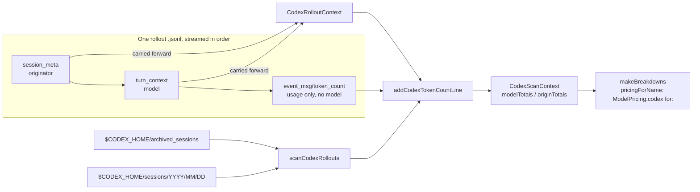

# 2026-07-25

## Session 1: Fix Codex model attribution and rollout scan coverage

**Status:** Implementation complete (TDD); SwiftLint clean; PR CI + exact-head verification pending

### Affected components

- `CostTracker` Codex rollout scan and per-model/per-origin attribution
- Shared pricing table (`MeterBarShared.ModelPricing`)
- Usage dashboard "Spend by model" / "Spend by origin" breakdowns (downstream, unchanged code)

### Root cause / motivation

Two questions about the 30 Day Spend card:

1. **"Why is June empty?"** — Not a bug. The window is 30 calendar days ending today (Jun 26 → Jul 25), so Jun 1–25 was never in scope. Inside the window, Jun 27 – Jul 6 is genuinely empty *on disk*: verified at entry-timestamp level (Claude entries Jun 26 = 108, Jun 27–Jul 6 = 0, Jul 8 = 2,312, Jul 9 = 11,574; Codex token events Jun 26 = 270, Jun 27–Jul 6 = 0, Jul 7 = 1,555). Oldest surviving Claude transcript anywhere is 2026-06-10. Logs were pruned/rotated; unrecoverable.
2. **"Why is everything 'Unknown model'?"** — Real bug, three compounding causes:
   - A Codex `token_count` event carries **no model**. The model is declared in a separate `turn_context` event. `codexModelName` only inspected the usage event itself, so it returned `nil` for 100% of real Codex spend → `"Unknown model"`.
   - The scan only walked `$CODEX_HOME/archived_sessions`. Codex archives a rollout **only when the session closes**, so every still-open session was silently dropped — 247 files in `$CODEX_HOME/sessions`, zero filename overlap, 4,992 in-window events across Jul 12/13/15/16/19/23/24.
   - The origin label was hardcoded `"Codex CLI"` while the real `session_meta.originator` values are `Codex Desktop` (480 files), `codex_exec` (118) and `Claude Code` (2).

### What was done

- Added `CodexRolloutContext` — per-file attribution state (`turnModel`, `sessionModel`, `originator`), reset on every rollout so one file never labels another's spend.
- Renamed `scanCodexArchivedSessions` → `scanCodexRollouts` and made it stream each file in order: non-usage lines update the rollout context, `token_count` lines are attributed against it.
- Added `codexRolloutDirectories(in:)` returning `archived_sessions` + `sessions`; `scanCodexSessions` now loops over both. `FileManager.enumerator` recurses, so the nested `sessions/YYYY/MM/DD/` layout is covered.
- Read `originator` from `session_meta` instead of hardcoding `"Codex CLI"` (the hardcoded string survives only as the no-context fallback).
- Added named `gpt-5.6-sol` / `-terra` / `-luna` rows and a `ModelPricing.codex(for:)` lookup; wired it into `makeBreakdowns` via a new optional `pricingForName` resolver.
- Tests written **first** (TDD): 7 new `CostTracker` tests + 1 new `ModelPricing` test; 3 existing tests renamed to the new entry point.

### Key decisions

- **Cross-directory dedup rides the existing `eventKeys` content hash**, not filename skipping. A rollout can exist *partially* in both directories mid-archive; hashing each event (`timestamp-session-input-cached-output-reasoning`) is correct in that case, filename skipping is not.
- **Event-level model still wins over `turn_context`.** Older rollouts stamped the model inside `info`; precedence is event → `turn_context` → `session_meta`. This also keeps the pre-existing (unrealistic) `codexTokenLine` fixture meaningful as a legacy-path regression test rather than deleting it.
- **`session_meta.model` is read even though it is `null` in all 600 sampled rollouts** — it costs one line and pre-turn events get named the day Codex populates it.
- **Per-model pricing wired into `makeBreakdowns` only, not the aggregate total.** Every published Codex slug bills at the same rate today, so rows still reconcile exactly with the provider total; the named rows exist so a future divergence is a one-line table edit instead of a re-plumb.
- **Mid-session model switches are real** — 2 of 200 sampled files carry two distinct `turn_context` models — so attribution follows the *last seen* model rather than a single per-file value. Covered by `testScanCodexRolloutsFollowsMidSessionModelSwitch`.

### Verification

- Empirics gathered directly from `~/.codex` before writing code: line ordering (`session_meta` 0 → `turn_context` 8 → `token_count` 16+), distinct-model-per-file histogram, originator histogram, null-`session_meta.model` check, directory overlap.
- `swiftlint lint --quiet` passed with exit 0, no output.
- New scan path matches the existing codebase pattern — `MeterBar/SessionWake/CodexSessionDiscovery.swift:47` already resolves `<CODEX_HOME>/sessions`.
- No stale `scanCodexArchivedSessions` references remain in Swift source (only in historical docs/session logs, left as point-in-time records).
- Local builds, tests, and typechecks skipped under the MacBook verification policy; PR CI is the execution gate.

### Mistakes and fixes

- **Mistake:** SourceKit reported `Cannot call value of non-function type 'TokenPricing'` at the `ModelPricing.codex(for:)` call sites.
- **Fix:** Judged to be stale indexing of the just-edited `MeterBarShared` module, not a real error — a static property `codex` and a static method `codex(for:)` have distinct declaration names and legally coexist (Foundation ships `URL.path` alongside `URL.path(percentEncoded:)`). Left the API as designed; CI settles it.
- **Prevention:** Treat a diagnostic that appears only in a freshly-edited local package module, with no corresponding language rule, as index lag — confirm against a shipping stdlib precedent before renaming a public API around it.

### Files changed

- `MeterBar/Services/CostTracker.swift` — `CodexRolloutContext`; `codexRolloutDirectories(in:)`; `scanCodexRollouts` (renamed, now streaming); `updateCodexRolloutContext`; `addCodexTokenCountLine`; `codexEventPayload(in:type:)`; `makeBreakdowns` `pricingForName` parameter and the Codex call site.
- `Packages/MeterBarShared/Sources/MeterBarShared/ModelPricing.swift` — three named Codex slugs + `codex(for:)`.
- `MeterBarTests/CostTrackerTests.swift` — 5 realistic rollout fixture helpers, 3 renames, 7 new tests.
- `MeterBarTests/ModelPricingTests.swift` — `testCodexLookupResolvesNamedModelsAndFallsBack`.
- `.agents/SYSTEM/ARCHITECTURE.md` — Codex scan scope corrected to both rollout directories + the attribution model.
- `.agents/SESSIONS/2026-07-25.md`

### Next steps

- [ ] Require green CI on the pushed head (also confirms the `codex` property/method overload compiles).
- [ ] Require an exact-head verifier PASS before merge.
- [ ] Unrelated, still open: `scanCodexSQLiteLogs` returns 0 rows against the current `logs_2.sqlite` — its format changed and the query was never updated.

---

**Total sessions today:** 1
