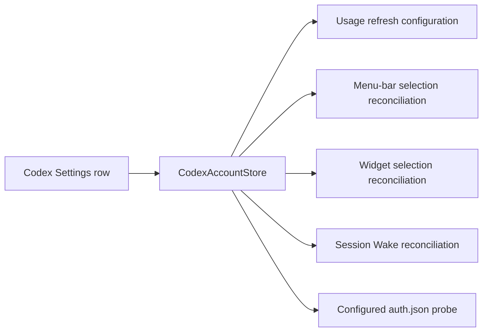

# 2026-07-29

## Session 1: Codex account-management parity

**Status:** Complete

### What was done

- Added reliable inline editing for Codex account labels and `CODEX_HOME`,
  including a user-selected directory override for the default profile.
- Added enable/disable controls for every Codex account and guarded disable or
  delete transitions that would otherwise leave no active profile.
- Kept the default account as an internal migration sentinel while allowing it
  to leave the active set after an alternative profile is enabled.
- Added guarded custom profile edit/delete controls, direct per-profile auth
  checks, honest connection states, and explicit accessibility labels.
- Reconciled disabled or deleted Codex identities from menu-bar, widget, and
  Session Wake selections.
- Added store, presentation/UI, path-resolution, menu-bar, widget, and Session
  Wake regression coverage.
- Opened traceability issue
  [#304](https://github.com/VincentShipsIt/meterbar.dev/issues/304).

### Feature flow

### Decisions

- **Never permit an empty enabled-account set.** The store rejects disabling or
  deleting the last enabled profile; legacy all-disabled data restores only the
  zero-config default sentinel.
- **Do not silently retarget account-scoped consumers.** Menu-bar and widget
  selections are pruned, while Session Wake clears the unavailable selection
  and disarms.
- **Treat auth state and metrics state separately.** Settings reads the
  configured profile's non-expired token instead of using cached metrics as a
  connection proxy.
- **Preserve focused edits across store publications.** Draft reconciliation
  updates pristine fields only and explicitly commits the resolved post-save
  value.

### Verification

- `swift test --filter
  'AppDelegateSplitTests|SessionWakeControllerTests|WidgetSettingsTests|CodexCliLocalServiceTests|CodexAccountStoreTests|CodexAccountProfileRowTests|MenuBarAccountSelectionTests|WidgetPreferencesStoreTests|AccountActivityInspectorTests'`:
  114 tests passed.
- `swift test --filter
  UsageDataManagerTests/testRefreshAllRetainsAndRefreshesTheOnlyEnabledCodexAccount`:
  passed after aligning the legacy all-disabled test with the new last-account
  invariant.
- `swiftlint lint --strict --quiet --no-cache`: passed.
- `xcodebuild -project MeterBar.xcodeproj -scheme MeterBar -configuration Debug
  -derivedDataPath /private/tmp/MeterBarCodexParityDerivedData
  CODE_SIGNING_ALLOWED=NO build`: succeeded.
- `git diff --check`: passed.

### Notes

- The preferred Fable planner and Opus verifier lane was unavailable because
  the project Claude profile was not authenticated. Planning and exact-diff
  review were completed locally; CI remains a delivery gate.
- Session Wake tests originally resolved their lock file into a sandbox-denied
  temporary directory. Their test-only lock now lives under `.build`, matching
  the writable build environment without changing production lock behavior.
- A local run of the entire coverage script was stopped after macOS Security
  blocked on the developer machine's real Claude Keychain. The credential-free
  exact-head CI run remains the authoritative full-suite and coverage gate.
