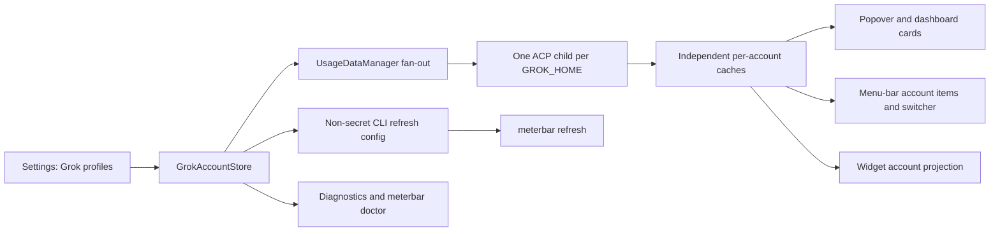
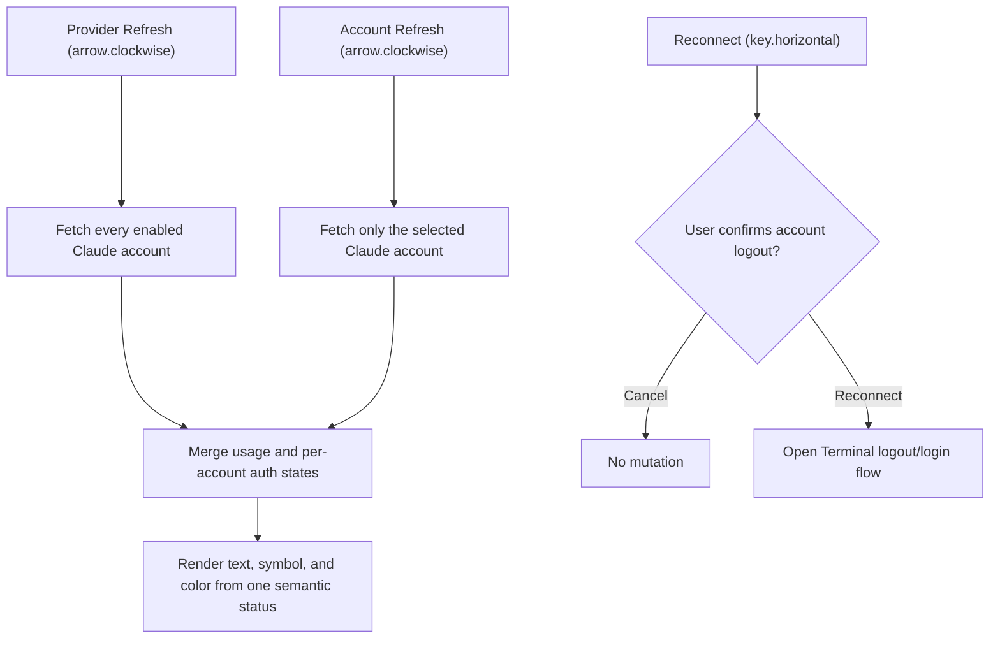

# 2026-07-29

## Session 1: Grok Build multi-account support

**Duration:** ~2 hours
## Session 1: Month-to-date project and model cost attribution

**Status:** Complete

### System flow



### What was done

- [x] Inspected issue #300, current `origin/master`, and open pull-request overlap.
- [x] Verified official Grok Build behavior: `GROK_HOME` owns profile state,
  `auth.json` remains CLI-owned, and ACP billing runs through the official agent.
- [x] Studied the Claude and Codex account stores, home resolvers, fan-out,
  snapshots, menu-bar candidates, widget projection, and refresh-config paths.
- [x] Added `GrokAccount`, `GrokAccountStore`, and `GrokHomeDirectory` with a
  zero-configuration default profile and persisted add/rename/remove/enable/order.
- [x] Scoped every Grok ACP process to its account's `GROK_HOME` without reading
  or logging token material.
- [x] Added concurrent Grok account fan-out, deterministic failure reporting,
  per-account cache isolation, representative metrics, shared snapshots, and wake
  freshness checks.
- [x] Added one card, menu-bar identity/candidate, and widget row per enabled
  account.
- [x] Added Grok account settings, non-secret CLI refresh projection, and
  per-profile readiness/doctor checks.
- [x] Added README and architecture documentation.
- [x] Completed TDD and verification.

### Files changed

- `MeterBar/Models/GrokAccount.swift` — Grok profile model and persisted account store.
- `MeterBar/Services/GrokHomeDirectory.swift` — official default/custom
  `GROK_HOME` and auth-presence path resolution.
- `MeterBar/Services/GrokCLIUsageService.swift` — account-aware access, ACP
  billing, errors, and environment injection.
- `MeterBar/Services/UsageDataManager.swift` — Grok fan-out, isolation, caches,
  representative metrics, shared snapshots, and wake handling.
- `MeterBar/UsageRefresh/*` — backward-compatible Grok profile projection for
  `meterbar refresh`.
- `MeterBar/Views/Settings/*Grok*` and provider settings — account CRUD,
  enablement, ordering, connection state, and provider integration.
- `MeterBar/Views/ProviderSnapshot.swift`, menu-bar models/presenter/probes, and
  widget settings — per-account downstream projections.
- `MeterBar/Services/ProviderReadinessInspector.swift` and diagnostics views —
  enabled-profile auth presence/readability and scoped refresh errors.
- `MeterBarTests/*Grok*` plus focused projection/manager/config tests — store,
  path, environment, merge, isolation, card, menu, widget, and readiness coverage.
- `README.md` and `.agents/SYSTEM/ARCHITECTURE.md` — setup, privacy, and
  implementation documentation.

### Decisions

- Mirror Codex's home-directory account model so Grok adds no third profile
  abstraction.
- Preserve the existing profile as a sentinel default that inherits exported
  `$GROK_HOME` or falls back to `~/.grok`.
- Persist only labels, directories, enablement, and ordering. Auth readiness
  checks file metadata only; token bytes never enter MeterBar.
- Keep `refresh-grok-accounts-v1.json` optional when reading so a new CLI remains
  compatible with configuration written by an older app.
- Treat account-level fetch failures independently and retain only that account's
  last-known-good snapshot.
- Use Grok's always-available weekly window for automatic menu-bar selection;
  session remains available as an explicit pin when the provider reports it.

### Mistakes and fixes

- The first compile exposed a public readiness API taking an internal account
  type. Kept the public API stable and added an internal account-aware overload.
- The first acceptance audit found Grok identities in the account catalog but no
  account-scoped status-item quota candidates. Added the probe path and regression
  tests before the full gate.
- The final correctness pass caught that choosing Grok's optional session window
  for automatic selection could hide weekly-only profiles. Switched automatic
  selection to weekly and added a weekly-only regression test.
- Two focused assertions were sensitive to shared-cache test pollution and
  floating-point representation. Isolated the readiness fixture and used an
  accuracy assertion.
- The first app-build attempt could not write Xcode/Swift caches in the sandbox.
  Re-ran the same build with approved cache access and confirmed success.

### Verification

- `swift test --filter 'GrokAccountStoreTests|GrokCLIUsageServiceTests|UsageDataManagerTests|ProviderSnapshotTests|ProviderReadinessInspectorTests|MenuBarAccountSelectionTests|WidgetSettingsTests|UsageRefreshConfigurationStoreTests'`
  — 158 tests passed.
- `swift test --filter 'AppDelegateSplitTests|StatusItemLimitSelectorTests|ProviderSettingsFactsTests'`
  — 68 tests passed.
- Post-review `swift test --filter
  'StatusItemLimitSelectorTests|AppDelegateSplitTests|GrokCLIUsageServiceTests|UsageDataManagerTests'`
  — 131 tests passed on the final code.
- `swift test` — passed.
- `swiftlint lint --strict` — 0 violations.
- `xcodebuild -quiet -project MeterBar.xcodeproj -scheme MeterBar -configuration Debug
  -derivedDataPath /tmp/meterbar-grok-multi-account-derived
  CODE_SIGNING_ALLOWED=NO build` — passed with existing warnings.
- `cd MeterBarCLI && swift build` — passed with existing Swift 6 migration warnings.
- `MeterBarCLI/.build/debug/meterbar doctor --provider grok` — healthy default
  profile reported without exposing credentials.
- `git diff --check` — passed.
- Independent Opus exact-head review was unavailable because the configured
  profile's OAuth session had expired; the PR remains unmerged for CI and human
  review.

### Next steps

- [ ] Review and merge the issue #300 pull request after required CI passes.
    A[Claude JSONL and Codex logs] --> B[Provider cost scanners]
    B --> C[Day by model and sanitized project accumulators]
    C --> D[Cost cache schema v2]
    E[Legacy v1 cache] --> F[Copy-forward migration]
    F --> D
    D --> G[Calendar-bounded daily aggregation]
    G --> H[Settings month-to-date view]
    G --> I[meterbar cost JSON and text]
```

### Affected components

- **Data:** Versioned cost-cache envelope and backward-compatible v1 migration.
- **Scanning:** Claude and Codex day × model, day × project, and nested
  day × project × model attribution.
- **Presentation:** Month-to-date Settings rows and CLI text/JSON output.
- **Documentation:** CLI JSON contract, architecture, and persisted-data map.

### What was done

- Added optional model/project attribution to each persisted daily usage row.
  Missing values distinguish migrated v1 data from a v2 scan with no rows.
- Bumped the cost cache to schema v2 and `cost-summary-v2.json`; a valid v1
  cache is copied forward without deleting the recoverable original.
- Made older pre-project cost payloads decode tolerantly and queued a normal
  rescan when migrated rows lack attribution.
- Aggregated project/model rollups over the exact selected calendar rows,
  preserving recorded model-aware costs and omitting incomplete attribution.
- Rendered month-to-date project rows with the same nested-model presentation
  as the existing 30-day view.
- Extended `meterbar cost --month-to-date` JSON and human-readable output.
- Added migration, partial-month, legacy-partial, scanner attribution,
  rollover-contract, JSON-contract, and presentation coverage.

### Key decisions

- Do not infer historical attribution during migration. Preserve the readable
  totals, mark attribution unavailable, and refresh from source logs.
- If any included daily row lacks a breakdown dimension, omit that entire
  rollup instead of presenting a misleading partial total.
- Persist only identifiers produced by `CostProjectAttribution`; raw paths,
  branch names, remotes, prompts, and credentials remain outside the cache.
- Keep the public CLI JSON schema at version 1 because all new fields are
  additive and optional; the internal cost-cache schema independently moves
  to version 2.

### Files changed

- `.agents/SYSTEM/ARCHITECTURE.md`
- `MeterBar/Models/CLIJSONOutput.swift`
- `MeterBar/Models/CostSummaryStore.swift`
- `MeterBar/Models/TokenCost.swift`
- `MeterBar/Services/ClaudeCostScanner.swift`
- `MeterBar/Services/CodexCostScanner.swift`
- `MeterBar/Services/CostScanWindows.swift`
- `MeterBar/Services/TokenUsageAggregator.swift`
- `MeterBar/Views/Settings/CostSettingsView.swift`
- `MeterBarCLI/Sources/MeterBarCLI.swift`
- `MeterBarTests/CLIJSONOutputTests.swift`
- `MeterBarTests/CostSummaryStoreTests.swift`
- `MeterBarTests/CostTrackerTests.swift`
- `MeterBarTests/CostWindowTests.swift`
- `MeterBarTests/SettingsViewSmokeTests.swift`
- `docs/audits/00-repo-map.md`
- `docs/cli-json-schema.md`

### Mistakes and fixes

- The first migration fixture exposed that caches predating project
  attribution could not decode the newer required arrays. Added tolerant
  custom decoding for additive breakdown fields.
- The first lint pass found an optional-property initialization style issue
  and nested dictionary mutation formatting. Refactored both and reran strict
  lint successfully.
- The configured Claude planning/review profile was unauthenticated, so no
  quota-bearing fallback was probed. Planning used the bounded issue contract,
  and verification used focused tests, strict lint, builds, and an exact-diff
  local review.

### Verification

- Focused Swift tests: 112 passed, 0 failed.
- `swiftlint lint --strict --quiet`: passed.
- `swift build --package-path MeterBarCLI`: succeeded.
- Debug app `xcodebuild` with code signing disabled: succeeded.
- `git diff --check`: passed.

### Next steps

- Publish the ready PR for CI and maintainer review; do not merge until the
  repository's required checks pass.
## Session 1: Claude Settings refresh and reconnect semantics

**Status:** Complete

### What was done

- Split the per-account Claude action into a non-mutating Refresh icon and an
  explicit, visibly labeled Reconnect action with a distinct key symbol.
- Added a destructive confirmation dialog that names the selected account and
  explains that reconnect opens Terminal, logs out that profile, and starts a
  new sign-in.
- Added scoped per-account refresh support while retaining provider-level
  refresh fan-out across every enabled Claude account.
- Replaced independent status text and connection-color inputs with one
  semantic presentation containing the text, symbol, and tone.
- Added regression coverage for action routing, reconnect confirmation, status
  presentation, provider-level fan-out, scoped refresh, peer preservation, and
  login-required refresh failures.

### Behavior flow



### Files changed

- `MeterBar/Services/UsageDataManager.swift`
- `MeterBar/Views/Components/SettingsComponents.swift`
- `MeterBar/Views/Settings/ClaudeAccountProfileRow.swift`
- `MeterBar/Views/Settings/ProviderSettingsView.swift`
- `MeterBarTests/ClaudeAccountSettingsPresentationTests.swift`
- `MeterBarTests/UsageDataManagerTests.swift`

### Decisions

- `arrow.clockwise` and Refresh remain exclusively non-mutating status/usage
  operations in the Claude account UI.
- Reconnect remains capable of logging out the selected profile, but only after
  a clearly labeled, account-specific destructive confirmation.
- A scoped account refresh does not record provider-wide parse health because
  one selected profile is not evidence about the entire integration.
- Claude planner and verifier profiles were unauthenticated, so implementation
  planning and final review used repository evidence, focused tests, lint, and
  a local structured QA pass.

### Verification

- Focused Claude Settings and account-refresh regressions: 9 tests passed.
- Related Claude auth, reconnect service, Settings facts, and smoke tests:
  48 tests passed.
- `swiftlint lint --strict --quiet`: passed.
- `git diff --check`: passed.
- MeterBar Debug app build with code signing disabled: succeeded.
- A broader `UsageDataManagerTests` filter still encounters the documented
  machine-dependent Grok discovery baseline; no Claude regression failed.
