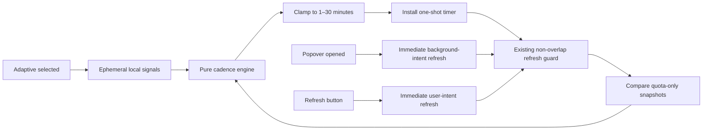
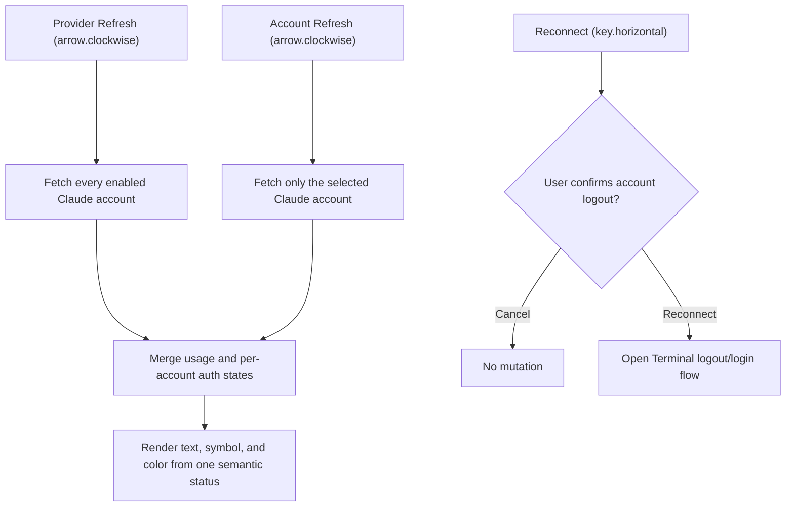

# 2026-07-29

## Session 1: Opt-in adaptive refresh cadence
## Session 1: Claude Settings refresh and reconnect semantics

**Status:** Complete

### What was done

- Added an opt-in Adaptive refresh choice while preserving the 10-minute
  default, every existing persisted raw value, Manual mode, and all six fixed
  repeating timer cadences.
- Added a pure cadence decision engine with an injected clock and hard 1–30
  minute bounds. It considers only recent MeterBar interaction, quota movement,
  battery/Low Power Mode, and thermal state.
- Kept all adaptive behavior history in memory. No signal is persisted, logged,
  emitted as telemetry, or sent to a provider.
- Replaced the repeating timer only for Adaptive mode with a reschedulable
  one-shot timer. Existing overlap protection and wake catch-up policy remain
  unchanged.
- Made popover-open and manual refresh explicit cadence overrides while
  preserving background Keychain access for popover-open and user-initiated
  access for Refresh buttons.
- Added the selected cadence, effective interval, and current reason to
  Diagnostics and its copied report.

### Flow

### Decisions

- Recent quota movement uses the fastest one-minute cadence; recent MeterBar
  interaction uses two minutes; idle backs off to 30 minutes.
- Battery power floors active cadence at 10 minutes, Low Power Mode and fair
  thermal pressure at 15 minutes, and serious/critical thermal pressure at
  30 minutes.
- A new or removed quota window is not counted as movement. Only a changed
  provider-reported `used` value for an existing window escalates cadence.
- Adaptive is opt-in and stored with a new `-1` raw value so all historical
  fixed and Manual preferences remain byte-for-byte compatible.

### Files changed

- `MeterBar/Models/AdaptiveRefreshCadence.swift`
- `MeterBar/Models/RefreshInterval.swift`
- `MeterBar/Services/UsageDataManager.swift`
- `MeterBar/Services/DiagnosticsRunner.swift`
- `MeterBar/App/MeterBarApp.swift`
- `MeterBar/Views/DashboardDiagnosticsSection.swift`
- `MeterBar/Views/MenuBarView.swift`
- `MeterBar/Views/Settings/GeneralSettingsView.swift`
- `MeterBar/Views/Settings/ProviderSettingsView.swift`
- `MeterBar/Views/UsageDashboardView.swift`
- `MeterBarTests/AdaptiveRefreshCadenceTests.swift`
- `MeterBarTests/DiagnosticsRunnerTests.swift`
- `MeterBarTests/RefreshIntervalTests.swift`
- `MeterBarTests/UsageDataManagerTests.swift`
- `README.md`
- `.agents/SYSTEM/ARCHITECTURE.md`

### Verification

- TDD red phase confirmed the new policy types did not exist.
- Focused policy, scheduler, persistence/default, override, diagnostics,
  overlap, and wake tests passed.
- Every fixed interval was verified to retain an exact repeating timer.
- Settings and Diagnostics render-smoke tests passed.
- Changed-file SwiftLint strict validation passed.
- `xcodebuild -project MeterBar.xcodeproj -scheme MeterBar
  CODE_SIGNING_ALLOWED=NO build` succeeded.
- The wider selected wake group reproduced three environment-sensitive
  master-side assertions already documented before this change:
  `testWakeDoesNotRefreshFreshOrManualOnlyData` (two assertions) and
  `testWakeIgnoresMissingMetricsForInaccessibleCodexAccounts` (one assertion).

### Delivery notes

- Planning was degraded because the configured Fable profile was not
  authenticated; implementation used the issue contract and repository
  patterns directly.
- Independent Opus review was unavailable for the same authentication state.
  The final head received local exact-diff correctness, security, secret, lint,
  test, and build review instead.
- Initial PR CI caught an observer-compatibility regression: updating the new
  diagnostics reason emitted a second `objectWillChange` event when the user
  changed the interval. The reason now rides the existing interval/refresh
  publications, with an explicit publication only for power-only reschedules.
- Split the per-account Claude action into a non-mutating Refresh icon and an
  explicit, visibly labeled Reconnect action with a distinct key symbol.
- Added a destructive confirmation dialog that names the selected account and
  explains that reconnect opens Terminal, logs out that profile, and starts a
  new sign-in.
- Added scoped per-account refresh support while retaining provider-level
  refresh fan-out across every enabled Claude account.
- Replaced independent status text and connection-color inputs with one
  semantic presentation containing the text, symbol, and tone.
- Added regression coverage for action routing, reconnect confirmation, status
  presentation, provider-level fan-out, scoped refresh, peer preservation, and
  login-required refresh failures.

### Behavior flow

### Files changed

- `MeterBar/Services/UsageDataManager.swift`
- `MeterBar/Views/Components/SettingsComponents.swift`
- `MeterBar/Views/Settings/ClaudeAccountProfileRow.swift`
- `MeterBar/Views/Settings/ProviderSettingsView.swift`
- `MeterBarTests/ClaudeAccountSettingsPresentationTests.swift`
- `MeterBarTests/UsageDataManagerTests.swift`

### Decisions

- `arrow.clockwise` and Refresh remain exclusively non-mutating status/usage
  operations in the Claude account UI.
- Reconnect remains capable of logging out the selected profile, but only after
  a clearly labeled, account-specific destructive confirmation.
- A scoped account refresh does not record provider-wide parse health because
  one selected profile is not evidence about the entire integration.
- Claude planner and verifier profiles were unauthenticated, so implementation
  planning and final review used repository evidence, focused tests, lint, and
  a local structured QA pass.

### Verification

- Focused Claude Settings and account-refresh regressions: 9 tests passed.
- Related Claude auth, reconnect service, Settings facts, and smoke tests:
  48 tests passed.
- `swiftlint lint --strict --quiet`: passed.
- `git diff --check`: passed.
- MeterBar Debug app build with code signing disabled: succeeded.
- A broader `UsageDataManagerTests` filter still encounters the documented
  machine-dependent Grok discovery baseline; no Claude regression failed.
