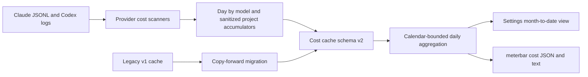
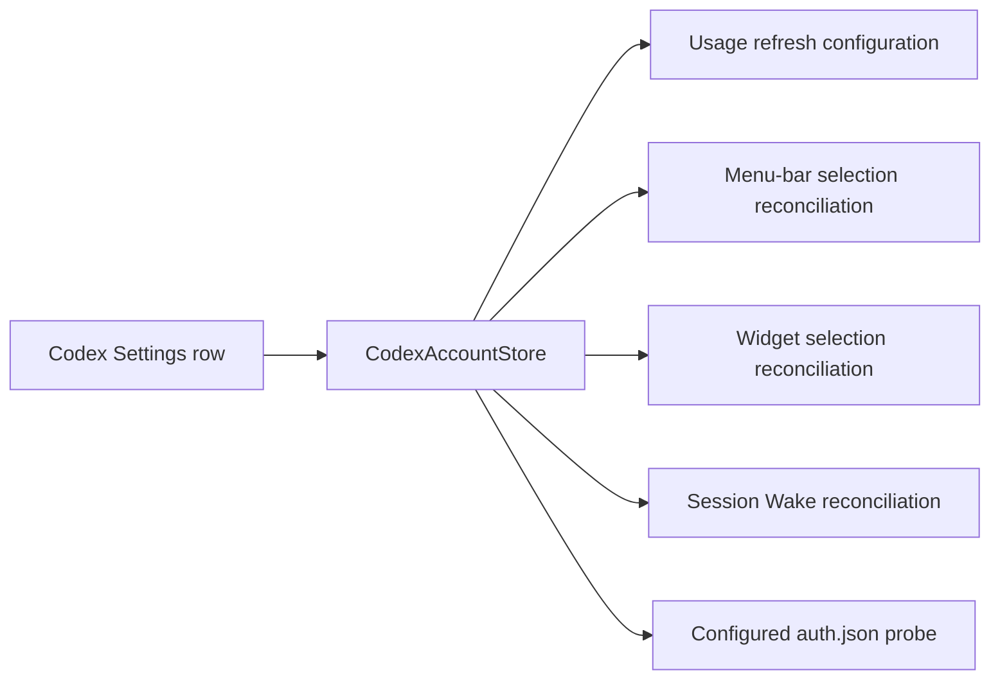
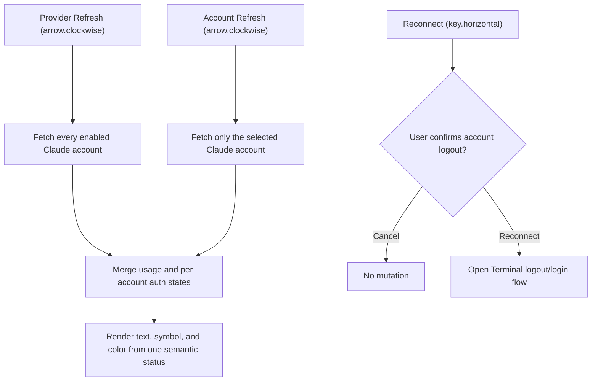

# 2026-07-29

## Session 1: Codex account-management parity
## Session 1: Month-to-date project and model cost attribution

**Status:** Complete

### System flow

### Affected components

- **Data:** Versioned cost-cache envelope and backward-compatible v1 migration.
- **Scanning:** Claude and Codex day × model, day × project, and nested
  day × project × model attribution.
- **Presentation:** Month-to-date Settings rows and CLI text/JSON output.
- **Documentation:** CLI JSON contract, architecture, and persisted-data map.

### What was done

- Added optional model/project attribution to each persisted daily usage row.
  Missing values distinguish migrated v1 data from a v2 scan with no rows.
- Bumped the cost cache to schema v2 and `cost-summary-v2.json`; a valid v1
  cache is copied forward without deleting the recoverable original.
- Made older pre-project cost payloads decode tolerantly and queued a normal
  rescan when migrated rows lack attribution.
- Aggregated project/model rollups over the exact selected calendar rows,
  preserving recorded model-aware costs and omitting incomplete attribution.
- Rendered month-to-date project rows with the same nested-model presentation
  as the existing 30-day view.
- Extended `meterbar cost --month-to-date` JSON and human-readable output.
- Added migration, partial-month, legacy-partial, scanner attribution,
  rollover-contract, JSON-contract, and presentation coverage.

### Key decisions

- Do not infer historical attribution during migration. Preserve the readable
  totals, mark attribution unavailable, and refresh from source logs.
- If any included daily row lacks a breakdown dimension, omit that entire
  rollup instead of presenting a misleading partial total.
- Persist only identifiers produced by `CostProjectAttribution`; raw paths,
  branch names, remotes, prompts, and credentials remain outside the cache.
- Keep the public CLI JSON schema at version 1 because all new fields are
  additive and optional; the internal cost-cache schema independently moves
  to version 2.

### Files changed

- `.agents/SYSTEM/ARCHITECTURE.md`
- `MeterBar/Models/CLIJSONOutput.swift`
- `MeterBar/Models/CostSummaryStore.swift`
- `MeterBar/Models/TokenCost.swift`
- `MeterBar/Services/ClaudeCostScanner.swift`
- `MeterBar/Services/CodexCostScanner.swift`
- `MeterBar/Services/CostScanWindows.swift`
- `MeterBar/Services/TokenUsageAggregator.swift`
- `MeterBar/Views/Settings/CostSettingsView.swift`
- `MeterBarCLI/Sources/MeterBarCLI.swift`
- `MeterBarTests/CLIJSONOutputTests.swift`
- `MeterBarTests/CostSummaryStoreTests.swift`
- `MeterBarTests/CostTrackerTests.swift`
- `MeterBarTests/CostWindowTests.swift`
- `MeterBarTests/SettingsViewSmokeTests.swift`
- `docs/audits/00-repo-map.md`
- `docs/cli-json-schema.md`

### Mistakes and fixes

- The first migration fixture exposed that caches predating project
  attribution could not decode the newer required arrays. Added tolerant
  custom decoding for additive breakdown fields.
- The first lint pass found an optional-property initialization style issue
  and nested dictionary mutation formatting. Refactored both and reran strict
  lint successfully.
- The configured Claude planning/review profile was unauthenticated, so no
  quota-bearing fallback was probed. Planning used the bounded issue contract,
  and verification used focused tests, strict lint, builds, and an exact-diff
  local review.

### Verification

- Focused Swift tests: 112 passed, 0 failed.
- `swiftlint lint --strict --quiet`: passed.
- `swift build --package-path MeterBarCLI`: succeeded.
- Debug app `xcodebuild` with code signing disabled: succeeded.
- `git diff --check`: passed.

### Next steps

- Publish the ready PR for CI and maintainer review; do not merge until the
  repository's required checks pass.
## Session 1: Claude Settings refresh and reconnect semantics

**Status:** Complete

### What was done

- Added reliable inline editing for Codex account labels and `CODEX_HOME`,
  including a user-selected directory override for the default profile.
- Added enable/disable controls for every Codex account and guarded disable or
  delete transitions that would otherwise leave no active profile.
- Kept the default account as an internal migration sentinel while allowing it
  to leave the active set after an alternative profile is enabled.
- Added guarded custom profile edit/delete controls, direct per-profile auth
  checks, honest connection states, and explicit accessibility labels.
- Reconciled disabled or deleted Codex identities from menu-bar, widget, and
  Session Wake selections.
- Added store, presentation/UI, path-resolution, menu-bar, widget, and Session
  Wake regression coverage.
- Opened traceability issue
  [#304](https://github.com/VincentShipsIt/meterbar.dev/issues/304).

### Feature flow

### Decisions

- **Never permit an empty enabled-account set.** The store rejects disabling or
  deleting the last enabled profile; legacy all-disabled data restores only the
  zero-config default sentinel.
- **Do not silently retarget account-scoped consumers.** Menu-bar and widget
  selections are pruned, while Session Wake clears the unavailable selection
  and disarms.
- **Treat auth state and metrics state separately.** Settings reads the
  configured profile's non-expired token instead of using cached metrics as a
  connection proxy.
- **Preserve focused edits across store publications.** Draft reconciliation
  updates pristine fields only and explicitly commits the resolved post-save
  value.

### Verification

- `swift test --filter
  'AppDelegateSplitTests|SessionWakeControllerTests|WidgetSettingsTests|CodexCliLocalServiceTests|CodexAccountStoreTests|CodexAccountProfileRowTests|MenuBarAccountSelectionTests|WidgetPreferencesStoreTests|AccountActivityInspectorTests'`:
  114 tests passed.
- `swift test --filter
  UsageDataManagerTests/testRefreshAllRetainsAndRefreshesTheOnlyEnabledCodexAccount`:
  passed after aligning the legacy all-disabled test with the new last-account
  invariant.
- `swiftlint lint --strict --quiet --no-cache`: passed.
- `xcodebuild -project MeterBar.xcodeproj -scheme MeterBar -configuration Debug
  -derivedDataPath /private/tmp/MeterBarCodexParityDerivedData
  CODE_SIGNING_ALLOWED=NO build`: succeeded.
- `git diff --check`: passed.

### Notes

- The preferred Fable planner and Opus verifier lane was unavailable because
  the project Claude profile was not authenticated. Planning and exact-diff
  review were completed locally; CI remains a delivery gate.
- Session Wake tests originally resolved their lock file into a sandbox-denied
  temporary directory. Their test-only lock now lives under `.build`, matching
  the writable build environment without changing production lock behavior.
- A local run of the entire coverage script was stopped after macOS Security
  blocked on the developer machine's real Claude Keychain. The credential-free
  exact-head CI run remains the authoritative full-suite and coverage gate.
- Split the per-account Claude action into a non-mutating Refresh icon and an
  explicit, visibly labeled Reconnect action with a distinct key symbol.
- Added a destructive confirmation dialog that names the selected account and
  explains that reconnect opens Terminal, logs out that profile, and starts a
  new sign-in.
- Added scoped per-account refresh support while retaining provider-level
  refresh fan-out across every enabled Claude account.
- Replaced independent status text and connection-color inputs with one
  semantic presentation containing the text, symbol, and tone.
- Added regression coverage for action routing, reconnect confirmation, status
  presentation, provider-level fan-out, scoped refresh, peer preservation, and
  login-required refresh failures.

### Behavior flow

### Files changed

- `MeterBar/Services/UsageDataManager.swift`
- `MeterBar/Views/Components/SettingsComponents.swift`
- `MeterBar/Views/Settings/ClaudeAccountProfileRow.swift`
- `MeterBar/Views/Settings/ProviderSettingsView.swift`
- `MeterBarTests/ClaudeAccountSettingsPresentationTests.swift`
- `MeterBarTests/UsageDataManagerTests.swift`

### Decisions

- `arrow.clockwise` and Refresh remain exclusively non-mutating status/usage
  operations in the Claude account UI.
- Reconnect remains capable of logging out the selected profile, but only after
  a clearly labeled, account-specific destructive confirmation.
- A scoped account refresh does not record provider-wide parse health because
  one selected profile is not evidence about the entire integration.
- Claude planner and verifier profiles were unauthenticated, so implementation
  planning and final review used repository evidence, focused tests, lint, and
  a local structured QA pass.

### Verification

- Focused Claude Settings and account-refresh regressions: 9 tests passed.
- Related Claude auth, reconnect service, Settings facts, and smoke tests:
  48 tests passed.
- `swiftlint lint --strict --quiet`: passed.
- `git diff --check`: passed.
- MeterBar Debug app build with code signing disabled: succeeded.
- A broader `UsageDataManagerTests` filter still encounters the documented
  machine-dependent Grok discovery baseline; no Claude regression failed.
