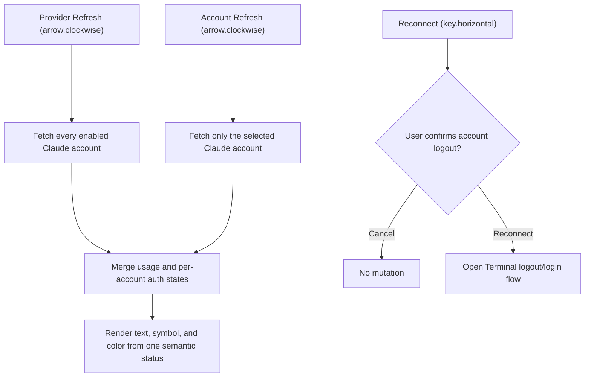

# 2026-07-29

## Session 1: Claude Settings refresh and reconnect semantics

**Status:** Complete

### What was done

- Split the per-account Claude action into a non-mutating Refresh icon and an
  explicit, visibly labeled Reconnect action with a distinct key symbol.
- Added a destructive confirmation dialog that names the selected account and
  explains that reconnect opens Terminal, logs out that profile, and starts a
  new sign-in.
- Added scoped per-account refresh support while retaining provider-level
  refresh fan-out across every enabled Claude account.
- Replaced independent status text and connection-color inputs with one
  semantic presentation containing the text, symbol, and tone.
- Added regression coverage for action routing, reconnect confirmation, status
  presentation, provider-level fan-out, scoped refresh, peer preservation, and
  login-required refresh failures.

### Behavior flow

### Files changed

- `MeterBar/Services/UsageDataManager.swift`
- `MeterBar/Views/Components/SettingsComponents.swift`
- `MeterBar/Views/Settings/ClaudeAccountProfileRow.swift`
- `MeterBar/Views/Settings/ProviderSettingsView.swift`
- `MeterBarTests/ClaudeAccountSettingsPresentationTests.swift`
- `MeterBarTests/UsageDataManagerTests.swift`

### Decisions

- `arrow.clockwise` and Refresh remain exclusively non-mutating status/usage
  operations in the Claude account UI.
- Reconnect remains capable of logging out the selected profile, but only after
  a clearly labeled, account-specific destructive confirmation.
- A scoped account refresh does not record provider-wide parse health because
  one selected profile is not evidence about the entire integration.
- Claude planner and verifier profiles were unauthenticated, so implementation
  planning and final review used repository evidence, focused tests, lint, and
  a local structured QA pass.

### Verification

- Focused Claude Settings and account-refresh regressions: 9 tests passed.
- Related Claude auth, reconnect service, Settings facts, and smoke tests:
  48 tests passed.
- `swiftlint lint --strict --quiet`: passed.
- `git diff --check`: passed.
- MeterBar Debug app build with code signing disabled: succeeded.
- A broader `UsageDataManagerTests` filter still encounters the documented
  machine-dependent Grok discovery baseline; no Claude regression failed.
