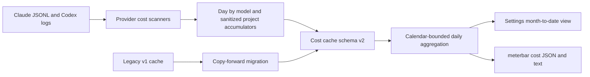
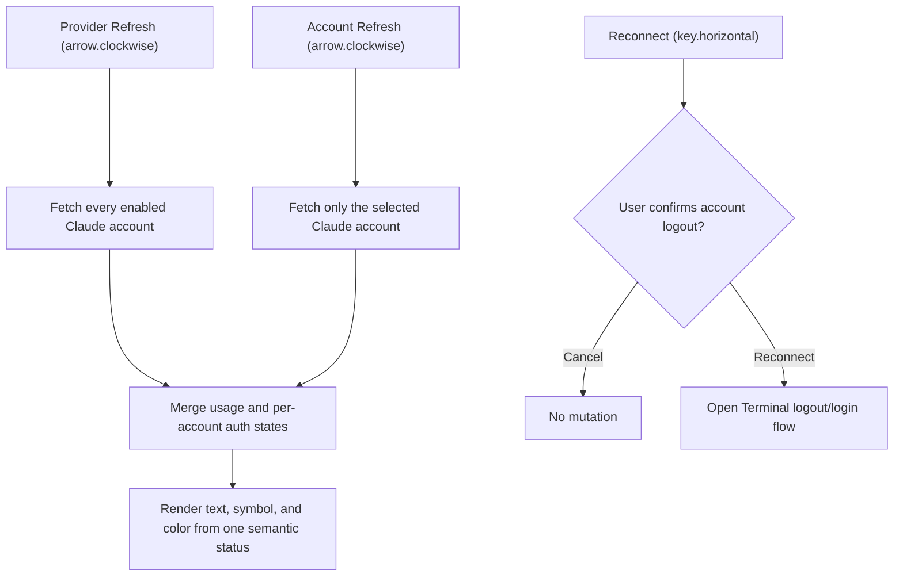

# 2026-07-29

## Session 1: menu-bar display options (#269)

**Status:** Complete — ready PR #306 published, not merged.

### System flow

```text
Settings preferences
  -> UserDefaults-backed MenuBarDisplayPreferencesStore
  -> StatusItemRefreshTrigger
  -> StatusLimitProbeRequestBuilder (window id + snapshot timestamp)
  -> pure MenuBarStatusItemPlanner / StatusItemLabelFormatter
  -> StatusItemPresenter (AppKit font, tint, timer)
  -> bounded title + complete tooltip / VoiceOver label
## Session 1: Month-to-date project and model cost attribution

**Status:** Complete

### System flow



### Affected components

- General Settings menu-bar controls.
- Menu-bar preference persistence and refresh fan-in.
- Provider/account quota candidate metadata.
- Pure status-item selection and formatting.
- AppKit status-button typography, contrast, and countdown refresh.
- Rendering-contract and persistence tests.

### What was done

- [x] Read issue #269, confirmed no open PR overlap, and inspected existing preference,
  formatter, status-item planner, and test patterns.
- [x] Added persisted opt-in controls for Session + Weekly, pace, Small/Default/Large
  font size, high contrast, and exhausted-window reset countdown.
- [x] Preserved the exact upgraded-install path: one selected window, compact
  percent-left, native AppKit font/tint, and no reset countdown.
- [x] Added bounded combined labels (`S` / `W`), reserve/deficit abbreviations,
  minute-updated reset countdowns, explicit stale/unknown placeholders, and
  complete tooltip/VoiceOver wording.
- [x] Kept formatting in pure presentation models and added focused contracts
  across merged, per-provider, per-account, compact, regular, light, and dark cases.
- [x] Ran focused tests, strict SwiftLint, and the complete unsigned Xcode build.
- [x] Ran the full Swift package suite and reproduced a visible Liquid Glass
  timing failure unchanged on untouched `origin/master`.
- [x] Published ready PR #306 to `master`; it remains unmerged.

### Key decisions

- Every new preference is additive and defaults to the legacy presentation.
- `Default` font size stores no point-size override; AppKit remains the source of
  native menu-bar typography. Small/Large opt into 11/15-point text.
- Combined visible content has a hard 32-character limit before the existing
  leading spacer. Full semantics stay in VoiceOver/tooltips instead of widening
  the status item.
- Missing, estimated, uncomputable, or stale data renders `—`; it never becomes
  a fabricated zero or a stale current-looking percentage.
- High contrast uses adaptive bold black/white text and template-icon tint.
- The countdown timer runs only for opted-in exhausted windows and re-applies
  cached candidates; it performs no provider or filesystem probes.
- The preferred Fable planning lane was skipped after fresh CLI authentication
  telemetry reported an expired login (`planning_degraded`); implementation
  continued with a local explicit plan per global routing policy.

### Files changed

- `.agents/SYSTEM/ARCHITECTURE.md` — documented the implemented display layer.
- `MeterBar/Models/StorageKeys.swift` — new persisted preference keys.
- `MeterBar/Services/MenuBarDisplayPreferencesStore.swift` — options and pure formatter.
- `MeterBar/Models/StatusItemLimitSelector.swift` — stable window/timestamp metadata.
- `MeterBar/Models/MenuBarStatusItemPlanner.swift` — combined/stale/accessibility contracts.
- `MeterBar/App/StatusLimitProbeRequests.swift` — propagated window and freshness metadata.
- `MeterBar/App/StatusItemRefreshTrigger.swift` — observed every new preference.
- `MeterBar/App/StatusItemPresenter.swift` — typography, contrast, and minute refresh.
- `MeterBar/Views/Settings/GeneralSettingsView.swift` — additive controls.
- `MeterBarTests/MenuBarDisplayPreferencesStoreTests.swift` — persistence/pace coverage.
- `MeterBarTests/StatusItemRenderingContractTests.swift` — bounded rendering contracts.
- `.agents/SESSIONS/2026-07-29.md` — this delivery record.

### Mistakes and fixes

- Final diff review found that assigning a 14-point semibold font in the default
  path would subtly change upgraded installs. The implementation now leaves the
  native AppKit font untouched unless the user explicitly opts in.
- The first implementation of that correction used an ambiguous `CGFloat.init`
  mapping; focused tests and the Xcode compiler caught it immediately, and the
  conversion was made explicit before publication.

### Next steps

- [ ] Review PR #306 and let required CI complete.
- [ ] Merge only after repository gates pass; this session does not merge.
- **Data:** Versioned cost-cache envelope and backward-compatible v1 migration.
- **Scanning:** Claude and Codex day × model, day × project, and nested
  day × project × model attribution.
- **Presentation:** Month-to-date Settings rows and CLI text/JSON output.
- **Documentation:** CLI JSON contract, architecture, and persisted-data map.

### What was done

- Added optional model/project attribution to each persisted daily usage row.
  Missing values distinguish migrated v1 data from a v2 scan with no rows.
- Bumped the cost cache to schema v2 and `cost-summary-v2.json`; a valid v1
  cache is copied forward without deleting the recoverable original.
- Made older pre-project cost payloads decode tolerantly and queued a normal
  rescan when migrated rows lack attribution.
- Aggregated project/model rollups over the exact selected calendar rows,
  preserving recorded model-aware costs and omitting incomplete attribution.
- Rendered month-to-date project rows with the same nested-model presentation
  as the existing 30-day view.
- Extended `meterbar cost --month-to-date` JSON and human-readable output.
- Added migration, partial-month, legacy-partial, scanner attribution,
  rollover-contract, JSON-contract, and presentation coverage.

### Key decisions

- Do not infer historical attribution during migration. Preserve the readable
  totals, mark attribution unavailable, and refresh from source logs.
- If any included daily row lacks a breakdown dimension, omit that entire
  rollup instead of presenting a misleading partial total.
- Persist only identifiers produced by `CostProjectAttribution`; raw paths,
  branch names, remotes, prompts, and credentials remain outside the cache.
- Keep the public CLI JSON schema at version 1 because all new fields are
  additive and optional; the internal cost-cache schema independently moves
  to version 2.

### Files changed

- `.agents/SYSTEM/ARCHITECTURE.md`
- `MeterBar/Models/CLIJSONOutput.swift`
- `MeterBar/Models/CostSummaryStore.swift`
- `MeterBar/Models/TokenCost.swift`
- `MeterBar/Services/ClaudeCostScanner.swift`
- `MeterBar/Services/CodexCostScanner.swift`
- `MeterBar/Services/CostScanWindows.swift`
- `MeterBar/Services/TokenUsageAggregator.swift`
- `MeterBar/Views/Settings/CostSettingsView.swift`
- `MeterBarCLI/Sources/MeterBarCLI.swift`
- `MeterBarTests/CLIJSONOutputTests.swift`
- `MeterBarTests/CostSummaryStoreTests.swift`
- `MeterBarTests/CostTrackerTests.swift`
- `MeterBarTests/CostWindowTests.swift`
- `MeterBarTests/SettingsViewSmokeTests.swift`
- `docs/audits/00-repo-map.md`
- `docs/cli-json-schema.md`

### Mistakes and fixes

- The first migration fixture exposed that caches predating project
  attribution could not decode the newer required arrays. Added tolerant
  custom decoding for additive breakdown fields.
- The first lint pass found an optional-property initialization style issue
  and nested dictionary mutation formatting. Refactored both and reran strict
  lint successfully.
- The configured Claude planning/review profile was unauthenticated, so no
  quota-bearing fallback was probed. Planning used the bounded issue contract,
  and verification used focused tests, strict lint, builds, and an exact-diff
  local review.

### Verification

- Focused Swift tests: 112 passed, 0 failed.
- `swiftlint lint --strict --quiet`: passed.
- `swift build --package-path MeterBarCLI`: succeeded.
- Debug app `xcodebuild` with code signing disabled: succeeded.
- `git diff --check`: passed.

### Next steps

- Publish the ready PR for CI and maintainer review; do not merge until the
  repository's required checks pass.
## Session 1: Claude Settings refresh and reconnect semantics

**Status:** Complete

### What was done

- Split the per-account Claude action into a non-mutating Refresh icon and an
  explicit, visibly labeled Reconnect action with a distinct key symbol.
- Added a destructive confirmation dialog that names the selected account and
  explains that reconnect opens Terminal, logs out that profile, and starts a
  new sign-in.
- Added scoped per-account refresh support while retaining provider-level
  refresh fan-out across every enabled Claude account.
- Replaced independent status text and connection-color inputs with one
  semantic presentation containing the text, symbol, and tone.
- Added regression coverage for action routing, reconnect confirmation, status
  presentation, provider-level fan-out, scoped refresh, peer preservation, and
  login-required refresh failures.

### Behavior flow



### Files changed

- `MeterBar/Services/UsageDataManager.swift`
- `MeterBar/Views/Components/SettingsComponents.swift`
- `MeterBar/Views/Settings/ClaudeAccountProfileRow.swift`
- `MeterBar/Views/Settings/ProviderSettingsView.swift`
- `MeterBarTests/ClaudeAccountSettingsPresentationTests.swift`
- `MeterBarTests/UsageDataManagerTests.swift`

### Decisions

- `arrow.clockwise` and Refresh remain exclusively non-mutating status/usage
  operations in the Claude account UI.
- Reconnect remains capable of logging out the selected profile, but only after
  a clearly labeled, account-specific destructive confirmation.
- A scoped account refresh does not record provider-wide parse health because
  one selected profile is not evidence about the entire integration.
- Claude planner and verifier profiles were unauthenticated, so implementation
  planning and final review used repository evidence, focused tests, lint, and
  a local structured QA pass.

### Verification

- Focused Claude Settings and account-refresh regressions: 9 tests passed.
- Related Claude auth, reconnect service, Settings facts, and smoke tests:
  48 tests passed.
- `swiftlint lint --strict --quiet`: passed.
- `git diff --check`: passed.
- MeterBar Debug app build with code signing disabled: succeeded.
- A broader `UsageDataManagerTests` filter still encounters the documented
  machine-dependent Grok discovery baseline; no Claude regression failed.
