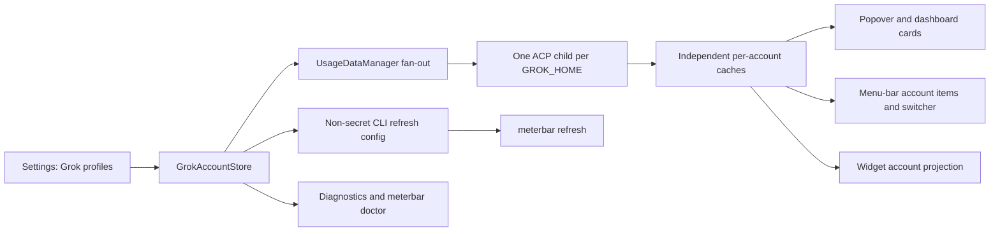
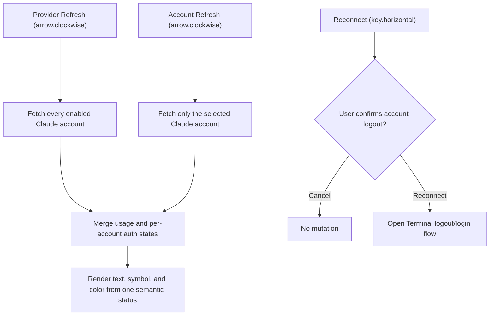

# 2026-07-29

## Session 1: Opt-in adaptive refresh cadence
## Session 1: Codex account-management parity
## Session 1: menu-bar display options (#269)

**Status:** Complete — ready PR #306 published, not merged.

### System flow

```text
Settings preferences
  -> UserDefaults-backed MenuBarDisplayPreferencesStore
  -> StatusItemRefreshTrigger
  -> StatusLimitProbeRequestBuilder (window id + snapshot timestamp)
  -> pure MenuBarStatusItemPlanner / StatusItemLabelFormatter
  -> StatusItemPresenter (AppKit font, tint, timer)
  -> bounded title + complete tooltip / VoiceOver label
## Session 1: Grok Build multi-account support

**Duration:** ~2 hours
## Session 1: App-wide quota event hooks and webhooks (#268)

**Status:** Complete — ready PR pending publication
## Session 1: Month-to-date project and model cost attribution

**Status:** Complete

### System flow



### What was done

- [x] Inspected issue #300, current `origin/master`, and open pull-request overlap.
- [x] Verified official Grok Build behavior: `GROK_HOME` owns profile state,
  `auth.json` remains CLI-owned, and ACP billing runs through the official agent.
- [x] Studied the Claude and Codex account stores, home resolvers, fan-out,
  snapshots, menu-bar candidates, widget projection, and refresh-config paths.
- [x] Added `GrokAccount`, `GrokAccountStore`, and `GrokHomeDirectory` with a
  zero-configuration default profile and persisted add/rename/remove/enable/order.
- [x] Scoped every Grok ACP process to its account's `GROK_HOME` without reading
  or logging token material.
- [x] Added concurrent Grok account fan-out, deterministic failure reporting,
  per-account cache isolation, representative metrics, shared snapshots, and wake
  freshness checks.
- [x] Added one card, menu-bar identity/candidate, and widget row per enabled
  account.
- [x] Added Grok account settings, non-secret CLI refresh projection, and
  per-profile readiness/doctor checks.
- [x] Added README and architecture documentation.
- [x] Completed TDD and verification.

### Files changed

- `MeterBar/Models/GrokAccount.swift` — Grok profile model and persisted account store.
- `MeterBar/Services/GrokHomeDirectory.swift` — official default/custom
  `GROK_HOME` and auth-presence path resolution.
- `MeterBar/Services/GrokCLIUsageService.swift` — account-aware access, ACP
  billing, errors, and environment injection.
- `MeterBar/Services/UsageDataManager.swift` — Grok fan-out, isolation, caches,
  representative metrics, shared snapshots, and wake handling.
- `MeterBar/UsageRefresh/*` — backward-compatible Grok profile projection for
  `meterbar refresh`.
- `MeterBar/Views/Settings/*Grok*` and provider settings — account CRUD,
  enablement, ordering, connection state, and provider integration.
- `MeterBar/Views/ProviderSnapshot.swift`, menu-bar models/presenter/probes, and
  widget settings — per-account downstream projections.
- `MeterBar/Services/ProviderReadinessInspector.swift` and diagnostics views —
  enabled-profile auth presence/readability and scoped refresh errors.
- `MeterBarTests/*Grok*` plus focused projection/manager/config tests — store,
  path, environment, merge, isolation, card, menu, widget, and readiness coverage.
- `README.md` and `.agents/SYSTEM/ARCHITECTURE.md` — setup, privacy, and
  implementation documentation.

### Decisions

- Mirror Codex's home-directory account model so Grok adds no third profile
  abstraction.
- Preserve the existing profile as a sentinel default that inherits exported
  `$GROK_HOME` or falls back to `~/.grok`.
- Persist only labels, directories, enablement, and ordering. Auth readiness
  checks file metadata only; token bytes never enter MeterBar.
- Keep `refresh-grok-accounts-v1.json` optional when reading so a new CLI remains
  compatible with configuration written by an older app.
- Treat account-level fetch failures independently and retain only that account's
  last-known-good snapshot.
- Use Grok's always-available weekly window for automatic menu-bar selection;
  session remains available as an explicit pin when the provider reports it.

### Mistakes and fixes

- The first compile exposed a public readiness API taking an internal account
  type. Kept the public API stable and added an internal account-aware overload.
- The first acceptance audit found Grok identities in the account catalog but no
  account-scoped status-item quota candidates. Added the probe path and regression
  tests before the full gate.
- The final correctness pass caught that choosing Grok's optional session window
  for automatic selection could hide weekly-only profiles. Switched automatic
  selection to weekly and added a weekly-only regression test.
- Two focused assertions were sensitive to shared-cache test pollution and
  floating-point representation. Isolated the readiness fixture and used an
  accuracy assertion.
- The first app-build attempt could not write Xcode/Swift caches in the sandbox.
  Re-ran the same build with approved cache access and confirmed success.

### Verification

- `swift test --filter 'GrokAccountStoreTests|GrokCLIUsageServiceTests|UsageDataManagerTests|ProviderSnapshotTests|ProviderReadinessInspectorTests|MenuBarAccountSelectionTests|WidgetSettingsTests|UsageRefreshConfigurationStoreTests'`
  — 158 tests passed.
- `swift test --filter 'AppDelegateSplitTests|StatusItemLimitSelectorTests|ProviderSettingsFactsTests'`
  — 68 tests passed.
- Post-review `swift test --filter
  'StatusItemLimitSelectorTests|AppDelegateSplitTests|GrokCLIUsageServiceTests|UsageDataManagerTests'`
  — 131 tests passed on the final code.
- `swift test` — passed.
- `swiftlint lint --strict` — 0 violations.
- `xcodebuild -quiet -project MeterBar.xcodeproj -scheme MeterBar -configuration Debug
  -derivedDataPath /tmp/meterbar-grok-multi-account-derived
  CODE_SIGNING_ALLOWED=NO build` — passed with existing warnings.
- `cd MeterBarCLI && swift build` — passed with existing Swift 6 migration warnings.
- `MeterBarCLI/.build/debug/meterbar doctor --provider grok` — healthy default
  profile reported without exposing credentials.
- `git diff --check` — passed.
- Independent Opus exact-head review was unavailable because the configured
  profile's OAuth session had expired; the PR remains unmerged for CI and human
  review.

### Next steps

- [ ] Review and merge the issue #300 pull request after required CI passes.
    Refresh[Provider/account refresh] --> Events[Quota event service]
    Events --> Local[Literal argv hook]
    Events --> Webhook[Opt-in webhook]
    Events --> Diagnostics[Non-fatal diagnostics]
    Wake[Session Wake transitions] --> Local
    Settings[Versioned integration settings] --> Events
    Settings --> Wake
    A[Claude JSONL and Codex logs] --> B[Provider cost scanners]
    B --> C[Day by model and sanitized project accumulators]
    C --> D[Cost cache schema v2]
    E[Legacy v1 cache] --> F[Copy-forward migration]
    F --> D
    D --> G[Calendar-bounded daily aggregation]
    G --> H[Settings month-to-date view]
    G --> I[meterbar cost JSON and text]
```

### Affected components

- General Settings menu-bar controls.
- Menu-bar preference persistence and refresh fan-in.
- Provider/account quota candidate metadata.
- Pure status-item selection and formatting.
- AppKit status-button typography, contrast, and countdown refresh.
- Rendering-contract and persistence tests.

### What was done

- [x] Read issue #269, confirmed no open PR overlap, and inspected existing preference,
  formatter, status-item planner, and test patterns.
- [x] Added persisted opt-in controls for Session + Weekly, pace, Small/Default/Large
  font size, high contrast, and exhausted-window reset countdown.
- [x] Preserved the exact upgraded-install path: one selected window, compact
  percent-left, native AppKit font/tint, and no reset countdown.
- [x] Added bounded combined labels (`S` / `W`), reserve/deficit abbreviations,
  minute-updated reset countdowns, explicit stale/unknown placeholders, and
  complete tooltip/VoiceOver wording.
- [x] Kept formatting in pure presentation models and added focused contracts
  across merged, per-provider, per-account, compact, regular, light, and dark cases.
- [x] Ran focused tests, strict SwiftLint, and the complete unsigned Xcode build.
- [x] Ran the full Swift package suite and reproduced a visible Liquid Glass
  timing failure unchanged on untouched `origin/master`.
- [x] Published ready PR #306 to `master`; it remains unmerged.

### Key decisions

- Every new preference is additive and defaults to the legacy presentation.
- `Default` font size stores no point-size override; AppKit remains the source of
  native menu-bar typography. Small/Large opt into 11/15-point text.
- Combined visible content has a hard 32-character limit before the existing
  leading spacer. Full semantics stay in VoiceOver/tooltips instead of widening
  the status item.
- Missing, estimated, uncomputable, or stale data renders `—`; it never becomes
  a fabricated zero or a stale current-looking percentage.
- High contrast uses adaptive bold black/white text and template-icon tint.
- The countdown timer runs only for opted-in exhausted windows and re-applies
  cached candidates; it performs no provider or filesystem probes.
- The preferred Fable planning lane was skipped after fresh CLI authentication
  telemetry reported an expired login (`planning_degraded`); implementation
  continued with a local explicit plan per global routing policy.

### Files changed

- `.agents/SYSTEM/ARCHITECTURE.md` — documented the implemented display layer.
- `MeterBar/Models/StorageKeys.swift` — new persisted preference keys.
- `MeterBar/Services/MenuBarDisplayPreferencesStore.swift` — options and pure formatter.
- `MeterBar/Models/StatusItemLimitSelector.swift` — stable window/timestamp metadata.
- `MeterBar/Models/MenuBarStatusItemPlanner.swift` — combined/stale/accessibility contracts.
- `MeterBar/App/StatusLimitProbeRequests.swift` — propagated window and freshness metadata.
- `MeterBar/App/StatusItemRefreshTrigger.swift` — observed every new preference.
- `MeterBar/App/StatusItemPresenter.swift` — typography, contrast, and minute refresh.
- `MeterBar/Views/Settings/GeneralSettingsView.swift` — additive controls.
- `MeterBarTests/MenuBarDisplayPreferencesStoreTests.swift` — persistence/pace coverage.
- `MeterBarTests/StatusItemRenderingContractTests.swift` — bounded rendering contracts.
- `.agents/SESSIONS/2026-07-29.md` — this delivery record.

### Mistakes and fixes

- Final diff review found that assigning a 14-point semibold font in the default
  path would subtly change upgraded installs. The implementation now leaves the
  native AppKit font untouched unless the user explicitly opts in.
- The first implementation of that correction used an ambiguous `CGFloat.init`
  mapping; focused tests and the Xcode compiler caught it immediately, and the
  conversion was made explicit before publication.

### Next steps

- [ ] Review PR #306 and let required CI complete.
- [ ] Merge only after repository gates pass; this session does not merge.
- Quota transition planning and delivery services
- Integration preference persistence and migration
- Session Wake hook compatibility
- Settings UI and public webhook schema documentation

### What was done

- [x] Loaded repository memory, critical rules, architecture, and recent sessions.
- [x] Inspected issue #268, current `master`, and open PR overlap.
- [x] Read the existing wake-hook, notification-decider, account-planner, and persistence patterns.
- [x] Added provider/account/window transition planning for warning, critical, exhausted, and recovered.
- [x] Added scoped opt-ins, direct local execution, webhook delivery, diagnostics, and legacy migration.
- [x] Added a General settings surface and documented the public webhook v1 contract.
- [x] Added focused transition, flapping, isolation, migration, timeout/failure, and SSRF/secret tests.
- [x] Passed 93 focused tests, strict SwiftLint, and the unsigned Xcode app build.

### Key decisions

- The shared `QuotaBand` model remains the only severity threshold source.
- First observations prime state; stale cached quota never fires as a new transition.
- Provider/account/window namespaces are independent and are removed when no longer tracked.
- Local commands continue using `Process` with an absolute executable and literal argv only.
- Webhooks are explicit opt-in, HTTPS/443-only, DNS checked, redirect-free, ephemeral, and secret-free.
- The webhook JSON body is public version 1; additive fields are compatible and breaking changes require a new version.
- Existing Session Wake settings migrate once into the new store and mirror back to the legacy key.
- Provider routing was degraded: the Ship Claude profile reported unauthenticated, so implementation planning and exact-head review stayed in Codex with local tests, build, and PR CI as gates.

### Files changed

- `MeterBar/Services/QuotaEvent*.swift` — transition planning, scoped settings, delivery, diagnostics, and orchestration.
- `MeterBar/Services/QuotaWebhookClient.swift` — bounded public-HTTPS webhook transport and SSRF boundary.
- `MeterBar/App/QuotaEventCoordinator.swift` — app-wide refresh/account/provider bridge.
- `MeterBar/SessionWake/*` — unchanged legacy environment behavior backed by promoted settings.
- `MeterBar/Views/Settings/QuotaEventSettingsView.swift` — explicit outbound integration controls and disclosure.
- `MeterBarTests/QuotaEvent*Tests.swift`, `MeterBarTests/QuotaWebhookClientTests.swift` — focused TDD coverage.
- `README.md`, `docs/cli-json-schema.md`, `docs/quota-event-webhooks.md` — user and public-contract documentation.
- `.agents/SYSTEM/ARCHITECTURE.md` — implemented architecture update.

### Mistakes and fixes

- The first app build exposed missing `MeterBarShared` imports in the generalized runner/delivery files; both were added and the build passed.
- Flat providers initially reused `default` as the SwiftUI row identity; row identity now includes provider plus account id.
- The initial webhook boundary lived only in the delivery handler; the client now revalidates URL policy before transport as defense in depth.
- A full local `swift test` attempt reached an existing interactive Keychain access and stalled. The process was stopped; focused suites and the app build completed cleanly, and PR CI remains the full-suite gate.

### Next steps

- [ ] Publish the ready PR to `master`, wait for CI evidence, and leave it unmerged.
- **Data:** Versioned cost-cache envelope and backward-compatible v1 migration.
- **Scanning:** Claude and Codex day × model, day × project, and nested
  day × project × model attribution.
- **Presentation:** Month-to-date Settings rows and CLI text/JSON output.
- **Documentation:** CLI JSON contract, architecture, and persisted-data map.

### What was done

- Added optional model/project attribution to each persisted daily usage row.
  Missing values distinguish migrated v1 data from a v2 scan with no rows.
- Bumped the cost cache to schema v2 and `cost-summary-v2.json`; a valid v1
  cache is copied forward without deleting the recoverable original.
- Made older pre-project cost payloads decode tolerantly and queued a normal
  rescan when migrated rows lack attribution.
- Aggregated project/model rollups over the exact selected calendar rows,
  preserving recorded model-aware costs and omitting incomplete attribution.
- Rendered month-to-date project rows with the same nested-model presentation
  as the existing 30-day view.
- Extended `meterbar cost --month-to-date` JSON and human-readable output.
- Added migration, partial-month, legacy-partial, scanner attribution,
  rollover-contract, JSON-contract, and presentation coverage.

### Key decisions

- Do not infer historical attribution during migration. Preserve the readable
  totals, mark attribution unavailable, and refresh from source logs.
- If any included daily row lacks a breakdown dimension, omit that entire
  rollup instead of presenting a misleading partial total.
- Persist only identifiers produced by `CostProjectAttribution`; raw paths,
  branch names, remotes, prompts, and credentials remain outside the cache.
- Keep the public CLI JSON schema at version 1 because all new fields are
  additive and optional; the internal cost-cache schema independently moves
  to version 2.

### Files changed

- `.agents/SYSTEM/ARCHITECTURE.md`
- `MeterBar/Models/CLIJSONOutput.swift`
- `MeterBar/Models/CostSummaryStore.swift`
- `MeterBar/Models/TokenCost.swift`
- `MeterBar/Services/ClaudeCostScanner.swift`
- `MeterBar/Services/CodexCostScanner.swift`
- `MeterBar/Services/CostScanWindows.swift`
- `MeterBar/Services/TokenUsageAggregator.swift`
- `MeterBar/Views/Settings/CostSettingsView.swift`
- `MeterBarCLI/Sources/MeterBarCLI.swift`
- `MeterBarTests/CLIJSONOutputTests.swift`
- `MeterBarTests/CostSummaryStoreTests.swift`
- `MeterBarTests/CostTrackerTests.swift`
- `MeterBarTests/CostWindowTests.swift`
- `MeterBarTests/SettingsViewSmokeTests.swift`
- `docs/audits/00-repo-map.md`
- `docs/cli-json-schema.md`

### Mistakes and fixes

- The first migration fixture exposed that caches predating project
  attribution could not decode the newer required arrays. Added tolerant
  custom decoding for additive breakdown fields.
- The first lint pass found an optional-property initialization style issue
  and nested dictionary mutation formatting. Refactored both and reran strict
  lint successfully.
- The configured Claude planning/review profile was unauthenticated, so no
  quota-bearing fallback was probed. Planning used the bounded issue contract,
  and verification used focused tests, strict lint, builds, and an exact-diff
  local review.

### Verification

- Focused Swift tests: 112 passed, 0 failed.
- `swiftlint lint --strict --quiet`: passed.
- `swift build --package-path MeterBarCLI`: succeeded.
- Debug app `xcodebuild` with code signing disabled: succeeded.
- `git diff --check`: passed.

### Next steps

- Publish the ready PR for CI and maintainer review; do not merge until the
  repository's required checks pass.
## Session 1: Claude Settings refresh and reconnect semantics

**Status:** Complete

### What was done

- Added an opt-in Adaptive refresh choice while preserving the 10-minute
  default, every existing persisted raw value, Manual mode, and all six fixed
  repeating timer cadences.
- Added a pure cadence decision engine with an injected clock and hard 1–30
  minute bounds. It considers only recent MeterBar interaction, quota movement,
  battery/Low Power Mode, and thermal state.
- Kept all adaptive behavior history in memory. No signal is persisted, logged,
  emitted as telemetry, or sent to a provider.
- Replaced the repeating timer only for Adaptive mode with a reschedulable
  one-shot timer. Existing overlap protection and wake catch-up policy remain
  unchanged.
- Made popover-open and manual refresh explicit cadence overrides while
  preserving background Keychain access for popover-open and user-initiated
  access for Refresh buttons.
- Added the selected cadence, effective interval, and current reason to
  Diagnostics and its copied report.

### Flow

```mermaid
flowchart LR
    Settings["Adaptive selected"] --> Signals["Ephemeral local signals"]
    Signals --> Engine["Pure cadence engine"]
    Engine --> Bounds["Clamp to 1–30 minutes"]
    Bounds --> Timer["Install one-shot timer"]
    Timer --> Guard["Existing non-overlap refresh guard"]
    Guard --> Movement["Compare quota-only snapshots"]
    Movement --> Engine
    Popover["Popover opened"] --> Immediate["Immediate background-intent refresh"]
    Manual["Refresh button"] --> UserRefresh["Immediate user-intent refresh"]
    Immediate --> Guard
    UserRefresh --> Guard
- Added reliable inline editing for Codex account labels and `CODEX_HOME`,
  including a user-selected directory override for the default profile.
- Added enable/disable controls for every Codex account and guarded disable or
  delete transitions that would otherwise leave no active profile.
- Kept the default account as an internal migration sentinel while allowing it
  to leave the active set after an alternative profile is enabled.
- Added guarded custom profile edit/delete controls, direct per-profile auth
  checks, honest connection states, and explicit accessibility labels.
- Reconciled disabled or deleted Codex identities from menu-bar, widget, and
  Session Wake selections.
- Added store, presentation/UI, path-resolution, menu-bar, widget, and Session
  Wake regression coverage.
- Opened traceability issue
  [#304](https://github.com/VincentShipsIt/meterbar.dev/issues/304).

### Feature flow

```mermaid
flowchart LR
    Settings["Codex Settings row"] --> Store["CodexAccountStore"]
    Store --> Refresh["Usage refresh configuration"]
    Store --> Menu["Menu-bar selection reconciliation"]
    Store --> Widget["Widget selection reconciliation"]
    Store --> Wake["Session Wake reconciliation"]
    Store --> Auth["Configured auth.json probe"]
```

### Decisions

- Recent quota movement uses the fastest one-minute cadence; recent MeterBar
  interaction uses two minutes; idle backs off to 30 minutes.
- Battery power floors active cadence at 10 minutes, Low Power Mode and fair
  thermal pressure at 15 minutes, and serious/critical thermal pressure at
  30 minutes.
- A new or removed quota window is not counted as movement. Only a changed
  provider-reported `used` value for an existing window escalates cadence.
- Adaptive is opt-in and stored with a new `-1` raw value so all historical
  fixed and Manual preferences remain byte-for-byte compatible.

### Files changed

- `MeterBar/Models/AdaptiveRefreshCadence.swift`
- `MeterBar/Models/RefreshInterval.swift`
- `MeterBar/Services/UsageDataManager.swift`
- `MeterBar/Services/DiagnosticsRunner.swift`
- `MeterBar/App/MeterBarApp.swift`
- `MeterBar/Views/DashboardDiagnosticsSection.swift`
- `MeterBar/Views/MenuBarView.swift`
- `MeterBar/Views/Settings/GeneralSettingsView.swift`
- `MeterBar/Views/Settings/ProviderSettingsView.swift`
- `MeterBar/Views/UsageDashboardView.swift`
- `MeterBarTests/AdaptiveRefreshCadenceTests.swift`
- `MeterBarTests/DiagnosticsRunnerTests.swift`
- `MeterBarTests/RefreshIntervalTests.swift`
- `MeterBarTests/UsageDataManagerTests.swift`
- `README.md`
- `.agents/SYSTEM/ARCHITECTURE.md`

### Verification

- TDD red phase confirmed the new policy types did not exist.
- Focused policy, scheduler, persistence/default, override, diagnostics,
  overlap, and wake tests passed.
- Every fixed interval was verified to retain an exact repeating timer.
- Settings and Diagnostics render-smoke tests passed.
- Changed-file SwiftLint strict validation passed.
- `xcodebuild -project MeterBar.xcodeproj -scheme MeterBar
  CODE_SIGNING_ALLOWED=NO build` succeeded.
- The wider selected wake group reproduced three environment-sensitive
  master-side assertions already documented before this change:
  `testWakeDoesNotRefreshFreshOrManualOnlyData` (two assertions) and
  `testWakeIgnoresMissingMetricsForInaccessibleCodexAccounts` (one assertion).

### Delivery notes

- Planning was degraded because the configured Fable profile was not
  authenticated; implementation used the issue contract and repository
  patterns directly.
- Independent Opus review was unavailable for the same authentication state.
  The final head received local exact-diff correctness, security, secret, lint,
  test, and build review instead.
- Initial PR CI caught an observer-compatibility regression: updating the new
  diagnostics reason emitted a second `objectWillChange` event when the user
  changed the interval. The reason now rides the existing interval/refresh
  publications, with an explicit publication only for power-only reschedules.
- **Never permit an empty enabled-account set.** The store rejects disabling or
  deleting the last enabled profile; legacy all-disabled data restores only the
  zero-config default sentinel.
- **Do not silently retarget account-scoped consumers.** Menu-bar and widget
  selections are pruned, while Session Wake clears the unavailable selection
  and disarms.
- **Treat auth state and metrics state separately.** Settings reads the
  configured profile's non-expired token instead of using cached metrics as a
  connection proxy.
- **Preserve focused edits across store publications.** Draft reconciliation
  updates pristine fields only and explicitly commits the resolved post-save
  value.

### Verification

- `swift test --filter
  'AppDelegateSplitTests|SessionWakeControllerTests|WidgetSettingsTests|CodexCliLocalServiceTests|CodexAccountStoreTests|CodexAccountProfileRowTests|MenuBarAccountSelectionTests|WidgetPreferencesStoreTests|AccountActivityInspectorTests'`:
  114 tests passed.
- `swift test --filter
  UsageDataManagerTests/testRefreshAllRetainsAndRefreshesTheOnlyEnabledCodexAccount`:
  passed after aligning the legacy all-disabled test with the new last-account
  invariant.
- `swiftlint lint --strict --quiet --no-cache`: passed.
- `xcodebuild -project MeterBar.xcodeproj -scheme MeterBar -configuration Debug
  -derivedDataPath /private/tmp/MeterBarCodexParityDerivedData
  CODE_SIGNING_ALLOWED=NO build`: succeeded.
- `git diff --check`: passed.

### Notes

- The preferred Fable planner and Opus verifier lane was unavailable because
  the project Claude profile was not authenticated. Planning and exact-diff
  review were completed locally; CI remains a delivery gate.
- Session Wake tests originally resolved their lock file into a sandbox-denied
  temporary directory. Their test-only lock now lives under `.build`, matching
  the writable build environment without changing production lock behavior.
- A local run of the entire coverage script was stopped after macOS Security
  blocked on the developer machine's real Claude Keychain. The credential-free
  exact-head CI run remains the authoritative full-suite and coverage gate.
- Split the per-account Claude action into a non-mutating Refresh icon and an
  explicit, visibly labeled Reconnect action with a distinct key symbol.
- Added a destructive confirmation dialog that names the selected account and
  explains that reconnect opens Terminal, logs out that profile, and starts a
  new sign-in.
- Added scoped per-account refresh support while retaining provider-level
  refresh fan-out across every enabled Claude account.
- Replaced independent status text and connection-color inputs with one
  semantic presentation containing the text, symbol, and tone.
- Added regression coverage for action routing, reconnect confirmation, status
  presentation, provider-level fan-out, scoped refresh, peer preservation, and
  login-required refresh failures.

### Behavior flow



### Files changed

- `MeterBar/Services/UsageDataManager.swift`
- `MeterBar/Views/Components/SettingsComponents.swift`
- `MeterBar/Views/Settings/ClaudeAccountProfileRow.swift`
- `MeterBar/Views/Settings/ProviderSettingsView.swift`
- `MeterBarTests/ClaudeAccountSettingsPresentationTests.swift`
- `MeterBarTests/UsageDataManagerTests.swift`

### Decisions

- `arrow.clockwise` and Refresh remain exclusively non-mutating status/usage
  operations in the Claude account UI.
- Reconnect remains capable of logging out the selected profile, but only after
  a clearly labeled, account-specific destructive confirmation.
- A scoped account refresh does not record provider-wide parse health because
  one selected profile is not evidence about the entire integration.
- Claude planner and verifier profiles were unauthenticated, so implementation
  planning and final review used repository evidence, focused tests, lint, and
  a local structured QA pass.

### Verification

- Focused Claude Settings and account-refresh regressions: 9 tests passed.
- Related Claude auth, reconnect service, Settings facts, and smoke tests:
  48 tests passed.
- `swiftlint lint --strict --quiet`: passed.
- `git diff --check`: passed.
- MeterBar Debug app build with code signing disabled: succeeded.
- A broader `UsageDataManagerTests` filter still encounters the documented
  machine-dependent Grok discovery baseline; no Claude regression failed.

## Session 8: Merge open PRs + integration audit

**Status:** Complete

### What was done

- Reviewed open PRs #301–#308; #302 and #303 merged first.
- #301 CodeRabbit threads fixed (Adaptive reschedule on publish-path movement + diagnostics selection label).
- Remaining feature PRs had cross-conflicts; landed via integration PR #309 after conflict resolution.
- Integration fix: StatusItem refresh fan-in for Grok accounts/metrics.
- Closed superseded #301, #305–#308 after #309 merged.
- Audited master for DRY, security, and optimization (findings below / in agent report).

### Files changed

- Integration composition on `master` via #309 (80 files).
- Pre-merge: Adaptive refresh CodeRabbit fix on #301 branch.

### Decisions

- Use one integration PR rather than serial rebase thrash across five conflicting feature branches.
- Keep webhook SSRF policy as-is (HTTPS/443, DNS public-only, redirect-blocked, ephemeral session).

### Next steps

- [ ] Patch bump 1.8.1 → 1.8.2
- [ ] Local Debug/Release install for manual test before `/release`
