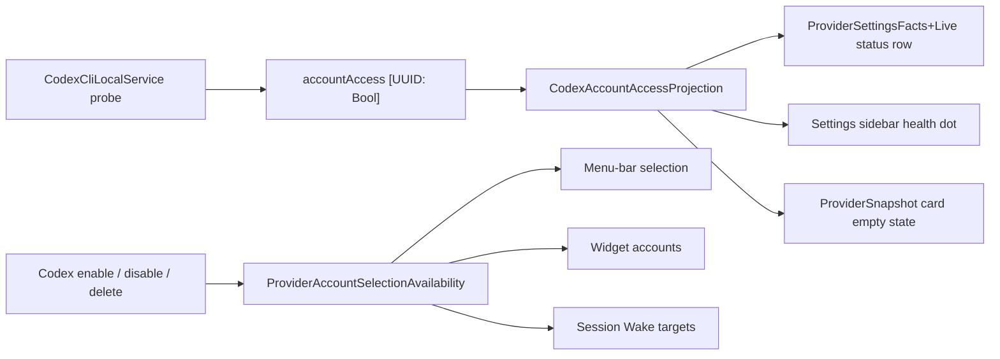

# 2026-08-02

**Summary:** Codex account parity residuals (#304)

---

## Session 1: Codex account-management parity residuals (#304)

**Status:** Complete — ready PR published, not merged.

### System flow

### What was done

- [x] Audited #304 against `master`: most accepted scope already shipped via
  PR #309 (carrying closed PR #305) and the multi-account UI refactor in PR #312.
- [x] Closed the residual gaps rather than re-implementing what already landed.
- [x] Added per-account Codex auth truth (`accountAccess`) plus a single writer
  so a custom `CODEX_HOME` profile can no longer publish over the default's
  shared flag.
- [x] Routed every Codex connection-state consumer through
  `CodexAccountAccessProjection` — Providers status row, sidebar health dot,
  and the provider card empty state.
- [x] Extracted downstream reconciliation out of the SwiftUI view into
  `ProviderAccountSelectionAvailability` + `ProviderAccountSelectionReconciler`
  so it is testable, which the issue lists as accepted scope.
- [x] Fixed Grok collateral pruning found during that extraction.
- [x] Gave the profile-row status pill an accessibility value, with a fallback
  to the pill's own text for Claude and Grok rows.
- [x] Added 18 tests across store, presentation, snapshot, and reconciliation.

### Files changed

- `MeterBar/Models/CodexAccountAccess.swift` - new; per-account auth projection
  shared by every Codex connection-state consumer.
- `MeterBar/Services/CodexCliLocalService.swift` - cached
  `@Published accountAccess: [UUID: Bool]`; all auth writes funnel through one
  `record(_:for:)` that guards the shared default-only state.
- `MeterBar/Views/Settings/ProviderSettingsFacts+Live.swift` - `codexLiveState()`
  reports connected when any enabled profile has a usable login.
- `MeterBar/Views/ProviderSnapshot.swift` - new `codexAccountAccess` input; card
  empty state asks for a login only when that account's own probe says so.
- `MeterBar/Views/{MenuBarView,UsageDashboardView}.swift`,
  `MeterBar/Views/Settings/{GeneralSettingsView,ProviderSettingsView,ProviderCatalogSettingsView}.swift`
  - pass the new per-account access map at the five snapshot call sites.
- `MeterBar/Views/Settings/ProviderAccountSelectionReconciler.swift` - new;
  availability projection plus the store fan-out.
- `MeterBar/Views/Settings/ProviderSettingsView.swift` - reconciliation
  delegates to the new type and now projects Grok accounts too.
- `MeterBar/Views/Settings/ProviderAccountProfileModels.swift` - new
  `ProviderAccountStatusAccessibility` helper.
- `MeterBar/Views/Settings/ProviderAccountProfileRow.swift` - optional
  `statusAccessibilityValue` on the shared row.
- `MeterBar/Views/Settings/CodexAccountSettingsRow.swift` - supplies the richer
  VoiceOver sentence from `ProviderAccountConnectionState`.
- `MeterBarTests/CodexAccountAccessTests.swift` - new; 7 tests.
- `MeterBarTests/ProviderAccountSelectionReconcilerTests.swift` - new; 7 tests.
- `MeterBarTests/CodexAccountProfileRowTests.swift` - +2 accessibility tests.
- `MeterBarTests/ProviderSnapshotTests.swift` - +2 per-account empty-state tests.

### Decisions

- **Decision:** Cache Codex auth per account in a published map instead of
  probing on demand like Grok does.
  - **Context:** Grok's probe is a `fileExists` check; Codex's is a file read
    plus a JSON/JWT decode.
  - **Rationale:** Too heavy to recompute on every render, so the probe result
    is recorded once and read from the map.

- **Decision:** Keep the shared `hasAccess` / `subscriptionType` pair as
  default-sentinel state rather than deleting it.
  - **Context:** Callers predate multi-account Codex.
  - **Rationale:** `record(_:for:)` writes it only when the account is the
    default, matching the guard the fetch path already had, so no caller
    changes meaning while the per-account map becomes the real source.

- **Decision:** Leave the empty `codexAccountAccess` map meaning "nothing
  probed yet".
  - **Context:** The snapshot input is constructed in five places.
  - **Rationale:** An empty map falls back to the default sentinel's shared
    flag, so existing behavior and existing snapshot tests are preserved.

- **Decision:** Extract reconciliation into a value type instead of testing the
  view.
  - **Context:** The logic lived in a private method on a SwiftUI `View`.
  - **Rationale:** "Downstream reconciliation tests" is accepted scope in #304
    and a private view method cannot be exercised.

### Mistakes and fixes

- **Mistake:** `ProviderSettingsView` reconciliation omitted `grokAccounts:`
  from both `MenuBarAccountCatalog.identities` and
  `WidgetSettingsAccountProjection.options`. Both default that parameter to
  `[]`, so any Codex disable or delete silently dropped selected Grok menu-bar
  items and Grok widget accounts.
- **Fix:** `ProviderAccountSelectionAvailability` projects every provider on
  every pass; covered by
  `testCodexReconciliationPreservesGrokAndClaudeIdentities`.
- **Prevention:** Defaulted collection parameters on projection helpers hide
  omissions at the call site — pass all providers explicitly.

- **Mistake:** Declared `ProviderAccountSelectionAvailability` `nonisolated`,
  which warned on the MainActor-isolated projection calls.
- **Fix:** Dropped `nonisolated` so it inherits the target's
  `defaultIsolation(MainActor.self)`.
- **Prevention:** Both package targets set that default; only mark
  `nonisolated` when the type genuinely does disk or decode work off-main.

### Verification

- `swift build` clean.
- `swift test --skip APIIntegrationTests`: 1607 tests, 3 failures — all three
  reproduce identically on a clean detached worktree at `master` (6368bba), so
  they are pre-existing and environmental, not regressions:
  - `SessionWakeAgentTests.testAgentLifetimeLockExcludesAppAndCLIHolders`
    (2 assertions) — the lock directory cannot be created under this `TMPDIR`.
  - `LiquidGlassP1RegressionTests.testRapidShowDismissShowLeavesPanelVisibleAndOpaque`
    — panel alpha reads 0.0 without a focused window server.
- All 18 new tests pass; the four touched suites are fully green
  (`CodexAccountAccessTests` 7, `ProviderAccountSelectionReconcilerTests` 7,
  `CodexAccountProfileRowTests` 9, `ProviderSnapshotTests` 35).
- `APIIntegrationTests` is skipped deliberately: it makes real API calls and
  reads the real login keychain, so `SecItemCopyMatching` blocks on a
  SecurityAgent authorization dialog and the run never terminates. Confirmed by
  sampling the hung `xctest` process. Pre-existing and unrelated to this change.
- SwiftLint clean across the repository.

### Next steps

- [ ] Land the PR once review and CI complete.
- [ ] Consider giving `APIIntegrationTests` an injectable keychain backend, or
  gating it behind an environment variable, so a full local `swift test` can
  terminate unattended.

---

**Total sessions today:** 1
