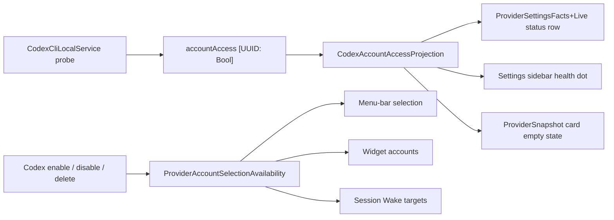

# 2026-08-02

**Summary:** Codex account parity residuals (#304)

---

## Session 1: Codex account-management parity residuals (#304)

**Status:** Complete — ready PR published, not merged.

### System flow



### What was done

- [x] Audited #304 against `master`: most accepted scope already shipped via
  PR #309 (carrying closed PR #305) and the multi-account UI refactor in PR #312.
- [x] Closed the residual gaps rather than re-implementing what already landed.
- [x] Added per-account Codex auth truth (`accountAccess`) plus a single writer
  so a custom `CODEX_HOME` profile can no longer publish over the default's
  shared flag.
- [x] Routed every Codex connection-state consumer through
  `CodexAccountAccessProjection` — Providers status row, sidebar health dot,
  and the provider card empty state.
- [x] Extracted downstream reconciliation out of the SwiftUI view into
  `ProviderAccountSelectionAvailability` + `ProviderAccountSelectionReconciler`
  so it is testable, which the issue lists as accepted scope.
- [x] Fixed Grok collateral pruning found during that extraction.
- [x] Gave the profile-row status pill an accessibility value, with a fallback
  to the pill's own text for Claude and Grok rows.
- [x] Added 18 tests across store, presentation, snapshot, and reconciliation.

### Files changed

- `MeterBar/Models/CodexAccountAccess.swift` - new; per-account auth projection
  shared by every Codex connection-state consumer.
- `MeterBar/Services/CodexCliLocalService.swift` - cached
  `@Published accountAccess: [UUID: Bool]`; all auth writes funnel through one
  `record(_:for:)` that guards the shared default-only state.
- `MeterBar/Views/Settings/ProviderSettingsFacts+Live.swift` - `codexLiveState()`
  reports connected when any enabled profile has a usable login.
- `MeterBar/Views/ProviderSnapshot.swift` - new `codexAccountAccess` input; card
  empty state asks for a login only when that account's own probe says so.
- `MeterBar/Views/{MenuBarView,UsageDashboardView}.swift`,
  `MeterBar/Views/Settings/{GeneralSettingsView,ProviderSettingsView,ProviderCatalogSettingsView}.swift`
  - pass the new per-account access map at the five snapshot call sites.
- `MeterBar/Views/Settings/ProviderAccountSelectionReconciler.swift` - new;
  availability projection plus the store fan-out.
- `MeterBar/Views/Settings/ProviderSettingsView.swift` - reconciliation
  delegates to the new type and now projects Grok accounts too.
- `MeterBar/Views/Settings/ProviderAccountProfileModels.swift` - new
  `ProviderAccountStatusAccessibility` helper.
- `MeterBar/Views/Settings/ProviderAccountProfileRow.swift` - optional
  `statusAccessibilityValue` on the shared row.
- `MeterBar/Views/Settings/CodexAccountSettingsRow.swift` - supplies the richer
  VoiceOver sentence from `ProviderAccountConnectionState`.
- `MeterBarTests/CodexAccountAccessTests.swift` - new; 7 tests.
- `MeterBarTests/ProviderAccountSelectionReconcilerTests.swift` - new; 7 tests.
- `MeterBarTests/CodexAccountProfileRowTests.swift` - +2 accessibility tests.
- `MeterBarTests/ProviderSnapshotTests.swift` - +2 per-account empty-state tests.

### Decisions

- **Decision:** Cache Codex auth per account in a published map instead of
  probing on demand like Grok does.
  - **Context:** Grok's probe is a `fileExists` check; Codex's is a file read
    plus a JSON/JWT decode.
  - **Rationale:** Too heavy to recompute on every render, so the probe result
    is recorded once and read from the map.

- **Decision:** Keep the shared `hasAccess` / `subscriptionType` pair as
  default-sentinel state rather than deleting it.
  - **Context:** Callers predate multi-account Codex.
  - **Rationale:** `record(_:for:)` writes it only when the account is the
    default, matching the guard the fetch path already had, so no caller
    changes meaning while the per-account map becomes the real source.

- **Decision:** Leave the empty `codexAccountAccess` map meaning "nothing
  probed yet".
  - **Context:** The snapshot input is constructed in five places.
  - **Rationale:** An empty map falls back to the default sentinel's shared
    flag, so existing behavior and existing snapshot tests are preserved.

- **Decision:** Extract reconciliation into a value type instead of testing the
  view.
  - **Context:** The logic lived in a private method on a SwiftUI `View`.
  - **Rationale:** "Downstream reconciliation tests" is accepted scope in #304
    and a private view method cannot be exercised.

### Mistakes and fixes

- **Mistake:** `ProviderSettingsView` reconciliation omitted `grokAccounts:`
  from both `MenuBarAccountCatalog.identities` and
  `WidgetSettingsAccountProjection.options`. Both default that parameter to
  `[]`, so any Codex disable or delete silently dropped selected Grok menu-bar
  items and Grok widget accounts.
- **Fix:** `ProviderAccountSelectionAvailability` projects every provider on
  every pass; covered by
  `testCodexReconciliationPreservesGrokAndClaudeIdentities`.
- **Prevention:** Defaulted collection parameters on projection helpers hide
  omissions at the call site — pass all providers explicitly.

- **Mistake:** Declared `ProviderAccountSelectionAvailability` `nonisolated`,
  which warned on the MainActor-isolated projection calls.
- **Fix:** Dropped `nonisolated` so it inherits the target's
  `defaultIsolation(MainActor.self)`.
- **Prevention:** Both package targets set that default; only mark
  `nonisolated` when the type genuinely does disk or decode work off-main.

### Verification

- `swift build` clean.
- `swift test --skip APIIntegrationTests`: 1607 tests, 3 failures — all three
  reproduce identically on a clean detached worktree at `master` (6368bba), so
  they are pre-existing and environmental, not regressions:
  - `SessionWakeAgentTests.testAgentLifetimeLockExcludesAppAndCLIHolders`
    (2 assertions) — the lock directory cannot be created under this `TMPDIR`.
  - `LiquidGlassP1RegressionTests.testRapidShowDismissShowLeavesPanelVisibleAndOpaque`
    — panel alpha reads 0.0 without a focused window server.
- All 18 new tests pass; the four touched suites are fully green
  (`CodexAccountAccessTests` 7, `ProviderAccountSelectionReconcilerTests` 7,
  `CodexAccountProfileRowTests` 9, `ProviderSnapshotTests` 35).
- `APIIntegrationTests` is skipped deliberately: it makes real API calls and
  reads the real login keychain, so `SecItemCopyMatching` blocks on a
  SecurityAgent authorization dialog and the run never terminates. Confirmed by
  sampling the hung `xctest` process. Pre-existing and unrelated to this change.
- SwiftLint clean across the repository.

### Next steps

- [ ] Land the PR once review and CI complete.
- [ ] Consider giving `APIIntegrationTests` an injectable keychain backend, or
  gating it behind an environment variable, so a full local `swift test` can
  terminate unattended.
## Session 1: Remove the Fable 5 session-tracking feature

**Status:** Complete — full rip, ready PR published.

### Context

Fable 5 is now included in the Claude subscription, so "is a Fable session
active" detection no longer serves a purpose. The whole tracker — scanner,
store, presentation model, popover row, settings history pane, CLI command, and
JSON contract — is removed rather than deprecated.

### System flow (removed)

```text
Claude quota refresh
  -> UsageDataManager.scheduleRefresh
  -> ClaudeFableSessionTracker (off-main transcript scan)
  -> persisted snapshot (App Group + StorageKeys.claudeFableSessions)
  -> ClaudeFableSessionPresentation.normalized
  -> FableSessionCardActivity.byAccount -> ProviderSnapshot.fableActivity
  -> ProviderCardFableActivityRow / FableSessionHistoryView
  -> meterbar fable-sessions --json (FableSessionsCLIJSONResponse)
```

Every stage above is deleted. Nothing replaces it.

### What was done

- [x] Deleted the tracker itself: scanner, store, `ClaudeFableSession`,
  `ClaudeFableSessionTracking`, and `ClaudeFableProfileDiagnostic`.
- [x] Deleted the presentation model, the popover activity row, and the settings
  session-history pane.
- [x] Removed the `meterbar fable-sessions` subcommand and its registration —
  **breaking CLI change**.
- [x] Removed `FableSessionsCLIJSONResponse` and the "Fable sessions" section of
  the CLI JSON schema doc.
- [x] Unwired every reference site: `UsageDataManager` (property, init param,
  `scheduleRefresh` call), the `NoopFableSessionTracker` stub in
  `UsageRefreshCLI`, four view files holding `@StateObject fableSessionTracker`,
  `ProviderSnapshot.fableActivity` and its `byAccount` wiring,
  `ProviderStatusCard.fableActivitySection`,
  `ProviderCardPresentation.fableActivityAccessibilityLabel`,
  `StorageKeys.claudeFableSessions`, and `SharedMetricsStore.fableSessionsFileURL`.
- [x] Removed the command from the CLI JSON smoke validator and its fixture, so
  CI no longer probes a subcommand that does not exist.
- [x] Deleted the two dedicated test files and pruned Fable assertions and
  memberwise arguments from eight other test files.
- [x] `swift build` clean; `scripts/test-cli-json-smoke.sh` green; `swift test`
  at parity with a master baseline (see Verification).

### Verification

`swift test` on this machine cannot run the credential-touching suites:
`APIIntegrationTests` and `ClaudeTokenRefresherTests` reach the real login
keychain through `ClaudeCodeLocalService.fetchUsageViaOAuth`, and the unsigned
test binary blocks forever on a `SecurityAgent` authorization dialog. CI is
unaffected — it has no stored Claude credentials, so those tests self-skip.

Both sides were therefore run with `--skip APIIntegrationTests --skip
ClaudeTokenRefresherTests`, master from a detached baseline worktree:

| | master (6368bba) | this branch |
| --- | --- | --- |
| Executed | 1589 | 1556 |
| Failures | 3 | 3 |

Identical failing cases on both sides, so neither is a regression:

- `LiquidGlassP1RegressionTests.testRapidShowDismissShowLeavesPanelVisibleAndOpaque`
- `SessionWakeAgentTests.testAgentLifetimeLockExcludesAppAndCLIHolders`
  (sandboxed `TMPDIR` denies the lock directory)

The 33-test delta is the removed Fable coverage.

### Files changed

**Deleted**

- `MeterBar/Services/ClaudeFableSessionTracker.swift`
- `MeterBar/Models/ClaudeFableSessionPresentation.swift`
- `MeterBar/Views/ProviderCardFableActivityRow.swift`
- `MeterBar/Views/Settings/FableSessionHistoryView.swift`
- `MeterBarCLI/Sources/FableSessions.swift`
- `MeterBarTests/ClaudeFableSessionTrackerTests.swift`
- `MeterBarTests/FableSessionHistoryTests.swift`

**Modified**

- `MeterBar/Services/UsageDataManager.swift` — dropped the tracker dependency.
- `MeterBar/UsageRefresh/UsageRefreshCLI.swift` — dropped the no-op stub.
- `MeterBar/Models/CLIJSONOutput.swift` — dropped the response DTO.
- `MeterBar/Models/StorageKeys.swift`, `Packages/MeterBarShared/.../SharedMetricsStore.swift`
  — dropped the persistence keys.
- `MeterBar/Views/ProviderSnapshot.swift`, `ProviderStatusCard.swift`,
  `ProviderCardPresentation.swift`, `MenuBarView.swift`, `UsageDashboardView.swift`,
  `Settings/ProviderSettingsView.swift`, `Settings/ProviderCatalogSettingsView.swift`
  — unwired the display path.
- `MeterBarCLI/Sources/MeterBarCLI.swift` — dropped the subcommand.
- `scripts/verify-cli-json-smoke.sh`, `scripts/fixtures/cli-json-smoke/fake-meterbar.sh`
  — dropped the command probe, validator, and four fixture scenarios.
- `docs/cli-json-schema.md`, `.agents/SYSTEM/ARCHITECTURE.md` — dropped the docs.
- Eight test files — dropped Fable tests and `fableActivity: nil` arguments.

### Decisions

- **Decision:** Keep every model-name occurrence of "fable".
  - **Context:** `grep -ril fable` matches 58 files, but most are the Claude
    model-scoped weekly window label, cost-model pricing, and premium-model
    detection — all unrelated to the tracker.
  - **Rationale:** `OptimizationInsights.premiumMarkers`,
    `ModelPricing`'s `claude-fable-5` entry, `ClaudeCodeLocalService.sevenDayFable`,
    the `ClaudeCodeCLIUsageService` window-label parser, and every
    `modelLimitLabel == "Fable"` assertion describe the *model*, not session
    tracking. Removing them would break quota labelling and cost attribution.
    Each hit was classified by hand before any edit.

- **Decision:** Remove the CLI command outright rather than keep an empty stub.
  - **Context:** `meterbar fable-sessions --json` is a documented, versioned
    contract that third-party menu bars may consume.
  - **Rationale:** The command's only data source is the tracker. A stub that
    always returns `{"sessions": []}` would be a silent lie; an honest removal
    surfaces as a clear "unknown subcommand" error. Called out as breaking in
    the PR description.

- **Decision:** No `.pbxproj` surgery.
  - **Context:** Seven source files were deleted.
  - **Rationale:** The Xcode project uses filesystem-synchronized groups, so
    it carries no per-file references. Verified: zero Fable references in
    `MeterBar.xcodeproj/project.pbxproj`.

### Mistakes and fixes

- **Mistake:** The first reference sweep used Swift-symbol patterns
  (`ClaudeFableSession`, `fableActivity`, …) and reported a clean tree, but the
  CLI smoke scripts refer to the command in kebab-case as `fable-sessions`.
  Those two scripts run in CI and would have failed the build on a subcommand
  that no longer exists.
- **Fix:** Re-swept with a plain case-insensitive `fable` search across all
  tracked files, then classified each hit as tracker vs model-name.
- **Prevention:** When removing a CLI command, always grep the literal command
  string in addition to its Swift symbols — shell fixtures and CI workflows
  never mention the type names.

- **Mistake:** The first full run reported six assertion failures, two of which
  (`ManagedProcessTests.testFailedSecondPipeDoesNotLeakTheFirstPair`,
  `SessionWakeControllerTests.testCodexProviderStartsCodexRuntime`) looked like
  they might belong to this change.
- **Fix:** Built a detached master worktree and ran the same command there. Both
  cases failed to reproduce on a branch re-run and neither test file references
  any symbol touched here, so both are order-dependent flakes.
- **Prevention:** Never triage a failure against intuition alone — a baseline
  worktree at the merge-base costs one build and turns "probably pre-existing"
  into a fact.

### Next steps

- [ ] Note the breaking CLI removal in the next release notes.

---

**Total sessions today:** 1
