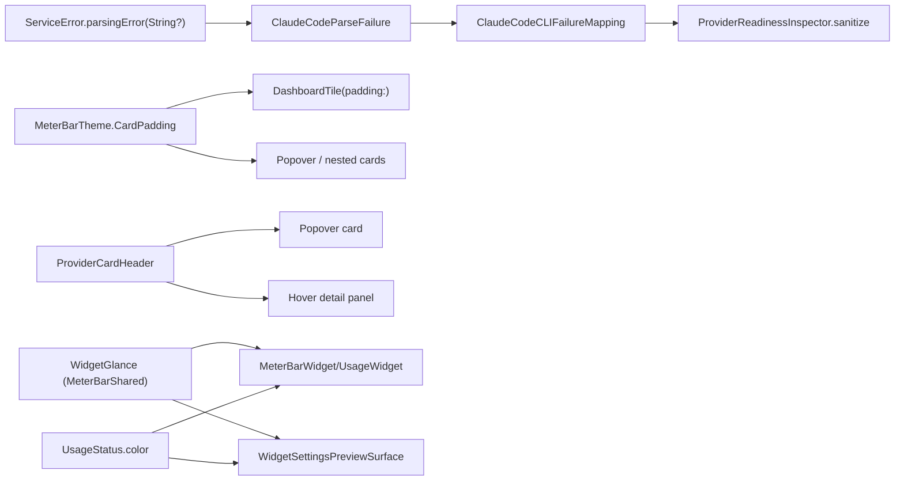

# 2026-08-03

**Summary:** Ten UI/behavior fixes across popover, dashboard, widget

---

## Session 1: Popover, dashboard, widget, and provider-error cleanup

**Status:** Complete — ready PR published, not merged.

### System flow

### What was done

Ten reported UI/behavior defects, fixed end to end with tests first.

- [x] **Popover label truncation.** A blocked or exhausted provider row squeezed
  the account title down to a single character while the trailing status text
  ran long. `ProviderBlockedSummaryPresentation` now decides one status line
  instead of concatenating three, and `ResetCountdowns.unavailableCounterText`
  owns the "no reset time" copy.
- [x] **Card padding audit.** Padding was hand-typed per surface and had drifted.
  `MeterBarTheme.CardPadding` (`.nested` 8 / `.popover` 12 / `.standard` 16) is
  now the only source, threaded through `DashboardTile(padding:)`.
- [x] **Hover panel parity.** The hover detail panel drew its own header and an
  extra bar the card never had. Both surfaces now render `ProviderCardHeader`.
- [x] **Overview grid.** `DashboardOverviewSection.masonryColumns` balances
  cards into columns by height instead of leaving ragged gaps.
- [x] **Costs row.** API-Rate Estimate and Lifetime Local share one equal-height
  row in `DashboardCostsSection`.
- [x] **Optimize page.** KPI tiles forced to a single 4x1 grid; the empty
  "Last 7 days" counter now reads "None" when the window genuinely has no usage
  rather than rendering a bare 0 next to a 30-day caption; `CodexCostScanner`
  buffers deferred usage so late-arriving rows stop landing under "Unknown model".
- [x] **Status refresh.** `DashboardStatusSection` gets a real refresh button
  with a spinner state, and its enablement logic is lifted into pure statics.
- [x] **Oversized switches.** New `meterBarSwitch()` view modifier applied at 26
  call sites.
- [x] **Widget design.** See "Decisions" — the widget was a scaled-down popover
  card. It now has its own glance vocabulary.
- [x] **"Failed to parse response".** The Claude CLI's real failure reason was
  being thrown away. `ServiceError.parsingError` carries a `String?` detail, and
  `ClaudeCodeParseFailure` + `ClaudeCodeCLIFailureMapping` classify it.

### Files changed

- `Packages/MeterBarShared/Sources/MeterBarShared/WidgetGlance.swift` - new;
  per-family metrics and a hero/rows layout decision for the widget surfaces.
  Layout numbers only, no SwiftUI — the package deliberately imports none.
- `MeterBarWidget/UsageWidget.swift` - rewritten around `WidgetGlance`. Small
  renders a hero number plus a rail; medium and large share one `WidgetGlanceStack`
  body with different row budgets. Deleted `ServiceMiniView`, `ServiceCompactView`,
  `WidgetRowDetails`, `WidgetStatusIndicator`.
- `MeterBar/Views/Settings/WidgetSettingsView.swift` - the settings preview was a
  third hand-rolled copy of the widget row at its own sizes; it now reads the
  same `WidgetGlance` metrics and layout the extension does.
- `MeterBar/Views/MeterBarTheme.swift` - `Spacing`, `CardPadding`,
  `meterBarSwitch()`, and `UsageStatus.color` so severity maps to color in one place.
- `MeterBar/Views/Components/ProviderCardHeader.swift` - new; one header for the
  popover card and the hover panel.
- `MeterBar/Views/Components/ProviderBlockedUsageSummary.swift` - single status
  line for blocked/exhausted rows.
- `MeterBar/Views/Components/ResetCountdowns.swift` - `unavailableCounterText`.
- `MeterBar/Views/{DashboardOverviewSection,DashboardCostsSection,DashboardStatusSection,OptimizeInsightsView}.swift`
  - grid, equal-height row, refresh button, 4x1 KPI tiles.
- `MeterBar/Services/{ClaudeCodeParseFailure,ClaudeCodeCLIFailureMapping}.swift` -
  new; classify a CLI parse failure into a message worth showing.
- `MeterBar/Services/ServiceError.swift` - `parsingError(String?)`.
- `MeterBar/Services/CodexCostScanner.swift` - deferred-usage buffer.
- `MeterBarTests/{WidgetGlanceTests,WidgetSettingsPreviewParityTests,ClaudeCodeParseFailureTests,ProviderBlockedSummaryPresentationTests}.swift`
  - new suites, written before the implementation they cover.

### Decisions

- **Decision:** The widget gets its own layout vocabulary rather than a shared
  component with the app.
  - **Context:** `MeterBarWidget` is an app-extension target outside the SwiftPM
    package, so it cannot link app types like `DashboardTile` or `LimitRow`.
    Only `MeterBarShared` is common ground, and nothing in it imports SwiftUI.
  - **Rationale:** Put the *numbers and the layout decision* in `MeterBarShared`
    as `WidgetGlance`, and let each target draw them. Three copies previously
    disagreed on icon source, font sizes, and status color; now they disagree
    about nothing, without the extension having to link the app.

- **Decision:** A glance is not a small card — four deliberate inversions.
  - **Context:** The complaint was that the widget looked like the popover card.
  - **Rationale:** The usage number becomes the largest type instead of the
    account name; the stacked quota subtitle competing with it is gone; the bar
    is a capsule with weight rather than a hairline; and status is carried by the
    bar's tint, so the card's separate status dot goes away.

- **Decision:** Icon parity is over size and layout, never one shared icon view.
  - **Context:** The two targets have separate asset catalogs — the extension
    uses `ServiceType.assetName`, the app uses `ProviderLogoKind.resourceName`.
  - **Rationale:** Forcing a shared view would mean duplicating assets into both
    catalogs for no visual gain.

### Mistakes and fixes

- **Mistake:** `swift test` output looked frozen — a redirected log sat at 98
  bytes while the run had been going for 14 minutes, so it read as a hang with
  no diagnosis available.
- **Fix:** Run it under a pty: `script -q /dev/null swift test > log 2>&1`.
  Output streamed per-test immediately.
- **Prevention:** Never diagnose a "hung" `swift test` from a plain redirect; it
  block-buffers. Also, XCTest's summary line is tab-indented, so `grep "^Executed"`
  never matches.

- **Mistake:** The run genuinely was blocked, and I initially assumed it was my
  change.
- **Fix:** With live output the last line was
  `APIIntegrationTests testClaudeCodeAPIAccess started` — a live-credential test
  whose declared `apiTimeout` is never applied to the awaited call, so it blocks
  forever without credentials. Re-ran with `--skip APIIntegrationTests`.
- **Prevention:** `APIIntegrationTests` is a live-network suite; skip it for
  local full-suite runs.

- **Mistake:** Reached for `pkill -f "swift-test|xctest"` to clear the stuck run.
- **Fix:** `-f` matches full command lines including this agent's own shell
  wrapper, which carried those strings in its environment. Used `pkill -x xctest`.
- **Prevention:** Always `-x` when killing test processes from inside an agent.

- **Mistake:** SwiftLint `--strict` rejected `@ViewBuilder` on its own line above
  a computed property.
- **Fix:** The `attributes` rule wants attributes on their own line for functions
  and types, but on the *same* line for variables. Collapsed it.

### Verification

- `swift test --skip APIIntegrationTests` — 1652 tests, 1 skipped, 3 failures.
- `xcodebuild -project MeterBar.xcodeproj -scheme MeterBar -configuration Debug`
  — BUILD SUCCEEDED (this is the only build that compiles the widget extension).
- `swiftlint --strict` — clean.
- The 3 failures are 2 tests, both reproduced verbatim on clean `master` at
  `7322b7f` in a throwaway worktree:
  - `LiquidGlassP1RegressionTests.testRapidShowDismissShowLeavesPanelVisibleAndOpaque`
    — panel alpha 0.0 vs expected 1.0. `MeterBarMenuPanelController` is untouched here.
  - `SessionWakeAgentTests.testAgentLifetimeLockExcludesAppAndCLIHolders`
    — sandbox denies writing the lock directory under `TMPDIR`. Environmental.

### Next steps

- [ ] Fix `APIIntegrationTests` to honor its own `apiTimeout`, or gate the suite
      behind an explicit environment flag so it cannot hang a local full run.
- [ ] Investigate the pre-existing `LiquidGlassP1RegressionTests` panel-alpha
      failure separately from this change.

---

**Total sessions today:** 1
